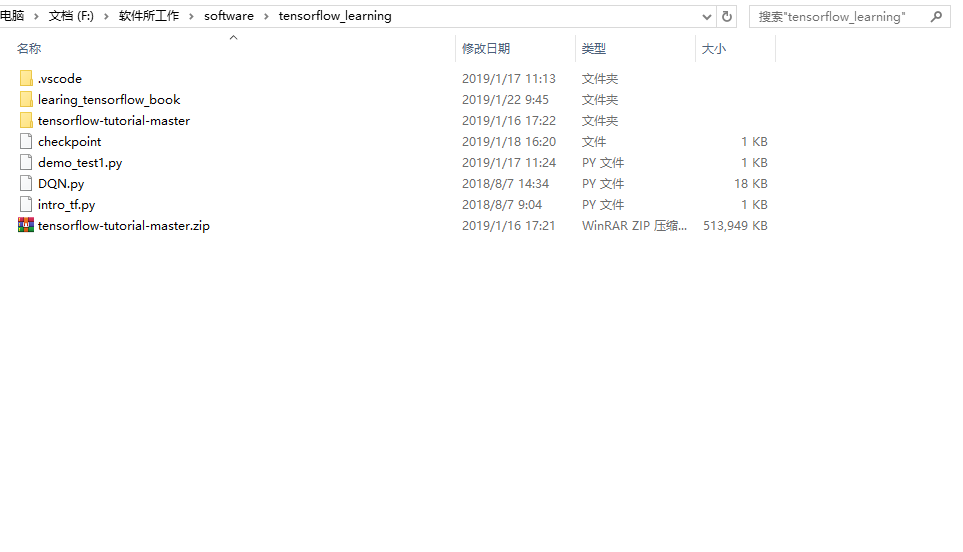
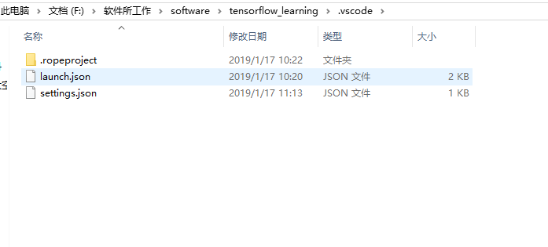
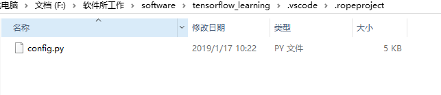
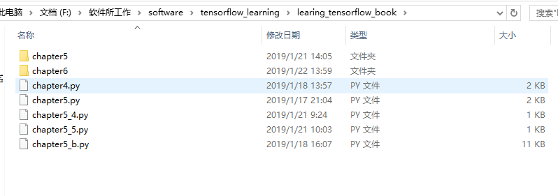

# 一、PySC2

## 1、flags

```
from absl import flags
FLAGS = flags.FLAGS
flags.DEFINE_enum("job_name", 'actor', ['actor', 'learner'], "Job type.")
flags.DEFINE_enum("policy", 'mlp', ['mlp', 'lstm'], "Job type.")
flags.DEFINE_integer("unroll_length", 128, "Length of rollout steps.")
flags.DEFINE_string("learner_ip", "localhost", "Learner IP address.")
flags.DEFINE_string("port_A", "5700", "Port for transporting model.")
flags.DEFINE_string("port_B", "5701", "Port for transporting data.")
flags.DEFINE_string("game_version", '4.6', "Game core version.")
flags.DEFINE_float("discount_gamma", 0.998, "Discount factor.")
flags.DEFINE_float("lambda_return", 0.95, "Lambda return factor.")
flags.DEFINE_float("clip_range", 0.1, "Clip range for PPO.")
flags.DEFINE_float("ent_coef", 0.01, "Coefficient for the entropy term.")
flags.DEFINE_float("vf_coef", 0.5, "Coefficient for the value loss.")
flags.DEFINE_float("learn_act_speed_ratio", 0, "Maximum learner/actor ratio.")
flags.DEFINE_integer("batch_size", 32, "Batch size.")
flags.DEFINE_integer("game_steps_per_episode", 43200, "Maximum steps per episode.")
flags.DEFINE_integer("learner_queue_size", 1024, "Size of learner's unroll queue.")
flags.DEFINE_integer("step_mul", 32, "Game steps per agent step.")
flags.DEFINE_string("difficulties", '1,2,4,6,9,A', "Bot's strengths.")
flags.DEFINE_float("learning_rate", 1e-5, "Learning rate.")
flags.DEFINE_string("init_model_path", None, "Initial model path.")
flags.DEFINE_string("save_dir", "./checkpoints/", "Dir to save models to")
flags.DEFINE_integer("save_interval", 50000, "Model saving frequency.")
flags.DEFINE_integer("print_interval", 1000, "Print train cost frequency.")
flags.DEFINE_boolean("disable_fog", False, "Disable fog-of-war.")
flags.DEFINE_boolean("use_all_combat_actions", False, "Use all combat actions.")
flags.DEFINE_boolean("use_region_features", False, "Use region features")
flags.DEFINE_boolean("use_action_mask", True, "Use region-wise combat.")
flags.DEFINE_boolean("use_reward_shaping", False, "Use reward shaping.")
flags.FLAGS(sys.argv)
```

## 2、observation_spec()

```
def observation_spec(self):
    """The observation spec for the SC2 environment.

    It's worth noting that the image-like observations are in y,x/row,column
    order which is different than the actions which are in x,y order. This is
    due to conflicting conventions, and to facilitate printing of the images.

    Returns:
      The dict of observation names to their tensor shapes. Shapes with a 0 can
      vary in length, for example the number of valid actions depends on which
      units you have selected.
    """
    obs_spec = named_array.NamedDict({
        "action_result": (0,),  # See error.proto: ActionResult.
        "alerts": (0,),  # See sc2api.proto: Alert.
        "available_actions": (0,),
        "build_queue": (0, len(UnitLayer)),  # pytype: disable=wrong-arg-types
        "cargo": (0, len(UnitLayer)),  # pytype: disable=wrong-arg-types
        "cargo_slots_available": (1,),
        "control_groups": (10, 2),
        "game_loop": (1,),
        "last_actions": (0,),
        "multi_select": (0, len(UnitLayer)),  # pytype: disable=wrong-arg-types
        "player": (len(Player),),  # pytype: disable=wrong-arg-types
        "score_cumulative": (len(ScoreCumulative),),  # pytype: disable=wrong-arg-types
        "score_by_category": (len(ScoreByCategory), len(ScoreCategories)),  # pytype: disable=wrong-arg-types
        "score_by_vital": (len(ScoreByVital), len(ScoreVitals)),  # pytype: disable=wrong-arg-types
        "single_select": (0, len(UnitLayer)),  # Only (n, 7) for n in (0, 1).  # pytype: disable=wrong-arg-types
    })

    aif = self._agent_interface_format

    if aif.feature_dimensions:
      obs_spec["feature_screen"] = (len(SCREEN_FEATURES),
                                    aif.feature_dimensions.screen.y,
                                    aif.feature_dimensions.screen.x)

      obs_spec["feature_minimap"] = (len(MINIMAP_FEATURES),
                                     aif.feature_dimensions.minimap.y,
                                     aif.feature_dimensions.minimap.x)
    if aif.rgb_dimensions:
      obs_spec["rgb_screen"] = (aif.rgb_dimensions.screen.y,
                                aif.rgb_dimensions.screen.x,
                                3)
      obs_spec["rgb_minimap"] = (aif.rgb_dimensions.minimap.y,
                                 aif.rgb_dimensions.minimap.x,
                                 3)
    if aif.use_feature_units:
      obs_spec["feature_units"] = (0, len(FeatureUnit))  # pytype: disable=wrong-arg-types

    if aif.use_raw_units:
      obs_spec["raw_units"] = (0, len(FeatureUnit))

    if aif.use_unit_counts:
      obs_spec["unit_counts"] = (0, len(UnitCounts))

    if aif.use_camera_position:
      obs_spec["camera_position"] = (2,)
    return obs_spec
```

## 3、AgentInterfaceFormat

```
class AgentInterfaceFormat(object):
  """Observation and action interface format specific to a particular agent."""

  def __init__(
      self,
      feature_dimensions=None,
      rgb_dimensions=None,
      action_space=None,
      camera_width_world_units=None,
      use_feature_units=False,
      use_raw_units=False,
      use_unit_counts=False,
      use_camera_position=False,
      hide_specific_actions=True):
    """Initializer.

    Args:
      feature_dimensions: Feature layer `Dimension`s. Either this or
          rgb_dimensions (or both) must be set.
      rgb_dimensions: RGB `Dimension`. Either this or feature_dimensions
          (or both) must be set.
      action_space: If you pass both feature and rgb sizes, then you must also
          specify which you want to use for your actions as an ActionSpace enum.
      camera_width_world_units: The width of your screen in world units. If your
          feature_dimensions.screen=(64, 48) and camera_width is 24, then each
          px represents 24 / 64 = 0.375 world units in each of x and y.
          It'll then represent a camera of size (24, 0.375 * 48) = (24, 18)
          world units.
      use_feature_units: Whether to include feature unit data in observations.
      use_raw_units: Whether to include raw unit data in observations. This
          differs from feature_units because it includes units outside the
          screen and hidden units, and because unit positions are given in
          terms of world units instead of screen units.
      use_unit_counts: Whether to include unit_counts observation. Disabled by
          default since it gives information outside the visible area.
      use_camera_position: Whether to include the camera's position (in world
          units) in the observations.
      hide_specific_actions: [bool] Some actions (eg cancel) have many
          specific versions (cancel this building, cancel that spell) and can
          be represented in a more general form. If a specific action is
          available, the general will also be available. If you set
          `hide_specific_actions` to False, the specific versions will also be
          available, but if it's True, the specific ones will be hidden.
          Similarly, when transforming back, a specific action will be returned
          as the general action. This simplifies the action space, though can
          lead to some actions in replays not being exactly representable using
          only the general actions.

    Raises:
      ValueError: if the parameters are inconsistent.
    """

    if not feature_dimensions and not rgb_dimensions:
      raise ValueError("Must set either the feature layer or rgb dimensions.")

    if action_space:
      if not isinstance(action_space, actions.ActionSpace):
        raise ValueError("action_space must be of type ActionSpace.")

      if ((action_space == actions.ActionSpace.FEATURES and
           not feature_dimensions) or
          (action_space == actions.ActionSpace.RGB and
           not rgb_dimensions)):
        raise ValueError(
            "Action space must match the observations, action space={}, "
            "feature_dimensions={}, rgb_dimensions={}".format(
                action_space, feature_dimensions, rgb_dimensions))
    else:
      if feature_dimensions and rgb_dimensions:
        raise ValueError(
            "You must specify the action space if you have both screen and "
            "rgb observations.")
      elif feature_dimensions:
        action_space = actions.ActionSpace.FEATURES
      else:
        action_space = actions.ActionSpace.RGB

    self._feature_dimensions = feature_dimensions
    self._rgb_dimensions = rgb_dimensions
    self._action_space = action_space
    self._camera_width_world_units = camera_width_world_units or 24
    self._use_feature_units = use_feature_units
    self._use_raw_units = use_raw_units
    self._use_unit_counts = use_unit_counts
    self._use_camera_position = use_camera_position
    self._hide_specific_actions = hide_specific_actions

    if action_space == actions.ActionSpace.FEATURES:
      self._action_dimensions = feature_dimensions
    else:
      self._action_dimensions = rgb_dimensions

  @property
  def feature_dimensions(self):
    return self._feature_dimensions

  @property
  def rgb_dimensions(self):
    return self._rgb_dimensions

  @property
  def action_space(self):
    return self._action_space

  @property
  def camera_width_world_units(self):
    return self._camera_width_world_units

  @property
  def use_feature_units(self):
    return self._use_feature_units

  @property
  def use_raw_units(self):
    return self._use_raw_units

  @property
  def use_unit_counts(self):
    return self._use_unit_counts

  @property
  def use_camera_position(self):
    return self._use_camera_position

  @property
  def hide_specific_actions(self):
    return self._hide_specific_actions

  @property
  def action_dimensions(self):
    return self._action_dimensions
```

## 4、obs(TimeStep)

- obs.type

  `<class 'pysc2.env.environment.TimeStep'>`

- len(obs):4

- obs.observation取值：两种方式，一种是字典，另一种直接按属性索引。其类型type(obs.observation)=`<class 'pysc2.lib.name_array.NameDict'>`

  - obs.observation['feature_units']
  - obs.observation.feature_units

  定义如下：

  ```
  class NamedDict(dict):
    """A dict where you can use `d["element"]` or `d.element`."""
  
    def __init__(self, *args, **kwargs):
      super(NamedDict, self).__init__(*args, **kwargs)
      self.__dict__ = self
  ```

  

- obs.observation.feature_units

  - type:`<class 'pysc2.lib.named_array.NamedNumpyArray'>`

    ```
  class NamedNumpyArray(np.ndarray):
    """A subclass of ndarray that lets you give names to indices.
  
    This is a normal ndarray in the sense that you can always index by numbers and
    slices, though elipses don't work. Also, all elements have the same type,
    unlike a record array.
  
    Names should be a list of names per dimension in the ndarray shape. The names
    should be a list or tuple of strings, a namedtuple class (with names taken
    from _fields), or an IntEnum. Alternatively if you don't want to give a name
    to a particular dimension, use None. If your array only has one dimension, the
    second level of list can be skipped.
  
    Example usage:
      a = named_array.NamedNumpyArray([1, 3, 6], ["a", "b", "c"])
      a.a, a[1], a["c"] => 1, 3, 6
      b = named_array.NamedNumpyArray([[1, 3], [6, 8]], [["a", "b"], None])
      b.a, b[1], b["a", 1] => [1, 3], [6, 8], 3
      c = named_array.NamedNumpyArray([[1, 3], [6, 8]], [None, ["a", "b"]])
      c[0].a, b[1, 0], b[1, "b"] => 1, 6, 8
    Look at the tests for more examples including using enums and named tuples.
    """
    ```

## 5、FeatureUnit

   ```
class FeatureUnit(enum.IntEnum):
  """Indices for the `feature_unit` observations."""
  unit_type = 0
  alliance = 1
  health = 2
  shield = 3
  energy = 4
  cargo_space_taken = 5
  build_progress = 6
  health_ratio = 7
  shield_ratio = 8
  energy_ratio = 9
  display_type = 10
  owner = 11
  x = 12
  y = 13
  facing = 14
  radius = 15
  cloak = 16
  is_selected = 17
  is_blip = 18
  is_powered = 19
  mineral_contents = 20
  vespene_contents = 21
  cargo_space_max = 22
  assigned_harvesters = 23
  ideal_harvesters = 24
  weapon_cooldown = 25
  order_length = 26  # If zero, the unit is idle.
  tag = 27  # Unique identifier for a unit (only populated for raw units).
   ```

 

```
def get_units_by_type(self,obs,unit_type):
		"""观察空间里面特征单元是否有指定的单元类型，并且全部返回"""
		import pdb
		pdb.set_trace()
		print(type(obs.observation.feature_units))  #<class 'pysc2.lib.named_array.NameNumpyArray'>
		print(obs.observation.feature_units.shape)  #(27,28)
		return [unit for unit in obs.observation.feature_units
				 if unit.unit_type == unit_type]
```

 说明该 feature_units有27个unit,每个unit类型为FeatureUnit

## 6、FunctionCall

```
class FunctionCall(collections.namedtuple(
    "FunctionCall", ["function", "arguments"])):
  """Represents a function call action.

  Attributes:
    function: Store the function id, eg 2 for select_point.
    arguments: The list of arguments for that function, each being a list of
        ints. For select_point this could be: [[0], [23, 38]].
  """
  __slots__ = ()

  @classmethod
  def init_with_validation(cls, function, arguments):
    """Return a `FunctionCall` given some validation for the function and args.

    Args:
      function: A function name or id, to be converted into a function id enum.
      arguments: An iterable of function arguments. Arguments that are enum
          types can be passed by name. Arguments that only take one value (ie
          not a point) don't need to be wrapped in a list.

    Returns:
      A new `FunctionCall` instance.

    Raises:
      KeyError: if the enum name doesn't exist.
      ValueError: if the enum id doesn't exist.
    """
    func = FUNCTIONS[function]
    args = []
    for arg, arg_type in zip(arguments, func.args):
      if arg_type.values:  # Allow enum values by name or int.
        if isinstance(arg, six.string_types):
          try:
            args.append([arg_type.values[arg]])
          except KeyError:
            raise KeyError("Unknown argument value: %s, valid values: %s" % (
                arg, [v.name for v in arg_type.values]))
        else:
          if isinstance(arg, (list, tuple)):
            arg = arg[0]
          try:
            args.append([arg_type.values(arg)])
          except ValueError:
            raise ValueError("Unknown argument value: %s, valid values: %s" % (
                arg, list(arg_type.values)))
      elif isinstance(arg, int):  # Allow bare ints.
        args.append([arg])
      else:  # Allow tuples or iterators.
        args.append(list(arg))
    return cls(func.id, args)

  @classmethod
  def all_arguments(cls, function, arguments):
    """Helper function for creating `FunctionCall`s with `Arguments`.

    Args:
      function: The value to store for the action function.
      arguments: The values to store for the arguments of the action. Can either
        be an `Arguments` object, a `dict`, or an iterable. If a `dict` or an
        iterable is provided, the values will be unpacked into an `Arguments`
        object.

    Returns:
      A new `FunctionCall` instance.
    """
    if isinstance(arguments, dict):
      arguments = Arguments(**arguments)
    elif not isinstance(arguments, Arguments):
      arguments = Arguments(*arguments)
    return cls(function, arguments)

  def __reduce__(self):
    return self.__class__, tuple(self)
```


# 二、Python基本函数

## 1、Python类中方法介绍

python类中方法：

```
class Test(object):
    def __init__(self, title):  #可定义多个参数
        self.title = title
    def get_title(self):   #定义了实例方法
        return self.title
    @classmethod
    def get_time(cls):  #定义了类方法
        print("On July 2")
    @staticmethod
    def get_grade():      #定义了静态方法
        print("89")
```

对三种方法的归纳总结：

| 方法     | 调用情况                 | 访问权限                                       |
| -------- | ------------------------ | ---------------------------------------------- |
| 普通方法 | 可以通过实例来调用       | 可访问实例属性，无法访问类属性                 |
| 类方法   | 可以通过类名和实例来调用 | 可访问类属性，无法访问实例属性                 |
| 静态方法 | 可以通过类名和实例来调用 | 无法访问类属性及实例属性（仅可通过传值的方式） |


## 2、python3 zip()函数
>Stashed changes

**zip()** 函数用于将可迭代的对象作为参数，将对象中对应的元素打包成一个个元组，然后返回由这些元组组成的对象，这样做的好处是节约了不少的内存。

> zip 方法在 Python 2 和 Python 3 中的不同：在 Python 3.x 中为了减少内存，zip() 返回的是一个对象。如需展示列表，需手动 list() 转换。
>
> 如果需要了解 Pyhton3 的应用，可以参考 [Python3 zip()](http://www.runoob.com/python3/python3-func-zip.html)。

```
>>>a = [1,2,3]
>>> b = [4,5,6]
>>> c = [4,5,6,7,8]
>>> zipped = zip(a,b)     # 返回一个对象
>>> zipped
<zip object at 0x103abc288>
>>> list(zipped)  # list() 转换为列表
[(1, 4), (2, 5), (3, 6)]
>>> list(zip(a,c))              # 元素个数与最短的列表一致
[(1, 4), (2, 5), (3, 6)]
 
>>> a1, a2 = zip(*zip(a,b))          # 与 zip 相反，*zip 可理解为解压，返回二维矩阵式
>>> list(a1)
[1, 2, 3]
>>> list(a2)
[4, 5, 6]
>>>
```

python zip(*a) 

> 解压

a为已经经过压缩的序列，比如[(1,2,3)],(4,5,6)],这个序列是由3个序列压缩得到的，分别为（1,4）,（2,5）,（3,6）。

经过zip([(1,2,3),(4,5,6)])得到3个元组

```
for i in zip(*a):
	print(i)
输出：
（1,4）
（2,5）
（3,6）
```

- 6) np.zeros()

```
    Examples
    --------
np.zeros(5)
    array([ 0.,  0.,  0.,  0.,  0.])    
np.zeros((5,), dtype=int)
    array([0, 0, 0, 0, 0])
np.zeros((2, 1))
    array([[ 0.],
           [ 0.]]) 
s = (2,2)
np.zeros(s)
    array([[ 0.,  0.],
           [ 0.,  0.]])
```

- 7)np.ones()

```
    Examples
    --------
np.ones(5)
    array([ 1.,  1.,  1.,  1.,  1.])
    
np.ones((5,), dtype=int)
    array([1, 1, 1, 1, 1])
    
np.ones((2, 1))
    array([[ 1.],
           [ 1.]])
    
s = (2,2)
np.ones(s)
    array([[ 1.,  1.],
           [ 1.,  1.]])
```

## 3、np.stack()

```
stack(arrays, axis=0, out=None)
    Join a sequence of arrays along a new axis.
    
    The `axis` parameter specifies the index of the new axis in the dimensions
    of the result. For example, if ``axis=0`` it will be the first dimension
    and if ``axis=-1`` it will be the last dimension.
    
    .. versionadded:: 1.10.0
    
    Parameters
    ----------
    arrays : sequence of array_like
        Each array must have the same shape.
    axis : int, optional
        The axis in the result array along which the input arrays are stacked.
    out : ndarray, optional
        If provided, the destination to place the result. The shape must be
        correct, matching that of what stack would have returned if no
        out argument were specified.
    
    Returns
    -------
    stacked : ndarray
        The stacked array has one more dimension than the input arrays.
    
    See Also
    --------
    concatenate : Join a sequence of arrays along an existing axis.
    split : Split array into a list of multiple sub-arrays of equal size.
    block : Assemble arrays from blocks.
    
    Examples
    --------
arrays = [np.random.randn(3, 4) for _ in range(10)]
np.stack(arrays, axis=0).shape
    (10, 3, 4)
    
np.stack(arrays, axis=1).shape
    (3, 10, 4)
    
np.stack(arrays, axis=2).shape
    (3, 4, 10)
    
a = np.array([1, 2, 3])
b = np.array([2, 3, 4])
np.stack((a, b))
    array([[1, 2, 3],
           [2, 3, 4]])
    
np.stack((a, b), axis=-1)
    array([[1, 2],
           [2, 3],
           [3, 4]])
```

- **9) os.path.join()**

## 4、os.makedirs()

os.mkdirs()-os.makedirs()-os.rmdir()-os.removedirs()

> 说明：os.makedirs()创建多级目录，包含子目录。其中os.mkdir()创建单级目录。
>
> >  os.rmdir()删除单级目录，os.removedirs()删除多级目录

```
  import os
  if not os.path.exists(checkpoint_dir):
          os.makedirs(checkpoint_dir)
  if not os.path.exists(monitor_path):
          os.makedirs(monitor_path)
```

## 5、numpy.append() 里的axis

```
def append(arr, values, axis=None):
    """
    Append values to the end of an array.
    Parameters
    ----------
    arr : array_like
        Values are appended to a copy of this array.
    values : array_like
        These values are appended to a copy of `arr`.  It must be of the
        correct shape (the same shape as `arr`, excluding `axis`).  If
        `axis` is not specified, `values` can be any shape and will be
        flattened before use.
    axis : int, optional
        The axis along which `values` are appended.  If `axis` is not
        given, both `arr` and `values` are flattened before use.
    Returns
    -------
    append : ndarray
        A copy of `arr` with `values` appended to `axis`.  Note that
        `append` does not occur in-place: a new array is allocated and
        filled.  If `axis` is None, `out` is a flattened array.

```

numpy.append(arr, values, axis=None):

简答来说，就是arr和values会重新组合成一个新的数组，做为返回值。而axis是一个可选的值

1. 当axis无定义时，是横向加成，返回总是为一维数组！

```
    Examples
    --------
    >>> np.append([1, 2, 3], [[4, 5, 6], [7, 8, 9]])
    array([1, 2, 3, 4, 5, 6, 7, 8, 9])

```

  2.当axis有定义的时候，分别为0和1的时候。（注意加载的时候，数组要设置好，行数或者列数要相同。不然会有error：all the input array dimensions except for the concatenation axis must match exactly）

```
当axis为0时，数组是加在下面（列数要相同）：

import numpy as np
aa= np.zeros((1,8))
bb=np.ones((3,8))
c = np.append(aa,bb,axis = 0)
print(c)
[[ 0.  0.  0.  0.  0.  0.  0.  0.]
 [ 1.  1.  1.  1.  1.  1.  1.  1.]
 [ 1.  1.  1.  1.  1.  1.  1.  1.]
 [ 1.  1.  1.  1.  1.  1.  1.  1.]]

当axis为1时，数组是加在右边（行数要相同）：

import numpy as np
aa= np.zeros((3,8))
bb=np.ones((3,1))
c = np.append(aa,bb,axis = 1)
print(c)
[[ 0.  0.  0.  0.  0.  0.  0.  0.  1.]
 [ 0.  0.  0.  0.  0.  0.  0.  0.  1.]
 [ 0.  0.  0.  0.  0.  0.  0.  0.  1.]]
```


## 6、python random.seed()函数

描述：**seed()** 方法改变随机数生成器的种子，可以在调用其他随机模块函数之前调用此函数。。

以下是 seed() 方法的语法:

```
import random
random.seed ( [x] )
```

**注意：**seed(()是不能直接访问的，需要导入 random 模块，然后通过 random 静态对象调用该方法。

- x -- 改变随机数生成器的种子seed。如果你不了解其原理，你不必特别去设定seed，Python会帮你选择seed。

返回值：本函数没有返回值。

以下展示了使用 seed(() 方法的实例：

```
#!/usr/bin/python
import random

random.seed( 10 )
print "Random number with seed 10 : ", random.random()
# 生成同一个随机数
random.seed( 10 )
print "Random number with seed 10 : ", random.random()
# 生成同一个随机数
random.seed( 10 )
print "Random number with seed 10 : ", random.random()
```

以上实例运行后输出结果为：

```
Random number with seed 10 :  0.57140259469
Random number with seed 10 :  0.57140259469
Random number with seed 10 :  0.57140259469
```

- python np.random.randn()

**函数原型：**np.random.randn（d1,d2,...,dn），或者randn(*[d1,d2,...,dn])

**返回：**产生均值为0，方差为1，维度为n的标准正太分布。

## 7、lambda匿名函数

python 使用 lambda 来创建匿名函数。

- lambda只是一个表达式，函数体比def简单很多。
- lambda的主体是一个表达式，而不是一个代码块。仅仅能在lambda表达式中封装有限的逻辑进去。
- lambda函数拥有自己的命名空间，且不能访问自有参数列表之外或全局命名空间里的参数。
- 虽然lambda函数看起来只能写一行，却不等同于C或C++的内联函数，后者的目的是调用小函数时不占用栈内存从而增加运行效率。

语法

lambda函数的语法只包含一个语句，如下：

```
lambda [arg1 [,arg2,.....argn]]:expression
```

如下实例：

实例(Python 2.0+)

```
#!/usr/bin/python # -*- coding: UTF-8 -*-   
# 可写函数说明 
sum = lambda arg1, arg2: arg1 + arg2;   
# 调用sum函数 print "相加后的值为 : ", sum( 10, 20 ) 
print "相加后的值为 : ", sum( 20, 20 )
```

以上实例输出结果：

```
相加后的值为 :  30
相加后的值为 :  40
```

## 8、python  collections()

collections是Python内建的一个集合模块，提供了许多有用的集合类。

- namedtuple

我们知道`tuple`可以表示不变集合，例如，一个点的二维坐标就可以表示成：

```
>>> p = (1, 2)
```

但是，看到`(1, 2)`，很难看出这个`tuple`是用来表示一个坐标的。

定义一个class又小题大做了，这时，`namedtuple`就派上了用场：

```
>>> from collections import namedtuple
>>> Point = namedtuple('Point', ['x', 'y'])
>>> p = Point(1, 2)
>>> p.x
1
>>> p.y
2
```

`namedtuple`是一个函数，它用来创建一个自定义的`tuple`对象，并且规定了`tuple`元素的个数，并可以用属性而不是索引来引用`tuple`的某个元素。

这样一来，我们用`namedtuple`可以很方便地定义一种数据类型，它具备tuple的不变性，又可以根据属性来引用，使用十分方便。

可以验证创建的`Point`对象是`tuple`的一种子类：

```
>>> isinstance(p, Point)
True
>>> isinstance(p, tuple)
True
```

类似的，如果要用坐标和半径表示一个圆，也可以用`namedtuple`定义：

```
# namedtuple('名称', [属性list]):
Circle = namedtuple('Circle', ['x', 'y', 'r'])
```

-  collection.namedtuple

 namedtuple是继承自tuple的子类。namedtuple和tuple比，有更多更酷的特性。namedtuple创建一个和tuple类似的对象，而且对象拥有可以访问的属性。这对象更像带有数据属性的类，不过数据属性是只读的。

```
>>> from collections import namedtuple
>>> TPoint = namedtuple('TPoint', ['x', 'y'])
>>> p = TPoint(x=10, y=10)
>>> p
TPoint(x=10, y=10)
>>> p.x
10
>>> p.y
10
>>> p[0]
10
>>> type(p)
<class '__main__.TPoint'>
>>> for i in p:
	print(i)	
10
10
>>> 
import collections
MyTupleClass = collections.namedtuple('MyTupleClass',['name', 'age', 'job'])
obj = MyTupleClass("Tomsom",12,'Cooker')
print(obj.name)
print(obj.age)
print(obj.job)

输出：
Tomsom
12
Cooker
```


- **deque**

使用`list`存储数据时，按索引访问元素很快，但是插入和删除元素就很慢了，因为`list`是线性存储，数据量大的时候，插入和删除效率很低。

deque是为了高效实现插入和删除操作的双向列表，适合用于队列和栈：

```
>>> from collections import deque
>>> q = deque(['a', 'b', 'c'])
>>> q.append('x')
>>> q.appendleft('y')
>>> q
deque(['y', 'a', 'b', 'c', 'x'])
```

`deque`除了实现list的`append()`和`pop()`外，还支持`appendleft()`和`popleft()`，这样就可以非常高效地往头部添加或删除元素。

## 9、numpy.expand_dims()

```
numpy.expand_dims¶
numpy.expand_dims(a, axis)[source]
Expand the shape of an array.

Insert a new axis, corresponding to a given position in the array shape.

Parameters:	
a : array_like

Input array.

axis : int

Position (amongst axes) where new axis is to be inserted.

Returns:	
res : ndarray

Output array. The number of dimensions is one greater than that of the input array.

See also
doc.indexing, atleast_1d, atleast_2d, atleast_3d

Examples

>>>
>>> x = np.array([1,2])
>>> x.shape
(2,)
The following is equivalent to x[np.newaxis,:] or x[np.newaxis]:

>>>
>>> y = np.expand_dims(x, axis=0)
>>> y
array([[1, 2]])
>>> y.shape
(1, 2)
>>>
>>> y = np.expand_dims(x, axis=1)  # Equivalent to x[:,newaxis]
>>> y
array([[1],
       [2]])
>>> y.shape
(2, 1)
Note that some examples may use None instead of np.newaxis. These are the same objects:

>>>
>>> np.newaxis is None
True

```

## 10、python @property

> **作用：**将（类中）方法转换成属性来进行调用，可以进行读取数据。如果只有@property，则该属性为只读属性。如果加上@***（方法名，或者说属性名）.setter则该属性为可以修改，并且定义的方法可以进行类型检查，及时检测错误。

在绑定属性时，如果我们直接把属性暴露出去，虽然写起来很简单，但是，没办法检查参数，导致可以把成绩随便改：

```
s = Student()
s.score = 9999
```

这显然不合逻辑。为了限制score的范围，可以通过一个`set_score()`方法来设置成绩，再通过一个`get_score()`来获取成绩，这样，在`set_score()`方法里，就可以检查参数：

```
class Student(object):

    def get_score(self):
        return self._score

    def set_score(self, value):
        if not isinstance(value, int):
            raise ValueError('score must be an integer!')
        if value < 0 or value > 100:
            raise ValueError('score must between 0 ~ 100!')
        self._score = value
```

现在，对任意的Student实例进行操作，就不能随心所欲地设置score了：

```
>>> s = Student()
>>> s.set_score(60) # ok!
>>> s.get_score()
60
>>> s.set_score(9999)
Traceback (most recent call last):
  ...
ValueError: score must between 0 ~ 100!
```

但是，上面的调用方法又略显复杂，没有直接用属性这么直接简单。

有没有既能检查参数，又可以用类似属性这样简单的方式来访问类的变量呢？对于追求完美的Python程序员来说，这是必须要做到的！

还记得装饰器（decorator）可以给函数动态加上功能吗？对于类的方法，装饰器一样起作用。Python内置的`@property`装饰器就是负责把一个方法变成属性调用的：

```
class Student(object):

    @property
    def score(self):
        return self._score

    @score.setter
    def score(self, value):
        if not isinstance(value, int):
            raise ValueError('score must be an integer!')
        if value < 0 or value > 100:
            raise ValueError('score must between 0 ~ 100!')
        self._score = value
```

`@property`的实现比较复杂，我们先考察如何使用。把一个getter方法变成属性，只需要加上`@property`就可以了，此时，`@property`本身又创建了另一个装饰器`@score.setter`，负责把一个setter方法变成属性赋值，于是，我们就拥有一个可控的属性操作：

```
>>> s = Student()
>>> s.score = 60 # OK，实际转化为s.set_score(60)
>>> s.score # OK，实际转化为s.get_score()
60
>>> s.score = 9999
Traceback (most recent call last):
  ...
ValueError: score must between 0 ~ 100!
```

注意到这个神奇的`@property`，我们在对实例属性操作的时候，就知道该属性很可能不是直接暴露的，而是通过getter和setter方法来实现的。

还可以定义只读属性，只定义getter方法，不定义setter方法就是一个只读属性：

```
class Student(object):

    @property
    def birth(self):
        return self._birth

    @birth.setter
    def birth(self, value):
        self._birth = value

    @property
    def age(self):
        return 2014 - self._birth
```

上面的`birth`是可读写属性，而`age`就是一个**只读**属性，因为`age`可以根据`birth`和当前时间计算出来。

- 小结

`@property`广泛应用在类的定义中，可以让调用者写出简短的代码，同时保证对参数进行必要的检查，这样，程序运行时就减少了出错的可能性。

## 11、python numpy.logaddexp()

Logarithm of the sum of exponentiations of the inputs.

先求参数的指数和，然后使用对数函数求取对数

Calculates `log(exp(x1) + exp(x2))`. This function is useful in statistics where the calculated probabilities of events may be so small as to exceed the range of normal floating point numbers. In such cases the logarithm of the calculated probability is stored. This function allows adding probabilities stored in such a fashion.

**x1, x2** : array_like

> Input values.

**result** : ndarray

> Logarithm of `exp(x1) + exp(x2)`.

 ```
>>> prob1 = np.log(1e-50)
>>> prob2 = np.log(2.5e-50)
>>> prob12 = np.logaddexp(prob1, prob2)
>>> prob12
-113.87649168120691
>>> np.exp(prob12)
3.5000000000000057e-50
 ```

## 12、Python super 详解

说到 super， 大家可能觉得很简单呀，不就是用来调用父类方法的嘛。如果真的这么简单的话也就不会有这篇文章了，且听我细细道来。

**super()** 函数是用于调用父类(超类)的一个方法。

super 是用来解决多重继承问题的，直接用类名调用父类方法在使用单继承的时候没问题，但是如果使用多继承，会涉及到查找顺序（MRO）、重复调用（钻石继承）等种种问题。

MRO 就是类的方法解析顺序表, 其实也就是继承父类方法时的顺序表。

- 约定 

object

```
# 默认， Python 3
class A:
    pass

# Python 2
class A(object):
    pass
```

Python 3 和 Python 2 的另一个区别是: Python 3 可以使用直接使用 super().xxx 代替 super(Class, self).xxx :

```
# 默认，Python 3
class B(A):
    def add(self, x):
        super().add(x)

# Python 2
class B(A):
    def add(self, x):
        super(B, self).add(x)
```

所以，你如果用的是 Python 2 的话，记得将本文的 super() 替换为 suepr(Class, self) 。

如果还有其他不兼容 Python 2 的情况，我会在文中注明的。

- 单继承

在单继承中 super 就像大家所想的那样，主要是用来调用父类的方法的。

```
class A:
    def __init__(self):
        self.n = 2

    def add(self, m):
        print('self is {0} @A.add'.format(self))
        self.n += m


class B(A):
    def __init__(self):
        self.n = 3

    def add(self, m):
        print('self is {0} @B.add'.format(self))
        super().add(m)
        self.n += 3
```

你觉得执行下面代码后， b.n 的值是多少呢？

```
b = B()
b.add(2)
print(b.n)
```

执行结果如下:

```
self is <__main__.B object at 0x106c49b38> @B.add
self is <__main__.B object at 0x106c49b38> @A.add
8
```

这个结果说明了两个问题:

- 1、super().add(m) 确实调用了父类 A 的 add 方法。
- 2、super().add(m) 调用父类方法 def add(self, m) 时, 此时==父类中 self 并不是父类的实例而是子类的实例== , 所以 b.add(2) 之后的结果是 5 而不是 4 。

不知道这个结果是否和你想到一样呢？下面我们来看一个多继承的例子。

- 多继承

这次我们再定义一个 class C，一个 class D:

```
class C(A):
    def __init__(self):
        self.n = 4

    def add(self, m):
        print('self is {0} @C.add'.format(self))
        super().add(m)
        self.n += 4


class D(B, C):
    def __init__(self):
        self.n = 5

    def add(self, m):
        print('self is {0} @D.add'.format(self))
        super().add(m)
        self.n += 5
```

下面的代码又输出啥呢？

```
d = D()
d.add(2)
print(d.n)
```

这次的输出如下:

```
self is <__main__.D object at 0x10ce10e48> @D.add
self is <__main__.D object at 0x10ce10e48> @B.add
self is <__main__.D object at 0x10ce10e48> @C.add
self is <__main__.D object at 0x10ce10e48> @A.add
19
```

你说对了吗？你可能会认为上面代码的输出类似:

```
self is <__main__.D object at 0x10ce10e48> @D.add
self is <__main__.D object at 0x10ce10e48> @B.add
self is <__main__.D object at 0x10ce10e48> @A.add
15
```

为什么会跟预期的不一样呢？下面我们将一起来看看 super 的奥秘。

- super 是个类

当我们调用 super() 的时候，实际上是实例化了一个 super 类。你没看错， super 是个类，既不是关键字也不是函数等其他数据结构:

```
>>> class A: pass
...
>>> s = super(A)
>>> type(s)
<class 'super'>
>>>
```

在大多数情况下， super 包含了两个非常重要的信息: **一个 MRO 以及 MRO 中的一个类。**当以如下方式调用 super 时:

```
super(a_type, obj)
```

**MRO** 指的是 type(obj) 的 MRO, MRO 中的那个类就是 a_type , 同时 isinstance(obj, a_type) == True 。

当这样调用时:

```
super(type1, type2)
```

MRO 指的是 type2 的 **MRO**, **MRO** 中的那个类就是 type1 ，同时 issubclass(type2, type1) == True 。

那么， super() 实际上做了啥呢？简单来说就是：提供一个 **MRO** 以及一个 **MRO** 中的类 C ， super() 将返回一个从 **MRO** 中 C 之后的类中查找方法的对象。

也就是说，查找方式时不是像常规方法一样从所有的 **MRO** 类中查找，而是从 **MRO** 的 tail 中查找。

举个例子, 有个 **MRO**:

```
[A, B, C, D, E, object]
```

下面的调用:

```
super(C, A).foo()
```

super 只会从 C 之后查找，即: 只会在 D 或 E 或 object 中查找 foo 方法。

- 多继承中 super 的工作方式

再回到前面的

```
d = D()
d.add(2)
print(d.n)
```

现在你可能已经有点眉目，为什么输出会是

```
self is <__main__.D object at 0x10ce10e48> @D.add
self is <__main__.D object at 0x10ce10e48> @B.add
self is <__main__.D object at 0x10ce10e48> @C.add
self is <__main__.D object at 0x10ce10e48> @A.add
19
```

了吧 ;)

下面我们来具体分析一下:

- D 的 **MRO** 是: [D, B, C, A, object] 。 **备注:** 可以通过 D.mro() (Python 2 使用 D.__mro__ ) 来查看 D 的 **MRO** 信息）

- 详细的代码分析如下:

  ```
  class A:
      def __init__(self):
          self.n = 2
  
      def add(self, m):
          # 第四步
          # 来自 D.add 中的 super
          # self == d, self.n == d.n == 5
          print('self is {0} @A.add'.format(self))
          self.n += m
          # d.n == 7
  
  
  class B(A):
      def __init__(self):
          self.n = 3
  
      def add(self, m):
          # 第二步
          # 来自 D.add 中的 super
          # self == d, self.n == d.n == 5
          print('self is {0} @B.add'.format(self))
          # 等价于 suepr(B, self).add(m)
          # self 的 MRO 是 [D, B, C, A, object]
          # 从 B 之后的 [C, A, object] 中查找 add 方法
          super().add(m)
  
          # 第六步
          # d.n = 11
          self.n += 3
          # d.n = 14
  
  class C(A):
      def __init__(self):
          self.n = 4
  
      def add(self, m):
          # 第三步
          # 来自 B.add 中的 super
          # self == d, self.n == d.n == 5
          print('self is {0} @C.add'.format(self))
          # 等价于 suepr(C, self).add(m)
          # self 的 MRO 是 [D, B, C, A, object]
          # 从 C 之后的 [A, object] 中查找 add 方法
          super().add(m)
  
          # 第五步
          # d.n = 7
          self.n += 4
          # d.n = 11
  
  
  class D(B, C):
      def __init__(self):
          self.n = 5
  
      def add(self, m):
          # 第一步
          print('self is {0} @D.add'.format(self))
          # 等价于 super(D, self).add(m)
          # self 的 MRO 是 [D, B, C, A, object]
          # 从 D 之后的 [B, C, A, object] 中查找 add 方法
          super().add(m)
  
          # 第七步
          # d.n = 14
          self.n += 5
          # self.n = 19
  
  d = D()
  d.add(2)
  print(d.n)
  ```

  调用过程图如下:

  ```
  D.mro() == [D, B, C, A, object]
  d = D()
  d.n == 5
  d.add(2)
  
  class D(B, C):          class B(A):            class C(A):             class A:
      def add(self, m):       def add(self, m):      def add(self, m):       def add(self, m):
          super().add(m)  1.--->  super().add(m) 2.--->  super().add(m)  3.--->  self.n += m
          self.n += 5   <------6. self.n += 3    <----5. self.n += 4     <----4. <--|
          (14+5=19)               (11+3=14)              (7+4=11)                (5+2=7)
  ```

  

现在你知道为什么 d.add(2) 后 d.n 的值是 19 了吧 ;)

##  13、scipy.spatial.distance

`计算两个集合之间的距离`

- Function Reference

Distance matrix computation from a collection of raw observation vectors stored in a rectangular array.

| [`pdist`](https://docs.scipy.org/doc/scipy/reference/generated/scipy.spatial.distance.pdist.html#scipy.spatial.distance.pdist)(X[, metric]) | Pairwise distances between observations in n-dimensional space. |
| ------------------------------------------------------------ | ------------------------------------------------------------ |
| [`cdist`](https://docs.scipy.org/doc/scipy/reference/generated/scipy.spatial.distance.cdist.html#scipy.spatial.distance.cdist)(XA, XB[, metric]) | Compute distance between each pair of the two collections of inputs. |
| [`squareform`](https://docs.scipy.org/doc/scipy/reference/generated/scipy.spatial.distance.squareform.html#scipy.spatial.distance.squareform)(X[, force, checks]) | Convert a vector-form distance vector to a square-form distance matrix, and vice-versa. |
| [`directed_hausdorff`](https://docs.scipy.org/doc/scipy/reference/generated/scipy.spatial.distance.directed_hausdorff.html#scipy.spatial.distance.directed_hausdorff)(u, v[, seed]) | Compute the directed Hausdorff distance between two N-D arrays. |

Predicates for checking the validity of distance matrices, both condensed and redundant. Also contained in this module are functions for computing the number of observations in a distance matrix.

| [`is_valid_dm`](https://docs.scipy.org/doc/scipy/reference/generated/scipy.spatial.distance.is_valid_dm.html#scipy.spatial.distance.is_valid_dm)(D[, tol, throw, name, warning]) | Return True if input array is a valid distance matrix.       |
| ------------------------------------------------------------ | ------------------------------------------------------------ |
| [`is_valid_y`](https://docs.scipy.org/doc/scipy/reference/generated/scipy.spatial.distance.is_valid_y.html#scipy.spatial.distance.is_valid_y)(y[, warning, throw, name]) | Return True if the input array is a valid condensed distance matrix. |
| [`num_obs_dm`](https://docs.scipy.org/doc/scipy/reference/generated/scipy.spatial.distance.num_obs_dm.html#scipy.spatial.distance.num_obs_dm)(d) | Return the number of original observations that correspond to a square, redundant distance matrix. |
| [`num_obs_y`](https://docs.scipy.org/doc/scipy/reference/generated/scipy.spatial.distance.num_obs_y.html#scipy.spatial.distance.num_obs_y)(Y) | Return the number of original observations that correspond to a condensed distance matrix. |

Distance functions between two numeric vectors `u` and `v`. Computing distances over a large collection of vectors is inefficient for these functions. Use `pdist` for this purpose.

| [`braycurtis`](https://docs.scipy.org/doc/scipy/reference/generated/scipy.spatial.distance.braycurtis.html#scipy.spatial.distance.braycurtis)(u, v[, w]) | Compute the Bray-Curtis distance between two 1-D arrays.     |
| ------------------------------------------------------------ | ------------------------------------------------------------ |
| [`canberra`](https://docs.scipy.org/doc/scipy/reference/generated/scipy.spatial.distance.canberra.html#scipy.spatial.distance.canberra)(u, v[, w]) | Compute the Canberra distance between two 1-D arrays.        |
| [`chebyshev`](https://docs.scipy.org/doc/scipy/reference/generated/scipy.spatial.distance.chebyshev.html#scipy.spatial.distance.chebyshev)(u, v[, w]) | Compute the Chebyshev distance.                              |
| [`cityblock`](https://docs.scipy.org/doc/scipy/reference/generated/scipy.spatial.distance.cityblock.html#scipy.spatial.distance.cityblock)(u, v[, w]) | Compute the City Block (Manhattan) distance.                 |
| [`correlation`](https://docs.scipy.org/doc/scipy/reference/generated/scipy.spatial.distance.correlation.html#scipy.spatial.distance.correlation)(u, v[, w, centered]) | Compute the correlation distance between two 1-D arrays.     |
| [`cosine`](https://docs.scipy.org/doc/scipy/reference/generated/scipy.spatial.distance.cosine.html#scipy.spatial.distance.cosine)(u, v[, w]) | Compute the Cosine distance between 1-D arrays.              |
| [`euclidean`](https://docs.scipy.org/doc/scipy/reference/generated/scipy.spatial.distance.euclidean.html#scipy.spatial.distance.euclidean)(u, v[, w]) | Computes the Euclidean distance between two 1-D arrays.      |
| [`mahalanobis`](https://docs.scipy.org/doc/scipy/reference/generated/scipy.spatial.distance.mahalanobis.html#scipy.spatial.distance.mahalanobis)(u, v, VI) | Compute the Mahalanobis distance between two 1-D arrays.     |
| [`minkowski`](https://docs.scipy.org/doc/scipy/reference/generated/scipy.spatial.distance.minkowski.html#scipy.spatial.distance.minkowski)(u, v[, p, w]) | Compute the Minkowski distance between two 1-D arrays.       |
| [`seuclidean`](https://docs.scipy.org/doc/scipy/reference/generated/scipy.spatial.distance.seuclidean.html#scipy.spatial.distance.seuclidean)(u, v, V) | Return the standardized Euclidean distance between two 1-D arrays. |
| [`sqeuclidean`](https://docs.scipy.org/doc/scipy/reference/generated/scipy.spatial.distance.sqeuclidean.html#scipy.spatial.distance.sqeuclidean)(u, v[, w]) | Compute the squared Euclidean distance between two 1-D arrays. |
| [`wminkowski`](https://docs.scipy.org/doc/scipy/reference/generated/scipy.spatial.distance.wminkowski.html#scipy.spatial.distance.wminkowski)(u, v, p, w) | Compute the weighted Minkowski distance between two 1-D arrays. |

Distance functions between two boolean vectors (representing sets) `u` and `v`. As in the case of numerical vectors, `pdist` is more efficient for computing the distances between all pairs.

| [`dice`](https://docs.scipy.org/doc/scipy/reference/generated/scipy.spatial.distance.dice.html#scipy.spatial.distance.dice)(u, v[, w]) | Compute the Dice dissimilarity between two boolean 1-D arrays. |
| ------------------------------------------------------------ | ------------------------------------------------------------ |
| [`hamming`](https://docs.scipy.org/doc/scipy/reference/generated/scipy.spatial.distance.hamming.html#scipy.spatial.distance.hamming)(u, v[, w]) | Compute the Hamming distance between two 1-D arrays.         |
| [`jaccard`](https://docs.scipy.org/doc/scipy/reference/generated/scipy.spatial.distance.jaccard.html#scipy.spatial.distance.jaccard)(u, v[, w]) | Compute the Jaccard-Needham dissimilarity between two boolean 1-D arrays. |
| [`kulsinski`](https://docs.scipy.org/doc/scipy/reference/generated/scipy.spatial.distance.kulsinski.html#scipy.spatial.distance.kulsinski)(u, v[, w]) | Compute the Kulsinski dissimilarity between two boolean 1-D arrays. |
| [`rogerstanimoto`](https://docs.scipy.org/doc/scipy/reference/generated/scipy.spatial.distance.rogerstanimoto.html#scipy.spatial.distance.rogerstanimoto)(u, v[, w]) | Compute the Rogers-Tanimoto dissimilarity between two boolean 1-D arrays. |
| [`russellrao`](https://docs.scipy.org/doc/scipy/reference/generated/scipy.spatial.distance.russellrao.html#scipy.spatial.distance.russellrao)(u, v[, w]) | Compute the Russell-Rao dissimilarity between two boolean 1-D arrays. |
| [`sokalmichener`](https://docs.scipy.org/doc/scipy/reference/generated/scipy.spatial.distance.sokalmichener.html#scipy.spatial.distance.sokalmichener)(u, v[, w]) | Compute the Sokal-Michener dissimilarity between two boolean 1-D arrays. |
| [`sokalsneath`](https://docs.scipy.org/doc/scipy/reference/generated/scipy.spatial.distance.sokalsneath.html#scipy.spatial.distance.sokalsneath)(u, v[, w]) | Compute the Sokal-Sneath dissimilarity between two boolean 1-D arrays. |
| [`yule`](https://docs.scipy.org/doc/scipy/reference/generated/scipy.spatial.distance.yule.html#scipy.spatial.distance.yule)(u, v[, w]) | Compute the Yule dissimilarity between two boolean 1-D arrays. |

[`hamming`](https://docs.scipy.org/doc/scipy/reference/generated/scipy.spatial.distance.hamming.html#scipy.spatial.distance.hamming) also operates over discrete numerical vectors.

## 14、python  \__getattr__

当调用类中未定义的属性或方法时，采用__getattr__可以防止出现错误

```
1.__getattr__示例： 
class Test(object):
  def __init__(self,name):
    self.name = name
  def __getattr__(self, value):
    if value == 'address':
      return 'China'
 
if __name__=="__main__":
  test = Test('letian')
  print test.name
  print test.address
  test.address = 'Anhui'
  print test.address
运行结果： 
letian
China
Anhui
如果是调用了一个类中未定义的方法，则__getattr__也要返回一个方法，例如： 

class Test(object):
  def __init__(self,name):
    self.name = name
  def __getattr__(self, value):
    return len
 
if __name__=="__main__":
  test = Test('letian')
  print test.getlength('letian')
运行结果： 
6
2.__getattribute__示例： 
class Test(object):
  def __init__(self,name):
    self.name = name
  def __getattribute__(self, value):
    if value == 'address':
      return 'China'
    
if __name__=="__main__":
  test = Test('letian')
  print test.name
  print test.address
  test.address = 'Anhui'
  print test.address
运行结果： 

None
China
China
```

## 15、Python isinstance() 函数

`描述`

isinstance() 函数来判断一个对象是否是一个已知的类型，类似 type()。

> isinstance() 与 type() 区别：
>
> - type() 不会认为子类是一种父类类型，不考虑继承关系。
> - isinstance() 会认为子类是一种父类类型，考虑继承关系。
>
> 如果要判断两个类型是否相同推荐使用 isinstance()。

`语法`

以下是 isinstance() 方法的语法:

```
isinstance(object, classinfo)
```

`参数`

- object -- 实例对象。

- classinfo -- 可以是直接或间接类名、基本类型或者由它们组成的元组。

  ` 返回`

如果对象的类型与参数二的类型（classinfo）相同则返回 True，否则返回 False。。

- 实例

以下展示了使用 isinstance 函数的实例：

```
>>>a = 2
>>> isinstance (a,int)
True
>>> isinstance (a,str)
False
>>> isinstance (a,(str,int,list))    # 是元组中的一个返回 True
True
```

- type() 与 isinstance()区别：

```
class A:
    pass
 
class B(A):
    pass
 
isinstance(A(), A)    # returns True
type(A()) == A        # returns True
isinstance(B(), A)    # returns True
type(B()) == A        # returns False
```

## 16、python all()/any()

> **描述：**all() 函数用于判断给定的可迭代参数 iterable 中的所有元素是否都为 TRUE，如果是返回 True，
>
> 否则返回 False。元素除了是 0、空、FALSE 外都算 TRUE。


函数等价于：

```
def all(iterable):
    for element in iterable:
        if not element:
            return False
    return True
```

- 语法

以下是 all() 方法的语法:

```
all(iterable)
```

参数

- iterable -- 元组或列表。

**返回值**

如果iterable的所有元素不为0、''、False或者iterable为空，all(iterable)返回True，否则返回False；

**注意：**空元组、空列表返回值为True，这里要特别注意。

```
>>>all(['a', 'b', 'c', 'd'])  # 列表list，元素都不为空或0
True
>>> all(['a', 'b', '', 'd'])   # 列表list，存在一个为空的元素
False
>>> all([0, 1，2, 3])          # 列表list，存在一个为0的元素
False
   
>>> all(('a', 'b', 'c', 'd'))  # 元组tuple，元素都不为空或0
True
>>> all(('a', 'b', '', 'd'))   # 元组tuple，存在一个为空的元素
False
>>> all((0, 1, 2, 3))          # 元组tuple，存在一个为0的元素
False
   
>>> all([])             # 空列表
True
>>> all(())             # 空元组
True
```

- **any()**

**any**(...)

>  any(iterable) -> bool
>
> Return True if bool(x) is True for any x in the iterable.
>
>     If the iterable is empty, return False.
>
> any(iterable)
>
> 说明：参数iterable：可迭代对象；

如果当iterable所有的值都是0、''或False时，那么结果为False，如果所有元素中有一个值非0、''或False，那么结果就为True。只要有一个元素值非0、False、空的话那么返回的就是True.

函数等价于：

```
def any(iterable):
   for element in iterable:
       if  element:
           return False
   return True
```

示例如下：

```
>>> any(['a', 'b', 'c', 'd'])  #列表list，元素都不为空或0
True
>>> any(['a', 'b', '', 'd'])  #列表list，存在一个为空的元素
True
>>> any([0, '', False])  #列表list,元素全为0,'',false
False
>>> any(('a', 'b', 'c', 'd'))  #元组tuple，元素都不为空或0
True
>>> any(('a', 'b', '', 'd'))  #元组tuple，存在一个为空的元素
True
>>> any((0, '', False))  #元组tuple，元素全为0,'',false
False
>>> any([]) # 空列表
False
>>> any(()) # 空元组
False
```

## 17、numpy.dtype.kind

```
numpy.dtype.kind

dtype.kind
A character code (one of ‘biufcmMOSUV’) identifying the general kind of data.

b	boolean
i	signed integer
u	unsigned integer
f	floating-point
c	complex floating-point
m	timedelta
M	datetime
O	object
S	(byte-)string
U	Unicode
V	voids
```

实例如下：

```
import numpy as np
np.asarray([1,5]).dtype.kind
Out[129]: 'i'

np.asarray([1,5]).dtype
Out[130]: dtype('int32')
```

## 18、os和sys模块

`sys模块`

sys模块主要是用于提供对**python解释器相关的操作**

`函数`

- sys.argv #命令行参数List，第一个元素是程序本身路径
- sys.path #返回模块的搜索路径，初始化时使用PYTHONPATH环境变量的值
- sys.modules.keys() #返回所有已经导入的模块列表
- sys.modules #返回系统导入的模块字段，key是模块名，value是模块
- sys.exc_info() #获取当前正在处理的异常类,exc_type、exc_value、exc_traceback当前处理的异常详细信息
- sys.exit(n) #退出程序，正常退出时exit(0)
- sys.hexversion #获取Python解释程序的版本值，16进制格式如：0x020403F0
- sys.version #获取Python解释程序的版本信息
- sys.platform #返回操作系统平台名称
- sys.maxint # 最大的Int值
- sys.stdout #标准输出
- sys.stdout.write('aaa') #标准输出内容
- sys.stdout.writelines() #无换行输出
- sys.stdin #标准输入
- sys.stdin.read() #输入一行
- sys.stderr #错误输出
- sys.exc_clear() #用来清除当前线程所出现的当前的或最近的错误信息
- sys.exec_prefix #返回平台独立的python文件安装的位置
- sys.byteorder #本地字节规则的指示器，big-endian平台的值是'big',little-endian平台的值是'little'
- sys.copyright #记录python版权相关的东西
- sys.api_version #解释器的C的API版本
- sys.version_info #'final'表示最终,也有'candidate'表示候选，表示版本级别，是否有后继的发行
- sys.getdefaultencoding() #返回当前你所用的默认的字符编码格式
- sys.getfilesystemencoding() #返回将Unicode文件名转换成系统文件名的编码的名字
- sys.builtin_module_names #Python解释器导入的内建模块列表
- sys.executable #Python解释程序路径
- sys.getwindowsversion() #获取Windows的版本
- sys.stdin.readline() #从标准输入读一行，sys.stdout.write(a) 屏幕输出a
- sys.setdefaultencoding(name) #用来设置当前默认的字符编码(详细使用参考文档)
- sys.displayhook(value) #如果value非空，这个函数会把他输出到sys.stdout(详细使用参考文档)

`常用功能`

[](javascript:void(0);)

```
sys.arg 获取位置参数
print(sys.argv)

执行该脚本，加参数的打印结果
python3 m_sys.py  1 2 3 4 5

['m_sys.py', '1', '2', '3', '4', '5']
可以发现 sys.arg返回的是整个位置参数，类似于shell的$0 $1...
sys.exit(n) 程序退出，n是退出是返回的对象
sys.version 获取python版本
>>> sys.version
'3.5.1 (v3.5.1:37a07cee5969, Dec  5 2015, 21:12:44) \n[GCC 4.2.1 (Apple Inc. build 5666) (dot 3)]'
sys.path 返回模块的搜索路径列表,可通过添加自定义路径，来添加自定义模块
>>> sys.path
['', '/Library/Frameworks/Python.framework/Versions/3.5/lib/python35.zip', '/Library/Frameworks/Python.framework/Versions/3.5/lib/python3.5', '/Library/Frameworks/Python.framework/Versions/3.5/lib/python3.5/plat-darwin', '/Library/Frameworks/Python.framework/Versions/3.5/lib/python3.5/lib-dynload', '/Library/Frameworks/Python.framework/Versions/3.5/lib/python3.5/site-packages']

sys.platform 返回当前系统平台 linux平台返回linux，windows平台返回win32，MAC返回darwin
>>> sys.platform
'darwin
sys.stdout.write() 输出内容
>>> sys.stdout.write('asd')
asd3
>>> sys.stdout.write('asd')
asd3
>>> sys.stdout.write('as')
as2

```

[](javascript:void(0);)

 

`应用：`

进度条：

[](javascript:void(0);)

```
#!/usr/bin/env python
# -*- coding: UTF-8 -*-
#pyversion:python3.5
#owner:fuzj


"""
sys 和python解析器相关
"""

import sys
import time


def view_bar(num,total):

    rate = num / total
    rate_num =  int(rate * 100)
    #r = '\r %d%%' %(rate_num)
    r = '\r%s>%d%%' % ('=' * rate_num, rate_num,)
    sys.stdout.write(r)
    sys.stdout.flush


if __name__ == '__main__':
    for i in range(0, 101):
        time.sleep(0.1)
        view_bar(i, 100)
效果：

====================================================================================================>100%

```

[](javascript:void(0);)

 

`os模块`

OS模块是Python标准库中的一个用于**访问操作系统功能的模块，**使用OS模块中提供的接口，可以实现跨平台访问

`用于提供系统级别的操作`

- os.getcwd() 获取当前工作目录，即当前python脚本工作的目录路径
- os.chdir(dirname) 改变当前脚本工作目录；相当于shell下cd
- os.curdir 返回当前目录: ('.')
- os.pardir 获取当前目录的父目录字符串名：('..')
- os.makedirs('dir1/dir2') 可生成多层递归目录
- os.removedirs('dirname1') 若目录为空，则删除，并递归到上一级目录，如若也为空，则删除，依此类推
- os.mkdir('dirname') 生成单级目录；相当于shell中mkdir dirname
- os.rmdir('dirname') 删除单级空目录，若目录不为空则无法删除，报错；相当于shell中rmdir dirname
- os.listdir('dirname') 列出指定目录下的所有文件和子目录，包括隐藏文件，并以列表方式打印
- os.remove() 删除一个文件
- os.rename(oldname,new) 重命名文件/目录
- os.stat('path/filename') 获取文件/目录信息
- os.sep 操作系统特定的路径分隔符，win下为\,Linux下为/
- os.linesep 当前平台使用的行终止符，win下为\t\n,Linux下为\n
- os.pathsep 用于分割文件路径的字符串
- os.name 字符串指示当前使用平台。win->'nt'; Linux->'posix'
- os.system(bash command) 运行shell命令，直接显示
- os.environ 获取系统环境变量
- os.path.abspath(path) 返回path规范化的绝对路径
- os.path.split(path) 将path分割成目录和文件名二元组返回
- os.path.dirname(path) 返回path的目录。其实就是os.path.split(path)的第一个元素
- os.path.basename(path) 返回path最后的文件名。如何path以／或\结尾，那么就会返回空值。即os.path.split(path)的第二个元素
- os.path.exists(path) 如果path存在，返回True；如果path不存在，返回False
- os.path.lexists  #路径存在则返回True,路径损坏也返回True
- os.path.isabs(path) 如果path是绝对路径，返回True
- os.path.isfile(path) 如果path是一个存在的文件，返回True。否则返回False
- os.path.isdir(path) 如果path是一个存在的目录，则返回True。否则返回False
- os.path.join(path1[, path2[, ...]]) 将多个路径组合后返回，第一个绝对路径之前的参数将被忽略
- os.path.getatime(path) 返回path所指向的文件或者目录的最后存取时间
- os.path.getmtime(path) 返回path所指向的文件或者目录的最后修改时间
- os.path.commonprefix(list) #返回list(多个路径)中，所有path共有的最长的路径。
- os.path.expanduser(path)  #把path中包含的"~"和"~user"转换成用户目录
- os.path.expandvars(path)  #根据环境变量的值替换path中包含的”$name”和”${name}”
- os.access('pathfile',os.W_OK) 检验文件权限模式，输出True，False
- os.chmod('pathfile',os.W_OK) 改变文件权限模式

## 19、eval

作用：

```
   将字符串str当成有效的表达式来求值并返回计算结果。参数：source：一个Python表达式或函数compile()返回的代码对象；globals：可选。必须是dictionary；locals：可选。任意map对象。

```

实例：

```
#################################################
字符串转换成列表
>>>a = "[[1,2], [3,4], [5,6], [7,8], [9,0]]"
>>>type(a)
<type 'str'>
>>> b = eval(a)
>>> print b
[[1, 2], [3, 4], [5, 6], [7, 8], [9, 0]]
>>> type(b)
<type 'list'>
#################################################
字符串转换成字典
>>> a = "{1: 'a', 2: 'b'}"
>>> type(a)
<type 'str'>
>>> b = eval(a)
>>> print b
{1: 'a', 2: 'b'}
>>> type(b)
<type 'dict'>
#################################################
字符串转换成元组
>>> a = "([1,2], [3,4], [5,6], [7,8], (9,0))"
>>> type(a)
<type 'str'>
>>> b = eval(a)
>>> print b
([1, 2], [3, 4], [5, 6], [7, 8], (9, 0))
>>> type(b)
<type 'tuple'>

```

## 20、defaultdict()函数

当我使用普通的字典时，用法一般是dict={},添加元素的只需要dict[element] =value即，调用的时候也是如此，dict[element] = xxx,但前提是element字典里，如果不在字典里就会报错，如： 

这时defaultdict就能排上用场了，defaultdict的作用是在于，当字典里的key不存在但被查找时，返回的不是keyError而是一个默认值，这个默认值是什么呢，下面会说

如何使用defaultdict
defaultdict接受一个工厂函数作为参数，如下来构造：

`dict =defaultdict( factory_function)`

这个factory_function可以是list、set、str等等，作用是当key不存在时，返回的是工厂函数的默认值，比如list对应[ ]，str对应的是空字符串，set对应set( )，int对应0，如下举例：

```
from collections import defaultdict

dict1 = defaultdict(int)
dict2 = defaultdict(set)
dict3 = defaultdict(str)
dict4 = defaultdict(list)
dict1[2] ='two'

print(dict1[1])
print(dict2[1])
print(dict3[1])
print(dict4[1])

```

输出：

0
set()

[]

## 21、enumerate() 函数

描述

enumerate() 函数用于将一个可遍历的数据对象(如列表、元组或字符串)组合为一个索引序列，同时列出数据和数据下标，一般用在 for 循环当中。

Python 2.3. 以上版本可用，2.6 添加 start 参数。

语法

以下是 enumerate() 方法的语法:

```
enumerate(sequence, [start=0])

```

参数

- sequence -- 一个序列、迭代器或其他支持迭代对象。
- start -- 下标起始位置。

返回值

返回 enumerate(枚举) 对象。

实例

以下展示了使用 enumerate() 方法的实例：

```
>>>seasons = ['Spring', 'Summer', 'Fall', 'Winter']
>>>list(enumerate(seasons))
[(0, 'Spring'), (1, 'Summer'), (2, 'Fall'), (3, 'Winter')]
>>>list(enumerate(seasons, start=1))       # 下标从 1 开始
[(1, 'Spring'), (2, 'Summer'), (3, 'Fall'), (4, 'Winter')]

```


普通的 for 循环

```
>>>i = 0 

>>> seq = ['one', 'two', 'three'] 

>>> for element in seq: 

        print i, seq[i] 

        i +=1 

...     0 one 
		1 two 
		2 three

```

for 循环使用 enumerate

```
>>>seq = ['one', 'two', 'three']

>>>for i, element in enumerate(seq): 

>>>...    print i, element 

0 one 
1 two 
2 three

```

## 22、@property属性介绍

在绑定属性时，如果我们直接把属性暴露出去，虽然写起来很简单，但是，没办法检查参数，导致可以把成绩随便改：

```
s = Student()
s.score = 9999

```

这显然不合逻辑。为了限制score的范围，可以通过一个`set_score()`方法来设置成绩，再通过一个`get_score()`来获取成绩，这样，在`set_score()`方法里，就可以检查参数：

```
class Student(object):

    def get_score(self):
        return self._score

    def set_score(self, value):
        if not isinstance(value, int):
            raise ValueError('score must be an integer!')
        if value < 0 or value > 100:
            raise ValueError('score must between 0 ~ 100!')
        self._score = value

```

现在，对任意的Student实例进行操作，就不能随心所欲地设置score了：

```
>>> s = Student()
>>> s.set_score(60) # ok!
>>> s.get_score()
60
>>> s.set_score(9999)
Traceback (most recent call last):
  ...
ValueError: score must between 0 ~ 100!

```

但是，上面的调用方法又略显复杂，没有直接用属性这么直接简单。

有没有既能检查参数，又可以用类似属性这样简单的方式来访问类的变量呢？对于追求完美的Python程序员来说，这是必须要做到的！

还记得装饰器（decorator）可以给函数动态加上功能吗？对于类的方法，装饰器一样起作用。Python内置的`@property`装饰器就是负责把一个方法变成属性调用的：

```
class Student(object):

    @property
    def score(self):
        return self._score

    @score.setter
    def score(self, value):
        if not isinstance(value, int):
            raise ValueError('score must be an integer!')
        if value < 0 or value > 100:
            raise ValueError('score must between 0 ~ 100!')
        self._score = value

```

`@property`的实现比较复杂，我们先考察如何使用。把一个getter方法变成属性，只需要加上`@property`就可以了，此时，`@property`本身又创建了另一个装饰器`@score.setter`，负责把一个setter方法变成属性赋值，于是，我们就拥有一个可控的属性操作：

```
>>> s = Student()
>>> s.score = 60 # OK，实际转化为s.set_score(60)
>>> s.score # OK，实际转化为s.get_score()
60
>>> s.score = 9999
Traceback (most recent call last):
  ...
ValueError: score must between 0 ~ 100!

```

注意到这个神奇的`@property`，我们在对实例属性操作的时候，就知道该属性很可能不是直接暴露的，而是通过getter和setter方法来实现的。

还可以定义只读属性，只定义getter方法，不定义setter方法就是一个只读属性：

```
class Student(object):

    @property
    def birth(self):
        return self._birth

    @birth.setter
    def birth(self, value):
        self._birth = value

    @property
    def age(self):
        return 2014 - self._birth

```

上面的`birth`是可读写属性，而`age`就是一个**只读**属性，因为`age`可以根据`birth`和当前时间计算出来。

`小结` 

> > > > > > > Stashed changes

`@property`广泛应用在类的定义中，可以让调用者写出简短的代码，同时保证对参数进行必要的检查，这样，程序运行时就减少了出错的可能性。

## 23、np.random

在python数据分析的学习和应用过程中，经常需要用到numpy的随机函数，由于随机函数random的功能比较多，经常会混淆或记不住，下面我们一起来汇总学习下。

```python
import numpy as np
```

**0 np.random.random()**

`numpy.random.random(*size=None*)`

Return random floats in the half-open interval [0.0, 1.0).

Results are from the “continuous uniform” distribution over the stated interval. To sample  multiply the output of [`random_sample`](https://docs.scipy.org/doc/numpy/reference/generated/numpy.random.random_sample.html#numpy.random.random_sample) by *(b-a)* and add *a*:

```
(b - a) * random_sample() + a
```

| Parameters: | size : int or tuple of ints, optionalOutput shape. If the given shape is, e.g., `(m, n, k)`, then `m * n * k` samples are drawn. Default is None, in which case a single value is returned. |
| ----------- | ------------------------------------------------------------ |
| Returns:    | **out** : float or ndarray of floatsArray of random floats of shape *size* (unless `size=None`, in which case a single float is returned). |

```
Examples

>>>
>>> np.random.random_sample()
0.47108547995356098
>>> type(np.random.random_sample())
<type 'float'>
>>> np.random.random_sample((5,))
array([ 0.30220482,  0.86820401,  0.1654503 ,  0.11659149,  0.54323428])
Three-by-two array of random numbers from [-5, 0):

>>>
>>> 5 * np.random.random_sample((3, 2)) - 5
array([[-3.99149989, -0.52338984],
       [-2.99091858, -0.79479508],
       [-1.23204345, -1.75224494]])
```


**1 numpy.random.rand()**

numpy.random.rand(d0,d1,…,dn)

- rand函数根据给定维度生成[0,1)之间的数据，包含0，不包含1
- dn表格每个维度
- 返回值为指定维度的array

```python
np.random.rand(4,2)
array([[ 0.02173903,  0.44376568],
       [ 0.25309942,  0.85259262],
       [ 0.56465709,  0.95135013],
       [ 0.14145746,  0.55389458]])
np.random.rand(4,3,2) # shape: 4*3*2
array([[[ 0.08256277,  0.11408276],
        [ 0.11182496,  0.51452019],
        [ 0.09731856,  0.18279204]],

       [[ 0.74637005,  0.76065562],
        [ 0.32060311,  0.69410458],
        [ 0.28890543,  0.68532579]],

       [[ 0.72110169,  0.52517524],
        [ 0.32876607,  0.66632414],
        [ 0.45762399,  0.49176764]],

       [[ 0.73886671,  0.81877121],
        [ 0.03984658,  0.99454548],
        [ 0.18205926,  0.99637823]]])
```

```
numpy.random.rand
numpy.random.rand(d0, d1, ..., dn)
Random values in a given shape.

Create an array of the given shape and populate it with random samples from a uniform distribution over [0, 1).

Parameters:	
d0, d1, …, dn : int, optional
The dimensions of the returned array, should all be positive. If no argument is given a single Python float is returned.

Returns:	
out : ndarray, shape (d0, d1, ..., dn)
Random values.

See also
random

Notes

This is a convenience function. If you want an interface that takes a shape-tuple as the first argument, refer to np.random.random_sample .

Examples

>>>
>>> np.random.rand(3,2)
array([[ 0.14022471,  0.96360618],  #random
       [ 0.37601032,  0.25528411],  #random
       [ 0.49313049,  0.94909878]]) #random
```


**2 numpy.random.randn()**

numpy.random.randn(d0,d1,…,dn)

- randn函数返回一个或一组样本，具有标准正态分布。
- dn表格每个维度
- 返回值为指定维度的array

```python
np.random.randn() # 当没有参数时，返回单个数据
-1.1241580894939212
np.random.randn(2,4)
array([[ 0.27795239, -2.57882503,  0.3817649 ,  1.42367345],
       [-1.16724625, -0.22408299,  0.63006614, -0.41714538]])
np.random.randn(4,3,2)
array([[[ 1.27820764,  0.92479163],
        [-0.15151257,  1.3428253 ],
        [-1.30948998,  0.15493686]],

       [[-1.49645411, -0.27724089],
        [ 0.71590275,  0.81377671],
        [-0.71833341,  1.61637676]],

       [[ 0.52486563, -1.7345101 ],
        [ 1.24456943, -0.10902915],
        [ 1.27292735, -0.00926068]],

       [[ 0.88303   ,  0.46116413],
        [ 0.13305507,  2.44968809],
        [-0.73132153, -0.88586716]]])
```

标准正态分布介绍

- 标准正态分布—-standard normal distribution
- 标准正态分布又称为u分布，是以0为均值、以1为标准差的正态分布，记为N（0，1）。

**3 numpy.random.randint()**

3.1 numpy.random.randint()

numpy.random.randint(low, high=None, size=None, dtype=’l’)

- 返回随机整数，范围区间为[low,high），包含low，不包含high
- 参数：low为最小值，high为最大值，size为数组维度大小，dtype为数据类型，默认的数据类型是np.int
- high没有填写时，默认生成随机数的范围是[0，low)

```python
np.random.randint(1,size=5) # 返回[0,1)之间的整数，所以只有0
array([0, 0, 0, 0, 0])
np.random.randint(1,5) # 返回1个[1,5)时间的随机整数
4
np.random.randint(-5,5,size=(2,2))
array([[ 2, -1],
       [ 2,  0]])
```

3.2 numpy.random.random_integers

numpy.random.random_integers(low, high=None, size=None)

- 返回随机整数，范围区间为[low,high]，包含low和high
- 参数：low为最小值，high为最大值，size为数组维度大小
- high没有填写时，默认生成随机数的范围是[1，low]

该函数在最新的numpy版本中已被替代，建议使用randint函数

```python
np.random.random_integers(1,size=5)
array([1, 1, 1, 1, 1])
```

**4 生成[0,1)之间的浮点数**

- numpy.random.random_sample(size=None)
- numpy.random.random(size=None)
- numpy.random.ranf(size=None)
- numpy.random.sample(size=None)

```python
print('-----------random_sample--------------')
print(np.random.random_sample(size=(2,2)))
print('-----------random--------------')
print(np.random.random(size=(2,2)))
print('-----------ranf--------------')
print(np.random.ranf(size=(2,2)))
print('-----------sample--------------')
print(np.random.sample(size=(2,2)))
-----------random_sample--------------
[[ 0.34966859  0.85655008]
 [ 0.16045328  0.87908218]]
-----------random--------------
[[ 0.25303772  0.45417512]
 [ 0.76053763  0.12454433]]
-----------ranf--------------
[[ 0.0379055   0.51288667]
 [ 0.71819639  0.97292903]]
-----------sample--------------
[[ 0.59942807  0.80211491]
 [ 0.36233939  0.12607092]]
```

**5 numpy.random.choice()**

numpy.random.choice(a, size=None, replace=True, p=None)

- 从给定的一维数组中生成随机数
- 参数： a为一维数组类似数据或整数；size为数组维度；p为数组中的数据出现的概率
- a为整数时，对应的一维数组为np.arange(a)

```python
np.random.choice(5,3)
array([4, 1, 4])
np.random.choice(5, 3, replace=False)
# 当replace为False时，生成的随机数不能有重复的数值
array([0, 3, 1])
np.random.choice(5,size=(3,2))
array([[1, 0],
       [4, 2],
       [3, 3]])
demo_list = ['lenovo', 'sansumg','moto','xiaomi', 'iphone']
np.random.choice(demo_list,size=(3,3))
array([['moto', 'iphone', 'xiaomi'],
       ['lenovo', 'xiaomi', 'xiaomi'],
       ['xiaomi', 'lenovo', 'iphone']],
      dtype='<U7')
```

- 参数p的长度与参数a的长度需要一致；
- 参数p为概率，p里的数据之和应为1

```python
demo_list = ['lenovo', 'sansumg','moto','xiaomi', 'iphone']
np.random.choice(demo_list,size=(3,3), p=[0.1,0.6,0.1,0.1,0.1])
array([['sansumg', 'sansumg', 'sansumg'],
       ['sansumg', 'sansumg', 'sansumg'],
       ['sansumg', 'xiaomi', 'iphone']],
      dtype='<U7')
```

6 numpy.random.seed()

- np.random.seed()的作用：使得随机数据可预测。
- 当我们设置相同的seed，每次生成的随机数相同。如果不设置seed，则每次会生成不同的随机数

```python
np.random.seed(0)
np.random.rand(5)
array([ 0.5488135 ,  0.71518937,  0.60276338,  0.54488318,  0.4236548 ])
np.random.seed(1676)
np.random.rand(5)
array([ 0.39983389,  0.29426895,  0.89541728,  0.71807369,  0.3531823 ])
np.random.seed(1676)
np.random.rand(5)
array([ 0.39983389,  0.29426895,  0.89541728,  0.71807369,  0.3531823 ])    
```

## 24、callable方法

`描述`

**callable()** 函数用于检查一个对象是否是可调用的。如果返回True，object仍然可能调用失败；但如果返回False，调用对象ojbect绝对不会成功。

对于函数, 方法, lambda 函式, 类, 以及实现了 __call__ 方法的类实例, 它都返回 True。

`语法`

callable()方法语法：

```
callable(object)
```

`参数`

- object -- 对象

`返回值`

可调用返回 True，否则返回 False。

`实例`

以下实例展示了 callable() 的使用方法：

```
>>>callable(0)
False
>>> callable("runoob")
False
 
>>> def add(a, b):
...     return a + b
... 
>>> callable(add)             # 函数返回 True
True
>>> class A:                  # 类
...     def method(self):
...             return 0
... 
>>> callable(A)               # 类返回 True
True
>>> a = A()
>>> callable(a)               # 没有实现 __call__, 返回 False
False
>>> class B:
...     def __call__(self):
...             return 0
... 
>>> callable(B)
True
>>> b = B()
>>> callable(b)               # 实现 __call__, 返回 True
True
```

## 25、python中\__str__和\__repr__

__repr__和__str__这两个方法都是用于显示的，__str__是面向用户的，而__repr__面向程序员。

- 打印操作会首先尝试__str__和str内置函数(print运行的内部等价形式)，它通常应该返回一个友好的显示。

- __repr__用于所有其他的环境中：用于交互模式下提示回应以及repr函数，如果没有使用__str__，会使用print和str。它通常应该返回一个编码字符串，可以用来重新创建对象，或者给开发者详细的显示。

当我们想所有环境下都统一显示的话，可以重构__repr__方法；当我们想在不同环境下支持不同的显示，例如终端用户显示使用__str__，而程序员在开发期间则使用底层的__repr__来显示，实际上__str__只是覆盖了__repr__以得到更友好的用户显示。

如果要把一个类的实例变成 **str**，就需要实现特殊方法__str__()：

```
class Person(object):
    def __init__(self, name, gender):
        self.name = name
        self.gender = gender
    def __str__(self):
        return '(Person: %s, %s)' % (self.name, self.gender)
```

现在，在交互式命令行下用 **print** 试试：

```
>>> p = Person('Bob', 'male')
>>> print p
(Person: Bob, male)
```

但是，如果直接敲变量 **p**：

```
>>> p
<main.Person object at 0x10c941890>
```

似乎__str__() 不会被调用。

因为 Python 定义了**__str__()**和**__repr__()**两种方法，__str__()用于显示给用户，而**__repr__()**用于显示给开发人员。

有一个偷懒的定义__repr__的方法：

```
class Person(object):
    def __init__(self, name, gender):
        self.name = name
        self.gender = gender
    def __str__(self):
        return '(Person: %s, %s)' % (self.name, self.gender)
    __repr__ = __str__
```

`任务`

请给**Student** 类定义**__str__**和**__repr__**方法，使得能打印出<Student: name, gender, score>：

```
class Student(Person):
    def __init__(self, name, gender, score):
        super(Student, self).__init__(name, gender)
        self.score = score
```


## 25、正则表达式

来自廖雪峰python官网

其他参考：http://www.runoob.com/python/python-reg-expressions.html

------

字符串是编程时涉及到的最多的一种数据结构，对字符串进行操作的需求几乎无处不在。比如判断一个字符串是否是合法的Email地址，虽然可以编程提取`@`前后的子串，再分别判断是否是单词和域名，但这样做不但麻烦，而且代码难以复用。

正则表达式是一种用来匹配字符串的强有力的武器。它的设计思想是用一种描述性的语言来给字符串定义一个规则，凡是符合规则的字符串，我们就认为它“匹配”了，否则，该字符串就是不合法的。

所以我们判断一个字符串是否是合法的Email的方法是：

1. 创建一个匹配Email的正则表达式；
2. 用该正则表达式去匹配用户的输入来判断是否合法。

因为正则表达式也是用字符串表示的，所以，我们要首先了解如何用字符来描述字符。

在正则表达式中，如果直接给出字符，就是精确匹配。用`\d`可以匹配一个数字，`\w`可以匹配一个字母或数字，所以：

- `'00\d'`可以匹配`'007'`，但无法匹配`'00A'`；
- `'\d\d\d'`可以匹配`'010'`；
- `'\w\w\d'`可以匹配`'py3'`；

`.`可以匹配任意字符，所以：

- `'py.'`可以匹配`'pyc'`、`'pyo'`、`'py!'`等等。

要匹配变长的字符，在正则表达式中，用`*`表示任意个字符（包括0个），用`+`表示至少一个字符，用`?`表示0个或1个字符，用`{n}`表示n个字符，用`{n,m}`表示n-m个字符：

来看一个复杂的例子：`\d{3}\s+\d{3,8}`。

我们来从左到右解读一下：

1. `\d{3}`表示匹配3个数字，例如`'010'`；
2. `\s`可以匹配一个空格（也包括Tab等空白符），所以`\s+`表示至少有一个空格，例如匹配`' '`，`' '`等；
3. `\d{3,8}`表示3-8个数字，例如`'1234567'`。

综合起来，上面的正则表达式可以匹配以任意个空格隔开的带区号的电话号码。

如果要匹配`'010-12345'`这样的号码呢？由于`'-'`是特殊字符，在正则表达式中，要用`'\'`转义，所以，上面的正则是`\d{3}\-\d{3,8}`。

但是，仍然无法匹配`'010 - 12345'`，因为带有空格。所以我们需要更复杂的匹配方式。

`进阶`

要做更精确地匹配，可以用`[]`表示范围，比如：

- `[0-9a-zA-Z\_]`可以匹配一个数字、字母或者下划线；
- `[0-9a-zA-Z\_]+`可以匹配至少由一个数字、字母或者下划线组成的字符串，比如`'a100'`，`'0_Z'`，`'Py3000'`等等；
- `[a-zA-Z\_][0-9a-zA-Z\_]*`可以匹配由字母或下划线开头，后接任意个由一个数字、字母或者下划线组成的字符串，也就是Python合法的变量；
- `[a-zA-Z\_][0-9a-zA-Z\_]{0, 19}`更精确地限制了变量的长度是1-20个字符（前面1个字符+后面最多19个字符）。

`A|B`可以匹配A或B，所以`(P|p)ython`可以匹配`'Python'`或者`'python'`。

`^`表示行的开头，`^\d`表示必须以数字开头。

`$`表示行的结束，`\d$`表示必须以数字结束。

你可能注意到了，`py`也可以匹配`'python'`，但是加上`^py$`就变成了整行匹配，就只能匹配`'py'`了。

- `re模块`

有了准备知识，我们就可以在Python中使用正则表达式了。Python提供`re`模块，包含所有正则表达式的功能。由于Python的字符串本身也用`\`转义，所以要特别注意：

```
s = 'ABC\\-001' # Python的字符串
# 对应的正则表达式字符串变成：
# 'ABC\-001'
```

因此我们强烈建议使用Python的`r`前缀，就不用考虑转义的问题了：

```
s = r'ABC\-001' # Python的字符串
# 对应的正则表达式字符串不变：
# 'ABC\-001'
```

先看看如何判断正则表达式是否匹配：

```
>>> import re
>>> re.match(r'^\d{3}\-\d{3,8}$', '010-12345')
<_sre.SRE_Match object at 0x1026e18b8>
>>> re.match(r'^\d{3}\-\d{3,8}$', '010 12345')
>>>
```

`match()`方法判断是否匹配，如果匹配成功，返回一个`Match`对象，否则返回`None`。常见的判断方法就是：

```
test = '用户输入的字符串'
if re.match(r'正则表达式', test):
    print 'ok'
else:
    print 'failed'
```

- `切分字符串`

用正则表达式切分字符串比用固定的字符更灵活，请看正常的切分代码：

```
>>> 'a b   c'.split(' ')
['a', 'b', '', '', 'c']
```

嗯，无法识别连续的空格，用正则表达式试试：

```
>>> re.split(r'\s+', 'a b   c')
['a', 'b', 'c']
```

无论多少个空格都可以正常分割。加入`,`试试：

```
>>> re.split(r'[\s\,]+', 'a,b, c  d')
['a', 'b', 'c', 'd']
```

再加入`;`试试：

```
>>> re.split(r'[\s\,\;]+', 'a,b;; c  d')
['a', 'b', 'c', 'd']
```

如果用户输入了一组标签，下次记得用正则表达式来把不规范的输入转化成正确的数组。

- 分组

除了简单地判断是否匹配之外，正则表达式还有提取子串的强大功能。用`()`表示的就是要提取的分组（Group）。比如：

`^(\d{3})-(\d{3,8})$`分别定义了两个组，可以直接从匹配的字符串中提取出区号和本地号码：

```
>>> m = re.match(r'^(\d{3})-(\d{3,8})$', '010-12345')
>>> m
<_sre.SRE_Match object at 0x1026fb3e8>
>>> m.group(0)
'010-12345'
>>> m.group(1)
'010'
>>> m.group(2)
'12345'
```

如果正则表达式中定义了组，就可以在`Match`对象上用`group()`方法提取出子串来。

注意到`group(0)`永远是原始字符串，`group(1)`、`group(2)`……表示第1、2、……个子串。

提取子串非常有用。来看一个更凶残的例子：

```
>>> t = '19:05:30'
>>> m = re.match(r'^(0[0-9]|1[0-9]|2[0-3]|[0-9])\:(0[0-9]|1[0-9]|2[0-9]|3[0-9]|4[0-9]|5[0-9]|[0-9])\:(0[0-9]|1[0-9]|2[0-9]|3[0-9]|4[0-9]|5[0-9]|[0-9])$', t)
>>> m.groups()
('19', '05', '30')
```

这个正则表达式可以直接识别合法的时间。但是有些时候，用正则表达式也无法做到完全验证，比如识别日期：

```
'^(0[1-9]|1[0-2]|[0-9])-(0[1-9]|1[0-9]|2[0-9]|3[0-1]|[0-9])$'
```

对于`'2-30'`，`'4-31'`这样的非法日期，用正则还是识别不了，或者说写出来非常困难，这时就需要程序配合识别了。

- 贪婪匹配

最后需要特别指出的是，正则匹配默认是贪婪匹配，也就是匹配尽可能多的字符。举例如下，匹配出数字后面的`0`：

```
>>> re.match(r'^(\d+)(0*)$', '102300').groups()
('102300', '')
```

由于`\d+`采用贪婪匹配，直接把后面的`0`全部匹配了，结果`0*`只能匹配空字符串了。

必须让`\d+`采用非贪婪匹配（也就是尽可能少匹配），才能把后面的`0`匹配出来，加个`?`就可以让`\d+`采用非贪婪匹配：

```
>>> re.match(r'^(\d+?)(0*)$', '102300').groups()
('1023', '00')
```

- 编译

当我们在Python中使用正则表达式时，re模块内部会干两件事情：

1. 编译正则表达式，如果正则表达式的字符串本身不合法，会报错；
2. 用编译后的正则表达式去匹配字符串。

如果一个正则表达式要重复使用几千次，出于效率的考虑，我们可以预编译该正则表达式，接下来重复使用时就不需要编译这个步骤了，直接匹配：

```
>>> import re
# 编译:
>>> re_telephone = re.compile(r'^(\d{3})-(\d{3,8})$')
# 使用：
>>> re_telephone.match('010-12345').groups()
('010', '12345')
>>> re_telephone.match('010-8086').groups()
('010', '8086')
```

编译后生成Regular Expression对象，由于该对象自己包含了正则表达式，所以调用对应的方法时不用给出正则字符串。

- 小结

正则表达式非常强大，要在短短的一节里讲完是不可能的。要讲清楚正则的所有内容，可以写一本厚厚的书了。如果你经常遇到正则表达式的问题，你可能需要一本正则表达式的参考书。

请尝试写一个验证Email地址的正则表达式。版本一应该可以验证出类似的Email：

```
someone@gmail.com
bill.gates@microsoft.com
```

版本二可以验证并提取出带名字的Email地址：

```
<Tom Paris> tom@voyager.org
```

## 26、python pdb

- 使用 pdb 进行调试

pdb 是 python 自带的一个包，为 python 程序提供了一种交互的源代码调试功能，主要特性包括设置断点、单步调试、进入函数调试、查看当前代码、查看栈片段、动态改变变量的值等。pdb 提供了一些常用的调试命令，详情见表 1。

- 表 1. pdb 常用命令

| 命令                | 解释                       |
| ------------------- | -------------------------- |
| break 或 b 设置断点 | 设置断点                   |
| continue 或 c       | 继续执行程序               |
| list 或 l           | 查看当前行的代码段         |
| step 或 s           | 进入函数                   |
| return 或 r         | 执行代码直到从当前函数返回 |
| exit 或 q           | 中止并退出                 |
| next 或 n           | 执行下一行                 |
| pp                  | 打印变量的值               |
| help                | 帮助                       |

pdb 调试有个明显的缺陷就是对于多线程，远程调试等支持得不够好，同时没有较为直观的界面显示，不太适合大型的 python 项目。而在较大的 python 项目中，这些调试需求比较常见，因此需要使用更为高级的调试工具。接下来将介绍 PyCharm IDE 的调试方法 .

------------------------------------------------------------------

## 27、Python hasattr()

**描述**

**hasattr()** 函数用于判断对象是否包含对应的属性。

**语法**

hasattr 语法：

```
hasattr(object, name)
```

**参数**

- object -- 对象。
- name -- 字符串，属性名。

**返回值**

如果对象有该属性返回 True，否则返回 False。

**实例**

以下实例展示了 hasattr 的使用方法：

```
#!/usr/bin/python
# -*- coding: UTF-8 -*-
 
class Coordinate:
    x = 10
    y = -5
    z = 0
 
point1 = Coordinate() 
print(hasattr(point1, 'x'))
print(hasattr(point1, 'y'))
print(hasattr(point1, 'z'))
print(hasattr(point1, 'no'))  # 没有该属性
```

输出结果如下：

```
True
True
True
False
```

## 28、numpy.ceil()

`numpy.ceil`(*x*, */*, *out=None*, *, *where=True*, *casting='same_kind'*, *order='K'*, *dtype=None*, *subok=True*[, *signature*, *extobj*]) *= <ufunc 'ceil'>*

Return the ceiling of the input, element-wise.

The ceil of the scalar *x* is the smallest integer *i*, such that *i >= x*. It is often denoted as .

```
Parameters:	
x : array_like

Input data.

out : ndarray, None, or tuple of ndarray and None, optional

A location into which the result is stored. If provided, it must have a shape that the inputs broadcast to. If not provided or None, a freshly-allocated array is returned. A tuple (possible only as a keyword argument) must have length equal to the number of outputs.

where : array_like, optional

Values of True indicate to calculate the ufunc at that position, values of False indicate to leave the value in the output alone.

**kwargs

For other keyword-only arguments, see the ufunc docs.

Returns:	
y : ndarray or scalar

The ceiling of each element in x, with float dtype.
```


```
Examples

>>> a = np.array([-1.7, -1.5, -0.2, 0.2, 1.5, 1.7, 2.0])
>>> np.ceil(a)
array([-1., -1., -0.,  1.,  2.,  2.,  2.])
```

## 29、字典创建

- 采用{}创建

```
a={"a":1,"b":2}
```

- 内置dict（）

```
x=dict(a="1",b="2")
```

```
x=dict((("a","1"),("b","2")))
```

```
x=dict((["a","1"],["b","2"]))
```

```
x=dict([("a","1"),("b","2")])
```

```
x=dict([("a","1"),["b","2"]])
```

- fromkeys()方法创建字典

```
dict.fromkeys(("a","b"),1)
```

## 30、python3 Counter()

Counter是dict子类，主要是为了对哈希对象进行计数。这是一个集合，其中元素值存储为字典的键，元素的数量存储为字典的值。计数值可以为0或者负值。初始化如下：

```
>>> c = Counter()                           # a new, empty counter
>>> c = Counter('gallahad')                 # a new counter from an iterable
>>> c = Counter({'red': 4, 'blue': 2})      # a new counter from a mapping
>>> c = Counter(cats=4, dogs=8)             # a new counter from keyword args
>>> c
Counter({'dogs':8,'cats':4})
```

```
>>> c=Counter('aabbbcccc')
>>> c
Counter({'c':4,'b':3,'a':2})
```

**elements**

Return an iterator over elements repeating each as many times as its count.  Elements are returned in arbitrary order.  If an element’s count is less than one, [`elements()`](https://docs.python.org/3/library/collections.html#collections.Counter.elements) will ignore it.

```
>>> c = Counter(a=4, b=2, c=0, d=-2)
>>> sorted(c.elements())
['a', 'a', 'a', 'a', 'b', 'b']
```

**most_common([*n*])**

Return a list of the *n* most common elements and their counts from the most common to the least.  If *n* is omitted or `None`, [`most_common()`](https://docs.python.org/3/library/collections.html#collections.Counter.most_common) returns *all* elements in the counter. Elements with equal counts are ordered arbitrarily:

```
>>> Counter('abracadabra').most_common(3)  # doctest: +SKIP
[('a', 5), ('r', 2), ('b', 2)]
```

**subtract([*iterable-or-mapping*])**

> 原来的元素中减去新传入的元素

Elements are subtracted from an *iterable* or from another *mapping* (or counter).  Like [`dict.update()`](https://docs.python.org/3/library/stdtypes.html#dict.update) but subtracts counts instead of replacing them.  Both inputs and outputs may be zero or negative.

```
>>> c = Counter(a=4, b=2, c=0, d=-2)
>>> d = Counter(a=1, b=2, c=3, d=4)
>>> c.subtract(d)
>>> c
Counter({'a': 3, 'b': 0, 'c': -3, 'd': -6})
```

**update([*iterable-or-mapping*])**

Elements are counted from an *iterable* or added-in from another *mapping* (or counter).  Like [`dict.update()`](https://docs.python.org/3/library/stdtypes.html#dict.update) but adds counts instead of replacing them.  Also, the *iterable* is expected to be a sequence of elements, not a sequence of `(key, value)` pairs. 

```
import collections
obj = collections.Counter(['11','22'])
obj.update(['22','55'])
print(obj)

#输出：Counter({'22': 2, '11': 1, '55': 1})
```

**其他操作**

```
>>> c = Counter(a=3, b=1)
>>> d = Counter(a=1, b=2)
>>> c + d                       # add two counters together:  c[x] + d[x]
Counter({'a': 4, 'b': 3})
>>> c - d                       # subtract (keeping only positive counts)
Counter({'a': 2})
>>> c & d                       # intersection:  min(c[x], d[x]) # doctest: +SKIP
Counter({'a': 1, 'b': 1})
>>> c | d                       # union:  max(c[x], d[x])
Counter({'a': 3, 'b': 2})
```

## 31、os.walk函数

- 概述 

os.walk() 方法用于通过在目录树中游走输出在目录中的文件名，向上或者向下。

os.walk() 方法是一个简单易用的文件、目录遍历器，可以帮助我们高效的处理文件、目录方面的事情。

在Unix，Windows中有效。

- 语法

**walk()**方法语法格式如下：

```
os.walk(top[, topdown=True[, onerror=None[, followlinks=False]]])
```

**参数**

- **top** -- 是你所要遍历的目录的地址, 返回的是一个三元组(root,dirs,files)。
  - root 所指的是当前正在遍历的这个文件夹的本身的地址
  - dirs 是一个 list ，内容是该文件夹中所有的目录的名字(不包括子目录)
  - files 同样是 list , 内容是该文件夹中所有的文件(不包括子目录)
- **topdown** --可选，为 True，则优先遍历 top 目录，否则优先遍历 top 的子目录(默认为开启)。如果 topdown 参数为 True，walk 会遍历top文件夹，与top 文件夹中每一个子目录。
- **onerror** -- 可选，需要一个 callable 对象，当 walk 需要异常时，会调用。
- **followlinks** -- 可选，如果为 True，则会遍历目录下的快捷方式(linux 下是软连接 symbolic link )实际所指的目录(默认关闭)，如果为 False，则优先遍历 top 的子目录。   

**返回值**

该方法没有返回值。

- 目录结构如下图所示：

  './'表示‘f:/软件所工作/software/tensorflow_learning’









- 输出x[0]

  说明：输出目录树中所有文件夹的路径

```
for x in os.walk('./'):
	print(x[0])
```

结果如下：

>for x in os.walk('./'):
>...     print(x[0])
>...
>./
>./.vscode
>./.vscode\.ropeproject
>./learing_tensorflow_book
>./learing_tensorflow_book\chapter5
>./learing_tensorflow_book\chapter5\__pycache__
>./learing_tensorflow_book\chapter6
>./learing_tensorflow_book\chapter6\flower_photos
>./learing_tensorflow_book\chapter6\flower_photos\flower_photos
>./learing_tensorflow_book\chapter6\flower_photos\flower_photos\daisy
>./learing_tensorflow_book\chapter6\flower_photos\flower_photos\dandelion
>./learing_tensorflow_book\chapter6\flower_photos\flower_photos\roses
>./learing_tensorflow_book\chapter6\flower_photos\flower_photos\sunflowers
>./learing_tensorflow_book\chapter6\flower_photos\flower_photos\tulips
>./tensorflow-tutorial-master
>./tensorflow-tutorial-master\Data_sets
>./tensorflow-tutorial-master\Data_sets\MNIST_data
>
>未完省略

- 输出x[1]

  说明：沿着目录树，输出当前目录下（不包含子目录）所有子文件夹的名称列表

```
for x in os.walk('./'):
	print(x[1])
```

结果如下：

> for x in os.walk('./'):
>...     print(x[1])
>...
>['.vscode', 'learing_tensorflow_book', 'tensorflow-tutorial-master']
>['.ropeproject']
>[]
>['chapter5', 'chapter6']
>['__pycache__']
>[]
>['flower_photos']
>['flower_photos']
>['daisy', 'dandelion', 'roses', 'sunflowers', 'tulips']
>[]
>[]
>[]
>[]
>[]
>['Data_sets', 'tensorflow-tutorial-master']
>['MNIST_data']
>[]
>
>未完省略

- 输出x[2]

  说明：沿着目录树，输出当前目录下（不包含子目录）所有文件列表，包括空列表

  ```
  for x in os.walk('./'):
  	print(x[2])
  ```

>  for x in os.walk('./'):
> ...     print(x[2])
> ...
> ['checkpoint', 'demo_test1.py', 'DQN.py', 'intro_tf.py', 'tensorflow-tutorial-master.zip']
> ['launch.json', 'settings.json']
> ['config.py']
> ['chapter4.py', 'chapter5.py', 'chapter5_4.py', 'chapter5_5.py', 'chapter5_b.py']
> ['checkpoint', 'mnist_eval.py', 'mnist_inference.py', 'mnist_train.py', 'model.ckpt-25001.data-00000-of-00001', 'model.ckpt-25001.index', 'model.ckpt-25001.meta', 'model.ckpt-26001.data-00000-of-00001', 'model.ckpt-26001.index', 'model.ckpt-26001.meta', 'model.ckpt-27001.data-00000-of-00001', 'model.ckpt-27001.index', 'model.ckpt-27001.meta', 'model.ckpt-28001.data-00000-of-00001', 'model.ckpt-28001.index', 'model.ckpt-28001.meta', 'model.ckpt-29001.data-00000-of-00001', 'model.ckpt-29001.index', 'model.ckpt-29001.meta']
> ['mnist_inference.cpython-36.pyc', 'mnist_train.cpython-36.pyc']
> ['flower_photos.tgz', 'mnist_inference.py', 'mnist_train.py']
> ['train_flowers.py']
> ['LICENSE.txt']
>
> 未完省略

## 32、python extend函数

功能：extend() 函数用于在列表末尾一次性追加另一个序列中的多个值（用新列表扩展原来的列表）。

extend()方法语法：

```
list.extend(seq)
```

```
#!/usr/bin/python

aList = [123, 'xyz', 'zara', 'abc', 123];
bList = [2009, 'manni'];
aList.extend(bList)

print "Extended List : ", aList ;
```

以上实例输出结果如下：

```
Extended List :  [123, 'xyz', 'zara', 'abc', 123, 2009, 'manni']
```

## 33、python glob.glob()

通配符是一些特殊符号，主要有星号(\*)和问号(?)，用来模糊搜索文件，“*”可以匹配任意个数个符号， “？”可以匹配单个字符。当查找文件夹时，可以使用它来代替一个或多个真正字符；

当不知道真正字符或者需要匹配符合一定条件的多个目标文件时，可以使用通配符代替一个或多个真正的字符。

英文 “globbing”意为统配，python在模块glob中定义了glob()函数，实现了对目录内容进行匹配的功能，glob.glob()函数接受通配模式作为输入，并返回所有匹配的文件名和路径名列表，与os.listdir类似。

glob(pathname, recursive=False) 
第一个参数pathname为需要匹配的字符串。（该参数应尽量加上r前缀，以免发生不必要的错误） 
第二个参数代表递归调用，与特殊通配符“**”一同使用，默认为False。 

该函数返回一个符合条件的路径的字符串列表，如果使用的是Windows系统，路径上的“\”符号会自动加上转义符号变为“\\”。 

## 34、np.split()

> time:2019/01/25

1、split(ary, indices_or_sections, axis=0) :把一个数组从左到右按顺序切分 
参数： 
ary:要切分的数组 
indices_or_sections:如果是一个整数，就用该数平均切分，如果是一个数组，为沿轴切分的位置（左开右闭） 
axis：沿着哪个维度进行切向，默认为0，横向切分。为1时，纵向切分

>x = np.arange(9.0)
>np.split(x, 3)
>[array([ 0.,  1.,  2.]), array([ 3.,  4.,  5.]), array([ 6.,  7.,  8.])]
>x = np.arange(8.0)
>np.split(x, [3, 5, 6, 10])
>[array([ 0.,  1.,  2.]),
>array([ 3.,  4.]),
>array([ 5.]),
>array([ 6.,  7.]),
>array([], dtype=float64)]

2、（3，）的用法

m = np.arange(8.0)
n = np.split(m, (3,))
print(n)

结果：[array([0., 1., 2.]), array([3., 4., 5., 6., 7.])]

机器学习中的用法解释：
#axis=1,代表列，是要把data数据集中的所有数据按第四、五列之间分割为X集和Y集。

x, y = np.split(data, (4,), axis=1

3、实际测试

```
#!/usr/bin/env python
# _*_ coding: utf-8 _*_
 
import numpy as np
 
# Test 1
A = np.arange(12).reshape(3, 4)
print A
 
# 纵向分割, 分成两部分, 按列分割
print np.split(A, 2, axis = 1)
# 横向分割, 分成三部分, 按行分割
print np.split(A, 3, axis = 0)
 
# Test 1 result
[[ 0  1  2  3]
 [ 4  5  6  7]
 [ 8  9 10 11]]
[array([[0, 1],
       [4, 5],
       [8, 9]]), array([[ 2,  3],
       [ 6,  7],
       [10, 11]])]
[array([[0, 1, 2, 3]]), array([[4, 5, 6, 7]]), array([[ 8,  9, 10, 11]])]
 
# Test 2
# 不均等分割
print np.array_split(A, 3, axis = 1)
 
# Test 2 result
[array([[0, 1],
       [4, 5],
       [8, 9]]), array([[ 2],
       [ 6],
       [10]]), array([[ 3],
       [ 7],
       [11]])]
In [5]: 
# Test 3
# 垂直方向分割
print np.vsplit(A, 3)
# 水平方向分割
print np.hsplit(A, 2)
 
# Test 3 result
[array([[0, 1, 2, 3]]), array([[4, 5, 6, 7]]), array([[ 8,  9, 10, 11]])]
[array([[0, 1],
       [4, 5],
       [8, 9]]), array([[ 2,  3],
       [ 6,  7],
       [10, 11]])]
```

## 35、`_slots()_`

- 更快的访问速度
- 减少内存消耗

正常情况下，当我们定义了一个class，创建了一个class的实例后，我们可以给该实例绑定任何属性和方法，这就是动态语言的灵活性。先定义class：

```
>>> class Student(object):
...     pass
...
```

然后，尝试给实例绑定一个属性：

```
>>> s = Student()
>>> s.name = 'Michael' # 动态给实例绑定一个属性
>>> print s.name
Michael
```

还可以尝试给实例绑定一个方法：

```
>>> def set_age(self, age): # 定义一个函数作为实例方法
...     self.age = age
...
>>> from types import MethodType
>>> s.set_age = MethodType(set_age, s, Student) # 给实例绑定一个方法
>>> s.set_age(25) # 调用实例方法
>>> s.age # 测试结果
25
```

但是，给一个实例绑定的方法，对另一个实例是不起作用的：

```
>>> s2 = Student() # 创建新的实例
>>> s2.set_age(25) # 尝试调用方法
Traceback (most recent call last):
  File "<stdin>", line 1, in <module>
AttributeError: 'Student' object has no attribute 'set_age'
```

为了给所有实例都绑定方法，可以给class绑定方法：

```
>>> def set_score(self, score):
...     self.score = score
...
>>> Student.set_score = MethodType(set_score, None, Student)
```

给class绑定方法后，所有实例均可调用：

```
>>> s.set_score(100)
>>> s.score
100
>>> s2.set_score(99)
>>> s2.score
99
```

通常情况下，上面的`set_score`方法可以直接定义在class中，但动态绑定允许我们在程序运行的过程中动态给class加上功能，这在静态语言中很难实现。

- 使用`__slots__`

但是，如果我们想要限制class的属性怎么办？比如，只允许对Student实例添加`name`和`age`属性。

为了达到限制的目的，Python允许在定义class的时候，定义一个特殊的`__slots__`变量，来限制该class能添加的属性：

```
>>> class Student(object):
...     __slots__ = ('name', 'age') # 用tuple定义允许绑定的属性名称
...
```

然后，我们试试：

```
>>> s = Student() # 创建新的实例
>>> s.name = 'Michael' # 绑定属性'name'
>>> s.age = 25 # 绑定属性'age'
>>> s.score = 99 # 绑定属性'score'
Traceback (most recent call last):
  File "<stdin>", line 1, in <module>
AttributeError: 'Student' object has no attribute 'score'
```

由于`'score'`没有被放到`__slots__`中，所以不能绑定`score`属性，试图绑定`score`将得到AttributeError的错误。

使用`__slots__`要注意，`__slots__`定义的属性仅对当前类起作用，对继承的子类是不起作用的：

```
>>> class GraduateStudent(Student):
...     pass
...
>>> g = GraduateStudent()
>>> g.score = 9999
```

除非在子类中也定义`__slots__`，这样，子类允许定义的属性就是自身的`__slots__`加上父类的`__slots__`。

```
class Person(object):

    __slots__ = ('name', 'gender')

    def __init__(self, name, gender):
        self.name = name
        self.gender = gender

class Student(Person):

    __slots__ = ('score',)

    def __init__(self,name,gender,score):
        super(Student,self).__init__(name,gender)
        self.score=score

s = Student('Bob', 'male', 59)
s.name = 'Tim'
s.score = 99
print s.score
```

其他详解

1）更快的访问速度

默认情况下，访问一个实例的属性是通过访问该实例的`__dict__`来实现的。如访问`a.x`就相当于访问`a.__dict__['x']`。为了便于理解，我粗略地将它拆分为四步：

1. `a.x` 2. `a.__dict__` 3. `a.__dict__['x']` 4. 结果

从`__slots__`的实现可以得知，定义了`__slots__`的类会为每个属性创建一个描述器。访问属性时就直接调用这个描述器。在这里我将它拆分为三步：

1. `b.x` 2. `member decriptor` 3. 结果

我在上文提到，访问`__dict__`和描述器的速度是相近的，而通过`__dict__`访问属性多了`a.__dict__['x']`字典访值一步（一个哈希函数的消耗）。由此可以推断出，使用了`__slots__`的类的属性访问速度比没有使用的要快。下面用一个例子验证：

```
from timeit import repeat

class A(object): pass

class B(object): __slots__ = ('x')

def get_set_del_fn(obj):
    def get_set_del():
        obj.x = 1
        obj.x
        del obj.x
    return get_set_del

a = A()
b = B()
ta = min(repeat(get_set_del_fn(a)))
tb = min(repeat(get_set_del_fn(b)))
print("%.2f%%" % ((ta/tb - 1)*100))
```

在本人电脑上测试速度有0-20%左右的提升。

2）减少内存消耗

Python内置的字典本质是一个哈希表，它是一种用空间换时间的数据结构。为了解决冲突的问题，当字典使用量超过2/3时，Python会根据情况进行2-4倍的扩容。由此可预见，取消`__dict__`的使用可以大幅减少实例的空间消耗。

下面用`pympler`模块测试在不同属性数目下，使用`__slots__`前后单个实例占用内存大小：

```
from string import ascii_letters
from pympler.asizeof import asizesof

def slots_memory(num=0):
    attrs = list(ascii_letters[:num])
    class Unslotted(object): pass
    class Slotted(object): __slots__ = attrs
    unslotted = Unslotted()
    slotted = Slotter()
    for attr in attrs:
        unslotted.__dict__[attr] = 0
        exec('slotted.%s = 0' % attr, globals(), locals())
    memory_use = asizesof(slotted, unslotted, unslotted.__dict__)
    return memory_use

def slots_test(nums):
    return [slots_memory(num) for num in nums]
```

测试结果:（单位：字节）

| 属性数量 | slotted | unslotted(`__dict__`) |
| -------- | ------- | --------------------- |
| 0        | 80      | 334(280)              |
| 1        | 152     | 408(344)              |
| 2        | 168     | 448(384)              |
| 8        | 264     | 1456(1392)            |
| 16       | 392     | 1776(1712)            |
| 25       | 536     | 4440(4376)            |

从上述结果可看到使用`__slots__`能极大地减少内存空间的消耗，这也是最常见到的用法。

## 36、absl.flags

absl.flags定义了分布式命令行系统，取代了getopt(),optparse和人工参数处理。

**介绍**

1）每个Python模块都可以定义对其有用的标志，而不需要在main()函数或者main()函数附近定义所有标志。

2）当1个模块导入另一个模块时，可以访问另一个模块的标志。（通过让所有模块共享一个对象，该对象包含标志信息）

**功能**

- 定义标志类型（boolean,float,integer,list）
- 自动生成帮助信息
- 从文件中读取参数
- 自动从帮助标志中生成手工页面

**实现**

标志通过使用DEFINE_*函数（）来定义（标志的类型是用来定义标志的值）

**实例**

```
from absl import app
from absl import flags

FLAGS = flags.FLAGS

# Flag names are globally defined!  So in general, we need to be
# careful to pick names that are unlikely to be used by other libraries.
# If there is a conflict, we'll get an error at import time.
flags.DEFINE_string('name', 'Jane Random', 'Your name.')
flags.DEFINE_integer('age', None, 'Your age in years.', lower_bound=0)
flags.DEFINE_boolean('debug', False, 'Produces debugging output.')
flags.DEFINE_enum('job', 'running', ['running', 'stopped'], 'Job status.')


def main(argv):
  if FLAGS.debug:
    print('non-flag arguments:', argv)
  print('Happy Birthday', FLAGS.name)
  if FLAGS.age is not None:
    print('You are %d years old, and your job is %s' % (FLAGS.age, FLAGS.job))


if __name__ == '__main__':
  app.run(main)
```

**标志类型**

This is a list of the `DEFINE_*`’s that you can do. All flags take a name, default value, help-string, and optional ‘short’ name (one-letter name). Some flags have other arguments, which are described with the flag.

- `DEFINE_string`: takes any input and interprets it as a string.

- `DEFINE_bool` or `DEFINE_boolean`: typically does not take an argument: pass `--myflag` to set `FLAGS.myflag` to `True`, or `--nomyflag` to set `FLAGS.myflag` to `False`. `--myflag=true` and `--myflag=false` are also supported, but not recommended.
- `DEFINE_float`: takes an input and interprets it as a floating point number. This also takes optional arguments `lower_bound` and `upper_bound`; if the number  specified on the command line is out of range, it raises a `FlagError`.
- `DEFINE_integer`: takes an input and interprets it as an integer. This also takes optional arguments `lower_bound` and `upper_bound` as for floats.
- `DEFINE_enum`: takes a list of strings that represents legal values. If the command-line value is not in this list, it raises a flag error; otherwise, it assigns to `FLAGS.flag` as a string.
- `DEFINE_list`: Takes a comma-separated list of strings on the command line and stores them in a Python list object.
- `DEFINE_spaceseplist`: Takes a space-separated list of strings on the commandline and stores them in a Python list object. For example: `--myspacesepflag "foo bar baz"`
- `DEFINE_multi_string`: The same as `DEFINE_string`, except the flag can be specified more than once on the command line. The result is a Python list object (list of strings), even if the flag is only on the command line once.
- `DEFINE_multi_integer`: The same as `DEFINE_integer`, except the flag can be specified more than once on the command line. The result is a Python list object (list of ints), even if the flag is only on the command line once.
- `DEFINE_multi_enum`: The same as `DEFINE_enum`, except the flag can be specified more than once on the command line. The result is a Python list object (list of strings), even if the flag is only on the command line once.

**特别标志**

  Some flags have special meanings:

- `--help`: prints a list of all key flags (see below).
- `--helpshort`: alias for `--help`.
- `--helpfull`: prints a list of all the flags in a human-readable fashion.
- `--helpxml`: prints a list of all flags, in XML format. *Do not* parse the output of `--helpfull` and `--helpshort`. Instead, parse the output of `--helpxml`.
- `--flagfile=filename`: read flags from file *filename*.
- `--undefok=f1,f2`: ignore unrecognized option errors for *f1*,*f2*. For boolean flags, you should use `--undefok=boolflag`, and `--boolflag` and `--noboolflag` will be accepted. Do not use `--undefok=noboolflag`.
- `--`: as in getopt(). This terminates flag-processing.

## 37、python参数取出（元组和字典）

- 元组

  The reverse situation occurs when the arguments are already in a list or tuple but need to be unpacked for a function call requiring separate positional arguments. For instance, the built-in [`range()`](https://docs.python.org/2.7/library/functions.html#range) function expects separate *start* and *stop* arguments. If they are not available separately, write the function call with the `*`-operator to unpack the arguments out of a list or tuple: 

```
>>> range(3, 6)             # normal call with separate arguments
[3, 4, 5]
>>> args = [3, 6]
>>> range(*args)            # call with arguments unpacked from a list
[3, 4, 5]
```

- 字典

  In the same fashion, dictionaries can deliver keyword arguments with the `**`-operator: 

```
>>> def parrot(voltage, state='a stiff', action='voom'):
...     print "-- This parrot wouldn't", action,
...     print "if you put", voltage, "volts through it.",
...     print "E's", state, "!"
...
>>> d = {"voltage": "four million", "state": "bleedin' demised", "action": "VOOM"}
>>> parrot(**d)
-- This parrot wouldn't VOOM if you put four million volts through it. E's bleedin' demised !
```

## 38、numpy reshape

```
numpy.reshape(a, newshape, order='C')
Gives a new shape to an array without changing its data.
```

```
>>> a = np.arange(6).reshape((3, 2))
>>> a
array([[0, 1],
       [2, 3],
       [4, 5]])
```

```
>>> np.reshape(a, (2, 3)) # C-like index ordering
array([[0, 1, 2],
       [3, 4, 5]])
>>> np.reshape(np.ravel(a), (2, 3)) # equivalent to C ravel then C reshape
array([[0, 1, 2],
       [3, 4, 5]])
>>> np.reshape(a, (2, 3), order='F') # Fortran-like index ordering
array([[0, 4, 3],
       [2, 1, 5]])
>>> np.reshape(np.ravel(a, order='F'), (2, 3), order='F')
array([[0, 4, 3],
       [2, 1, 5]])
```

```
>>> a = np.array([[1,2,3], [4,5,6]])
>>> np.reshape(a, 6)
array([1, 2, 3, 4, 5, 6])
>>> np.reshape(a, 6, order='F')
array([1, 4, 2, 5, 3, 6])
```

```
>>> np.reshape(a, (3,-1))       # the unspecified value is inferred to be 2
array([[1, 2],
       [3, 4],
       [5, 6]])
```

## 39、python多进程

python 多进程处理单元 multiprocessing 

- **线程**用于小任务，而**进程**用于更多的'重量级'的任务- 应用基本执行。 一个**线程**和**进程**之间的另一个**区别**是，在同一**进程**中的**线程**共享相同的地址空间，而不同的**进程**没有。 因此**线程**可以读写同样的数据结构和变量，便于**线程**之间的通信。 ... 定义方面：**进程**是程序在某个数据集合上的一次运行活动；**线程**是**进程**中的一个执行路径。
- 进程与线程区别
  - 多线程使用的是CPU的一个核，适合IO密集型
  - 多进程使用的是CPU的多个核，适合运算密集型

**1）multiprocessing的方法**

  cpu_count()：统计cpu总数

  active_children()：获取所有子进程

```
#!/usr/bin/env python
import multiprocessing
 
p = multiprocessing.cpu_count()
m = multiprocessing.active_children()
 
print(p)
print(m)
```

运行结果：

8

[]

# 三、Gym源码阅读

## 1、Discrete类

```
import numpy as np
import gym

class Discrete(gym.Space):
    """
    {0,1,...,n-1}

    Example usage:
    self.observation_space = spaces.Discrete(2)
    """
    def __init__(self, n):
        self.n = n
        gym.Space.__init__(self, (), np.int64)
    def sample(self):
        return gym.spaces.np_random.randint(self.n)
    def contains(self, x):
        if isinstance(x, int):
            as_int = x
        elif isinstance(x, (np.generic, np.ndarray)) and (x.dtype.kind in np.typecodes['AllInteger'] and x.shape == ()):
            as_int = int(x)
        else:
            return False
        return as_int >= 0 and as_int < self.n
    def __repr__(self):
        return "Discrete(%d)" % self.n
    def __eq__(self, other):
        return self.n == other.n
```

## 2、MultiDiscrete类

```
import gym
import numpy as np

class MultiDiscrete(gym.Space):
    def __init__(self, nvec):
        """
        nvec: vector of counts of each categorical variable
        """
        self.nvec = np.asarray(nvec, dtype=np.int32)
        assert self.nvec.ndim == 1, 'nvec should be a 1d array (or list) of ints'
        gym.Space.__init__(self, (self.nvec.size,), np.int8)
    def sample(self):
        return (gym.spaces.np_random.rand(self.nvec.size) * self.nvec).astype(self.dtype)
    def contains(self, x):
        return (x < self.nvec).all() and x.dtype.kind in 'ui'
    def to_jsonable(self, sample_n):
        return [sample.tolist() for sample in sample_n]
    def from_jsonable(self, sample_n):
        return np.array(sample_n)

```

=======


# 四、TensorFlow源码阅读-函数说明

>  **说明：**1)主要记录平时遇到的tf函数，并且对函数的功能进行简单说明，举出相应的示例理解。
>
>  	    2)numpy函数以及相关python3相关函数说明
>  	    

参考文献：

https://www.tensorflow.org/guide?hl=zh-CN


## 1、tf.ConfigProto()

`tf.ConfigProto`一般用在创建`session`的时候。用来对`session`进行参数配置

```python
with tf.Session(config = tf.ConfigProto(...),...)
#tf.ConfigProto()的参数
log_device_placement=True : 是否打印设备分配日志
allow_soft_placement=True ： 如果你指定的设备不存在，允许TF自动分配设备
tf.ConfigProto(log_device_placement=True,allow_soft_placement=True)1234
```

- 控制GPU资源使用率

```python
#allow growth
config = tf.ConfigProto()
config.gpu_options.allow_growth = True
session = tf.Session(config=config, ...)
# 使用allow_growth option，刚一开始分配少量的GPU容量，然后按需慢慢的增加，由于不会释放
#内存，所以会导致碎片123456
# per_process_gpu_memory_fraction
gpu_options=tf.GPUOptions(per_process_gpu_memory_fraction=0.7)
config=tf.ConfigProto(gpu_options=gpu_options)
session = tf.Session(config=config, ...)
#设置每个GPU应该拿出多少容量给进程使用，0.4代表 40%12345
```

- 控制使用哪块GPU

```python
~/ CUDA_VISIBLE_DEVICES=0  python your.py#使用GPU0
~/ CUDA_VISIBLE_DEVICES=0,1 python your.py#使用GPU0,1
#注意单词不要打错

#或者在 程序开头
os.environ['CUDA_VISIBLE_DEVICES'] = '0' #使用 GPU 0
os.environ['CUDA_VISIBLE_DEVICES'] = '0,1' # 使用 GPU 0，1
```

##  2、tf.placeholder()

```
tf.placeholder 函数
placeholder(
    dtype,
    shape=None,
    name=None
)
```

定义在：[tensorflow/python/ops/array_ops.py](https://www.w3cschool.cn/tensorflow_python/tensorflow_python-9gip2cze.html)

请参阅指南：[输入和读取器>占位符](https://www.w3cschool.cn/tensorflow_python/tensorflow_python-s7pv28uf.html)

插入一个张量的占位符，这个张量将一直被提供。 

注意：如果计算，该张量将产生一个错误，其值必须使用 feed_dict 可选参数来进行 session . run()、Tensor.eval() 或 oper.run()。

例如：

```
x = tf.placeholder(tf.float32, shape=(1024, 1024))
y = tf.matmul(x, x)

with tf.Session() as sess:
  print(sess.run(y))  # ERROR: will fail because x was not fed.

  rand_array = np.random.rand(1024, 1024)
  print(sess.run(y, feed_dict={x: rand_array}))  # Will succeed.
```

参数：

- dtype：要输入的张量中元素的类型。
- shape：要输入的张量的形状（可选）。如果未指定形状，则可以输入任何形状的张量。
- name：操作的名称（可选）。

返回：

一个可能被用作提供一个值的句柄的张量，但不直接计算。

该函数意思为占位符，类似于函数的形参，在运行时需要传递参数。

```
# --coding: utf-8 --

"""
Createdon Mon Aug  6 17:43:32 2018
 @author:27485

""" 
测试tensorflow里面placeholder函数的作用
占位符，运行时候需要传入参数，有点类似于函数的参数。
"""
import tensorflow as tf
import numpy as np

# 定义placeholder
input1= tf.placeholder(tf.float32)
input2= tf.placeholder(tf.float32) 
# 定义乘法运算
output= tf.multiply(input1, input2)
# 通过session执行乘法运行
with tf.Session() as sess:
# 执行时要传入placeholder的值
     print(sess.run(output, feed_dict = {input1:[7.],input2: [2.]}))
```

## 3、tf.contrib层

由 Carrie 创建， 最后一次修改 2017-08-22

> 包含用于构建神经网络层，正则化，摘要等的操作。

**建立神经网络层的更高层次的操作**

此包提供了一些操作, 它们负责在内部创建以一致方式使用的变量, 并为许多常见的机器学习算法提供构建块。

- [tf.contrib.layers.avg_pool2d](https://www.tensorflow.org/api_docs/python/tf/contrib/layers/avg_pool2d)
- [tf.contrib.layers.batch_norm](https://www.tensorflow.org/api_docs/python/tf/contrib/layers/batch_norm)
- [tf.contrib.layers.convolution2d](https://www.tensorflow.org/api_docs/python/tf/contrib/layers/conv2d)
- [tf.contrib.layers.conv2d_in_plane](https://www.tensorflow.org/api_docs/python/tf/contrib/layers/conv2d_in_plane)
- [tf.contrib.layers.convolution2d_in_plane](https://www.tensorflow.org/api_docs/python/tf/contrib/layers/conv2d_in_plane)
- [tf.nn.conv2d_transpose](https://www.tensorflow.org/api_docs/python/tf/nn/conv2d_transpose)
- [tf.contrib.layers.convolution2d_transpose](https://www.tensorflow.org/api_docs/python/tf/contrib/layers/conv2d_transpose)
- [tf.nn.dropout](https://www.tensorflow.org/api_docs/python/tf/nn/dropout)
- [tf.contrib.layers.flatten](https://www.tensorflow.org/api_docs/python/tf/contrib/layers/flatten)
- [tf.contrib.layers.fully_connected](https://www.tensorflow.org/api_docs/python/tf/contrib/layers/fully_connected)
- [tf.contrib.layers.layer_norm](https://www.tensorflow.org/api_docs/python/tf/contrib/layers/layer_norm)
- [tf.contrib.layers.linear](https://www.tensorflow.org/api_docs/python/tf/contrib/layers/linear)
- [tf.contrib.layers.max_pool2d](https://www.tensorflow.org/api_docs/python/tf/contrib/layers/max_pool2d)
- [tf.contrib.layers.one_hot_encoding](https://www.tensorflow.org/api_docs/python/tf/contrib/layers/one_hot_encoding)
- [tf.nn.relu](https://www.tensorflow.org/api_docs/python/tf/nn/relu)
- [tf.nn.relu6](https://www.tensorflow.org/api_docs/python/tf/nn/relu6)
- [tf.contrib.layers.repeat](https://www.tensorflow.org/api_docs/python/tf/contrib/layers/repeat)
- [tf.contrib.layers.safe_embedding_lookup_sparse](https://www.tensorflow.org/api_docs/python/tf/contrib/layers/safe_embedding_lookup_sparse)
- [tf.nn.separable_conv2d](https://www.tensorflow.org/api_docs/python/tf/nn/separable_conv2d)
- [tf.contrib.layers.separable_convolution2d](https://www.tensorflow.org/api_docs/python/tf/contrib/layers/separable_conv2d)
- [tf.nn.softmax](https://www.tensorflow.org/api_docs/python/tf/nn/softmax)
- [tf.stack](https://www.w3cschool.cn/tensorflow_python/tensorflow_python-36hu2mm9.html)
- [tf.contrib.layers.unit_norm](https://www.tensorflow.org/api_docs/python/tf/contrib/layers/unit_norm)
- [tf.contrib.layers.embed_sequence](https://www.tensorflow.org/api_docs/python/tf/contrib/layers/embed_sequence)

设置默认激活功能的 fully_connected 的别名可用：relu，relu6 和 linear。

stack 操作也可用，它通过重复应用层来构建一叠层。

**正则化**

正则化可以帮助防止过度配合。这些都有签名 fn(权重)。损失通常被添加到 tf.GraphKeys.REGULARIZATION_LOSSES。

- [tf.contrib.layers.apply_regularization](https://www.tensorflow.org/api_docs/python/tf/contrib/layers/apply_regularization)
- [tf.contrib.layers.l1_regularizer](https://www.tensorflow.org/api_docs/python/tf/contrib/layers/l1_regularizer)
- [tf.contrib.layers.l2_regularizer](https://www.tensorflow.org/api_docs/python/tf/contrib/layers/l2_regularizer)
- [tf.contrib.layers.sum_regularizer](https://www.tensorflow.org/api_docs/python/tf/contrib/layers/sum_regularizer)

**初始化**

用于初始化具有明确值的变量，给出其大小，数据类型和目的。

- [tf.contrib.layers.xavier_initializer](https://www.tensorflow.org/api_docs/python/tf/contrib/layers/xavier_initializer)
- [tf.contrib.layers.xavier_initializer_conv2d](https://www.tensorflow.org/api_docs/python/tf/contrib/layers/xavier_initializer)
- [tf.contrib.layers.variance_scaling_initializer](https://www.tensorflow.org/api_docs/python/tf/contrib/layers/variance_scaling_initializer)

**优化**

由于损失而优化权重。

- [tf.contrib.layers.optimize_loss](https://www.tensorflow.org/api_docs/python/tf/contrib/layers/optimize_loss)

**摘要**

帮助函数来汇总特定变量或操作。

- [tf.contrib.layers.summarize_activation](https://www.tensorflow.org/api_docs/python/tf/contrib/layers/summarize_activation)
- [tf.contrib.layers.summarize_tensor](https://www.tensorflow.org/api_docs/python/tf/contrib/layers/summarize_tensor)
- [tf.contrib.layers.summarize_tensors](https://www.tensorflow.org/api_docs/python/tf/contrib/layers/summarize_tensors)
- [tf.contrib.layers.summarize_collection](https://www.tensorflow.org/api_docs/python/tf/contrib/layers/summarize_collection)

层模块定义方便的函数 summarize_variables，summarize_weights 和 summarize_biases，分别将 summarize_collection 集合参数设置为变量、权重和偏差。

- [tf.contrib.layers.summarize_activations](https://www.tensorflow.org/api_docs/python/tf/contrib/layers/summarize_activations)

**功能列**

功能列提供了将数据映射到模型的机制。

- [tf.contrib.layers.bucketized_column](https://www.tensorflow.org/api_docs/python/tf/contrib/layers/bucketized_column)
- [tf.contrib.layers.check_feature_columns](https://www.tensorflow.org/api_docs/python/tf/contrib/layers/check_feature_columns)
- [tf.contrib.layers.create_feature_spec_for_parsing](https://www.tensorflow.org/api_docs/python/tf/contrib/layers/create_feature_spec_for_parsing)
- [tf.contrib.layers.crossed_column](https://www.tensorflow.org/api_docs/python/tf/contrib/layers/crossed_column)
- [tf.contrib.layers.embedding_column](https://www.tensorflow.org/api_docs/python/tf/contrib/layers/embedding_column)
- [tf.contrib.layers.scattered_embedding_column](https://www.tensorflow.org/api_docs/python/tf/contrib/layers/scattered_embedding_column)
- [tf.contrib.layers.input_from_feature_columns](https://www.tensorflow.org/api_docs/python/tf/contrib/layers/input_from_feature_columns)
- [tf.contrib.layers.joint_weighted_sum_from_feature_columns](https://www.tensorflow.org/api_docs/python/tf/contrib/layers/joint_weighted_sum_from_feature_columns)
- [tf.contrib.layers.make_place_holder_tensors_for_base_features](https://www.tensorflow.org/api_docs/python/tf/contrib/layers/make_place_holder_tensors_for_base_features)
- [tf.contrib.layers.multi_class_target](https://www.tensorflow.org/api_docs/python/tf/contrib/layers/multi_class_target)
- [tf.contrib.layers.one_hot_column](https://www.tensorflow.org/api_docs/python/tf/contrib/layers/one_hot_column)
- [tf.contrib.layers.parse_feature_columns_from_examples](https://www.tensorflow.org/api_docs/python/tf/contrib/layers/parse_feature_columns_from_examples)
- [tf.contrib.layers.parse_feature_columns_from_sequence_examples](https://www.tensorflow.org/api_docs/python/tf/contrib/layers/parse_feature_columns_from_sequence_examples)
- [tf.contrib.layers.real_valued_column](https://www.tensorflow.org/api_docs/python/tf/contrib/layers/real_valued_column)
- [tf.contrib.layers.shared_embedding_columns](https://www.tensorflow.org/api_docs/python/tf/contrib/layers/shared_embedding_columns)
- [tf.contrib.layers.sparse_column_with_hash_bucket](https://www.tensorflow.org/api_docs/python/tf/contrib/layers/sparse_column_with_hash_bucket)
- [tf.contrib.layers.sparse_column_with_integerized_feature](https://www.tensorflow.org/api_docs/python/tf/contrib/layers/sparse_column_with_integerized_feature)
- [tf.contrib.layers.sparse_column_with_keys](https://www.tensorflow.org/api_docs/python/tf/contrib/layers/sparse_column_with_keys)
- [tf.contrib.layers.weighted_sparse_column](https://www.tensorflow.org/api_docs/python/tf/contrib/layers/weighted_sparse_column)
- [tf.contrib.layers.weighted_sum_from_feature_columns](https://www.tensorflow.org/api_docs/python/tf/contrib/layers/weighted_sum_from_feature_columns)
- [tf.contrib.layers.infer_real_valued_columns](https://www.tensorflow.org/api_docs/python/tf/contrib/layers/infer_real_valued_columns)
- [tf.contrib.layers.sequence_input_from_feature_columns](https://www.tensorflow.org/api_docs/python/tf/contrib/layers/sequence_input_from_feature_columns)

##  4、tf.contrib.layers.conv2d()

说明：定义卷积层

```
def convolution(inputs,
                num_outputs,
                kernel_size,
                stride=1,
                padding='SAME',
                data_format=None,
                rate=1,
                activation_fn=nn.relu,
                normalizer_fn=None,
                normalizer_params=None,
                weights_initializer=initializers.xavier_initializer(),
                weights_regularizer=None,
                biases_initializer=init_ops.zeros_initializer(),
                biases_regularizer=None,
                reuse=None,
                variables_collections=None,
                outputs_collections=None,
                trainable=True,
                scope=None):
```

常用的参数说明如下：

·        inputs:形状为[batch_size, height, width, channels]的输入。

·        num_outputs：代表输出几个channel。这里不需要再指定输入的channel了，因为函数会自动根据inpus的shpe去判断。

·        kernel_size：卷积核大小，不需要带上batch和channel，只需要输入尺寸即可。[5,5]就代表5x5的卷积核，如果长和宽都一样，也可以只写一个数5.

·        stride：步长，默认是长宽都相等的步长。卷积时，一般都用1，所以默认值也是1.如果长和宽都不相等，也可以用一个数组[1,2]。

·        padding：填充方式，'SAME'或者'VALID'。

·        activation_fn：激活函数。默认是ReLU。也可以设置为None

·        weights_initializer：权重的初始化，默认为initializers.xavier_initializer()函数。

·        weights_regularizer：权重正则化项，可以加入正则函数。biases_initializer：偏置的初始化，默认为init_ops.zeros_initializer()函数。

·        biases_regularizer：偏置正则化项，可以加入正则函数。

·        **trainable****：**是否可训练，如作为训练节点，必须设置为True，默认即可。如果我们是微调网络，有时候需要冻结某一层的参数，则设置为False。

 

- 3)   tf.contirb.layers.flatten()

说明：定义平铺层

 

## 5、tf.contrib.layers.fully_connected

说明：定义全连接层

```
def fully_connected(inputs,
                    num_outputs,
                    activation_fn=nn.relu,
                    normalizer_fn=None,
                    normalizer_params=None,
                    weights_initializer=initializers.xavier_initializer(),
                    weights_regularizer=None,
                   biases_initializer=init_ops.zeros_initializer(),
                    biases_regularizer=None,
                    reuse=None,
                    variables_collections=None,
                    outputs_collections=None,
                    trainable=True,
                    scope=None):
```


[](javascript:void(0);)

·        inputs: A tensor of at least rank 2 and static value forthe last dimension; i.e. `[batch_size, depth]`, `[None, None, None, channels]`.

·        num_outputs: Integer or long, the number of output unitsin the layer.

·        activation_fn: Activation function. The default value isa ReLU function.Explicitly set it to None to skip it and maintain a linearactivation.

·        normalizer_fn: Normalization function to use instead of`biases`. If `normalizer_fn` is provided then `biases_initializer` and

·        `biases_regularizer` are ignored and `biases` are notcreated nor added.default set to None for no normalizer function

·        normalizer_params: Normalization function parameters.

·        weights_initializer: An initializer for the weights.

·        weights_regularizer: Optional regularizer for theweights.

·        biases_initializer: An initializer for the biases. IfNone skip biases.

·        biases_regularizer: Optional regularizer for the biases.

·        reuse: Whether or not the layer and its variables shouldbe reused. To be able to reuse the layer scope must be given.

·        variables_collections: Optional list of collections forall the variables or a dictionary containing a different list of collectionsper variable.

·        outputs_collections: Collection to add the outputs.

·        **trainable:** If `True`also add variables to the graph collection `GraphKeys.TRAINABLE_VARIABLES` (seetf.Variable).如果我们是微调网络，有时候需要冻结某一层的参数，则设置为False。

·        scope: Optional scope for variable_scope.

 

 ```
# -*- coding: utf-8 -*-
"""
Created on Thu May  3 12:29:16 2018

@author: zy
"""

'''
建立一个带有全连接层的卷积神经网络  并对CIFAR-10数据集进行分类
1.使用2个卷积层的同卷积操作，滤波器大小为5x5，每个卷积层后面都会跟一个步长为2x2的池化层，滤波器大小为2x2
2.对输出的64个feature map进行全局平均池化，得到64个特征
3.加入一个全连接层，使用softmax激活函数，得到分类
'''

import cifar10_input
import tensorflow as tf
import numpy as np

def print_op_shape(t):
    '''
    输出一个操作op节点的形状
    '''
    print(t.op.name,'',t.get_shape().as_list())

'''
一 引入数据集
'''
batch_size = 128
learning_rate = 1e-4
training_step = 15000
display_step = 200
#数据集目录
data_dir = './cifar10_data/cifar-10-batches-bin'
print('begin')
#获取训练集数据
images_train,labels_train = cifar10_input.inputs(eval_data=False,data_dir = data_dir,batch_size=batch_size)
print('begin data')


'''
二 定义网络结构
'''

#定义占位符
input_x = tf.placeholder(dtype=tf.float32,shape=[None,24,24,3])   #图像大小24x24x
input_y = tf.placeholder(dtype=tf.float32,shape=[None,10])        #0-9类别 

x_image = tf.reshape(input_x,[batch_size,24,24,3])

#1.卷积层 ->池化层

h_conv1 = tf.contrib.layers.conv2d(inputs=x_image,num_outputs=64,kernel_size=5,stride=1,padding='SAME', activation_fn=tf.nn.relu)    #输出为[-1,24,24,64]
print_op_shape(h_conv1)
h_pool1 = tf.contrib.layers.max_pool2d(inputs=h_conv1,kernel_size=2,stride=2,padding='SAME')         #输出为[-1,12,12,64]
print_op_shape(h_pool1)


#2.卷积层 ->池化层

h_conv2 =tf.contrib.layers.conv2d(inputs=h_pool1,num_outputs=64,kernel_size=[5,5],stride=[1,1],padding='SAME', activation_fn=tf.nn.relu)    #输出为[-1,12,12,64]
print_op_shape(h_conv2)
h_pool2 =  tf.contrib.layers.max_pool2d(inputs=h_conv2,kernel_size=[2,2],stride=[2,2],padding='SAME')   #输出为[-1,6,6,64]
print_op_shape(h_pool2)


#3全连接层

nt_hpool2 = tf.contrib.layers.avg_pool2d(inputs=h_pool2,kernel_size=6,stride=6,padding='SAME')          #输出为[-1,1,1,64]
print_op_shape(nt_hpool2)
nt_hpool2_flat = tf.reshape(nt_hpool2,[-1,64])            
y_conv = tf.contrib.layers.fully_connected(inputs=nt_hpool2_flat,num_outputs=10,activation_fn=tf.nn.softmax)
print_op_shape(y_conv)

'''
三 定义求解器
'''

#softmax交叉熵代价函数
cost = tf.reduce_mean(-tf.reduce_sum(input_y * tf.log(y_conv),axis=1))

#求解器
train = tf.train.AdamOptimizer(learning_rate).minimize(cost)

#返回一个准确度的数据
correct_prediction = tf.equal(tf.arg_max(y_conv,1),tf.arg_max(input_y,1))
#准确率
accuracy = tf.reduce_mean(tf.cast(correct_prediction,dtype=tf.float32))

'''
四 开始训练
'''
sess = tf.Session();
sess.run(tf.global_variables_initializer())
# 启动计算图中所有的队列线程 调用tf.train.start_queue_runners来将文件名填充到队列，否则read操作会被阻塞到文件名队列中有值为止。
tf.train.start_queue_runners(sess=sess)

for step in range(training_step):
    #获取batch_size大小数据集
    image_batch,label_batch = sess.run([images_train,labels_train])
    
    #one hot编码
    label_b = np.eye(10,dtype=np.float32)[label_batch]
    
    #开始训练
    train.run(feed_dict={input_x:image_batch,input_y:label_b},session=sess)
    
    if step % display_step == 0:
        train_accuracy = accuracy.eval(feed_dict={input_x:image_batch,input_y:label_b},session=sess)
        print('Step {0} tranining accuracy {1}'.format(step,train_accuracy))

 ```


## 6、tf.variable_scope()官方定义

定义在：[tensorflow/python/ops/variable_scope.py](https://www.w3cschool.cn/tensorflow_python/tensorflow_python-hbaz2o9y.html)

@tf_export("variable_scope")  # pylint: disable=invalid-name
class variable_scope(object):
  """A context manager for defining ops that creates variables (layers).
  This context manager validates that the (optional) `values` are from the same
  graph, ensures that graph is the default graph, and pushes a name scope and a
  variable scope.
  If `name_or_scope` is not None, it is used as is. If `scope` is None, then
  `default_name` is used.  In that case, if the same name has been previously
  used in the same scope, it will be made unique by appending `_N` to it.
  Variable scope allows you to create new variables and to share already created
  ones while providing checks to not create or share by accident. For details,
  see the @{$variables$Variable Scope How To}, here we present only a few basic
  examples.
  Simple example of how to create a new variable:

  ```python
  with tf.variable_scope("foo"):
      with tf.variable_scope("bar"):
          v = tf.get_variable("v", [1])
          assert v.name == "foo/bar/v:0"
  ```
  Basic example of sharing a variable AUTO_REUSE:
  ```python
  def foo():
    with tf.variable_scope("foo", reuse=tf.AUTO_REUSE):
      v = tf.get_variable("v", [1])
    return v
  v1 = foo()  # Creates v.
  v2 = foo()  # Gets the same, existing v.
  assert v1 == v2
  ```
  Basic example of sharing a variable with reuse=True:
  ```python
  with tf.variable_scope("foo"):
      v = tf.get_variable("v", [1])
  with tf.variable_scope("foo", reuse=True):
      v1 = tf.get_variable("v", [1])
  assert v1 == v
  ```
  Sharing a variable by capturing a scope and setting reuse:
  ```python
  with tf.variable_scope("foo") as scope:
      v = tf.get_variable("v", [1])
      scope.reuse_variables()
      v1 = tf.get_variable("v", [1])
  assert v1 == v
  ```
  To prevent accidental sharing of variables, we raise an exception when getting
  an existing variable in a non-reusing scope.
  ```python
  with tf.variable_scope("foo"):
      v = tf.get_variable("v", [1])
      v1 = tf.get_variable("v", [1])
      #  Raises ValueError("... v already exists ...").
  ```
  Similarly, we raise an exception when trying to get a variable that does not
  exist in reuse mode.
  ```python
  with tf.variable_scope("foo", reuse=True):
      v = tf.get_variable("v", [1])
      #  Raises ValueError("... v does not exists ...").
  ```
  Note that the `reuse` flag is inherited: if we open a reusing scope, then all
  its sub-scopes become reusing as well.
  A note about name scoping: Setting `reuse` does not impact the naming of other
  ops such as mult. See related discussion on
  [github#6189](https://github.com/tensorflow/tensorflow/issues/6189)
  Note that up to and including version 1.0, it was allowed (though explicitly
  discouraged) to pass False to the reuse argument, yielding undocumented
  behaviour slightly different from None. Starting at 1.1.0 passing None and
  False as reuse has exactly the same effect.
  """

## 7、tf.variable_scope()-1

**tensorflow 为了更好的管理变量,提供了variable scope机制** 
**官方解释:** 
Variable scope object to carry defaults to provide to get_variable.

Many of the arguments we need for get_variable in a variable store are most easily handled with a context. This object is used for the defaults.

Attributes:

- name: name of the current scope, used as prefix in get_variable.
- initializer: 传给get_variable的默认initializer.如果get_variable的时候指定了initializer,那么将覆盖这个默认的initializer.
- regularizer: 传给get_variable的默认regulizer.
- reuse: Boolean or None, setting the reuse in get_variable.
- caching_device: string, callable, or None: the caching device passed to get_variable.
- partitioner: callable or None: the partitioner passed to get_variable.
- custom_getter: default custom getter passed to get_variable.
- name_scope: The name passed to tf.name_scope.
- dtype: default type passed to get_variable (defaults to DT_FLOAT).

`regularizer`参数的作用是给在本`variable_scope`下创建的`weights`加上正则项.这样我们就可以不同`variable_scope`下的参数加不同的正则项了.

**可以看出,用variable scope管理get_varibale是很方便的**

- 如何确定 get_variable 的 prefixed name

首先, variable scope是可以嵌套的:

```python
with variable_scope.variable_scope("tet1"):
    var3 = tf.get_variable("var3",shape=[2],dtype=tf.float32)
    print var3.name
    with variable_scope.variable_scope("tet2"):
        var4 = tf.get_variable("var4",shape=[2],dtype=tf.float32)
        print var4.name
#输出为****************
#tet1/var3:0
#tet1/tet2/var4:0
#*********************12345678910
```

get_varibale.name 以创建变量的 `scope` 作为名字的prefix

```python
def te2():
    with variable_scope.variable_scope("te2"):
        var2 = tf.get_variable("var2",shape=[2], dtype=tf.float32)
        print var2.name
        def te1():
            with variable_scope.variable_scope("te1"):
                var1 = tf.get_variable("var1", shape=[2], dtype=tf.float32)
            return var1
        return te1() #在scope te2 内调用的
res = te2()
print res.name
#输出*********************
#te2/var2:0
#te2/te1/var1:0
#************************123456789101112131415
```

观察和上个程序的不同

```python
def te2():
    with variable_scope.variable_scope("te2"):
        var2 = tf.get_variable("var2",shape=[2], dtype=tf.float32)
        print var2.name
        def te1():
            with variable_scope.variable_scope("te1"):
                var1 = tf.get_variable("var1", shape=[2], dtype=tf.float32)
            return var1
    return te1()  #在scope te2外面调用的
res = te2()
print res.name
#输出*********************
#te2/var2:0
#te1/var1:0
#************************123456789101112131415
```

**还有需要注意一点的是tf.variable_scope("name") 与 tf.variable_scope(scope)的区别，看下面代码**

代码1

```python
import tensorflow as tf
with tf.variable_scope("scope"):
    tf.get_variable("w",shape=[1])#这个变量的name是 scope/w
    with tf.variable_scope("scope"):
        tf.get_variable("w", shape=[1]) #这个变量的name是 scope/scope/w
# 这两个变量的名字是不一样的，所以不会产生冲突123456
```

代码2

```python
import tensorflow as tf
with tf.variable_scope("yin"):
    tf.get_variable("w",shape=[1])
    scope = tf.get_variable_scope()#这个变量的name是 scope/w
    with tf.variable_scope(scope):#这种方式设置的scope，是用的外部的scope
        tf.get_variable("w", shape=[1])#这个变量的name也是 scope/w
# 两个变量的名字一样，会报错1234567
```

- 共享变量

共享变量的前提是，变量的名字是一样的，变量的名字是由`变量名`和其`scope`前缀一起构成， `tf.get_variable_scope().reuse_variables()` 是允许共享当前`scope`下的所有变量。`reused variables`可以看同一个节点

```python
with tf.variable_scope("level1"):
    tf.get_variable("w",shape=[1])
    scope = tf.get_variable_scope()
    with tf.variable_scope("level2"):
        tf.get_variable("w", shape=[1])

with tf.variable_scope("level1", reuse=True): #即使嵌套的variable_scope也会被reuse
    tf.get_variable("w",shape=[1])
    scope = tf.get_variable_scope()
    with tf.variable_scope("level2"):
        tf.get_variable("w", shape=[1])1234567891011
```

- 其它

`tf.get_variable_scope()` :获取当前scope 
`tf.get_variable_scope().reuse_variables()` 共享变量

## 8、tf.variable_scope()-2

variable_scope类

定义在：[tensorflow/python/ops/variable_scope.py](https://www.w3cschool.cn/tensorflow_python/tensorflow_python-hbaz2o9y.html)

请参阅指南：[变量>共享变量](https://www.w3cschool.cn/tensorflow_python/tensorflow_python-rv8u2c6g.html)

用于定义创建变量（层）的操作的上下文管理器。 

此上下文管理器验证（可选）values是否来自同一图形，确保图形是默认的图形，并推送名称范围和变量范围。

如果name_or_scope不是None，则使用as is。如果scope是None，则使用default_name。在这种情况下，如果以前在同一范围内使用过相同的名称，则通过添加_N来使其具有唯一性。

变量范围允许您创建新变量并共享已创建的变量，同时提供检查以防止意外创建或共享。在本文中我们提供了几个基本示例。

**示例1-如何创建一个新变量：**

```
with tf.variable_scope("foo"):
    with tf.variable_scope("bar"):
        v = tf.get_variable("v", [1])
        assert v.name == "foo/bar/v:0"
```

**示例2-共享变量AUTO_REUSE：**

```
def foo():
  with tf.variable_scope("foo", reuse=tf.AUTO_REUSE):
    v = tf.get_variable("v", [1])
  return v

v1 = foo()  # Creates v.
v2 = foo()  # Gets the same, existing v.
assert v1 == v2
```

**示例3-使用reuse=True共享变量：**

```
with tf.variable_scope("foo"):
    v = tf.get_variable("v", [1])
with tf.variable_scope("foo", reuse=True):
    v1 = tf.get_variable("v", [1])
assert v1 == v
```

**示例4-通过捕获范围并设置重用来共享变量：**

```
with tf.variable_scope("foo") as scope:
    v = tf.get_variable("v", [1])
    scope.reuse_variables()
    v1 = tf.get_variable("v", [1])
assert v1 == v
```

为了防止意外共享变量，我们在获取非重用范围中的现有变量时引发异常。

```
with tf.variable_scope("foo"):
    v = tf.get_variable("v", [1])
    v1 = tf.get_variable("v", [1])
    #  Raises ValueError("... v already exists ...")
```

同样，我们在尝试获取重用模式中不存在的变量时引发异常。

```
with tf.variable_scope("foo", reuse=True):
    v = tf.get_variable("v", [1])
    #  Raises ValueError("... v does not exists ...")
```

请注意，reuse（重用）标志是有继承性的：如果我们打开一个重用范围，那么它的所有子范围也会重用。 

关于名称范围的说明：设置reuse不会影响其他操作（如多重）的命名。

请注意，1.0版本开始（包含）允许（虽然明确劝阻）将False传递给重用参数，从而产生与None无关的未记录行为。从1.1.0版本开始传递None和False作为重用具有完全相同的效果。

方法

__init__

```
__init__(
    name_or_scope,
    default_name=None,
    values=None,
    initializer=None,
    regularizer=None,
    caching_device=None,
    partitioner=None,
    custom_getter=None,
    reuse=None,
    dtype=None,
    use_resource=None,
    constraint=None,
    auxiliary_name_scope=True
)
```

用于初始化上下文管理器。

参数：

- name_or_scope：string或者VariableScope表示打开的范围。
- default_name：如果name_or_scope参数为None，则使用默认的名称，该名称将是唯一的；如果提供了name_or_scope，它将不会被使用，因此它不是必需的，并且可以是None。
- values：传递给操作函数的Tensor参数列表。
- initializer：此范围内变量的默认初始值设定项。
- regularizer：此范围内变量的默认正规化器。
- caching_device：此范围内变量的默认缓存设备。
- partitioner：此范围内变量的默认分区程序。
- custom_getter：此范围内的变量的默认自定义吸气。
- reuse：可以是True、None或tf.AUTO_REUSE；如果是True，则我们进入此范围的重用模式以及所有子范围；如果是tf.AUTO_REUSE，则我们创建变量（如果它们不存在），否则返回它们；如果是None，则我们继承父范围的重用标志。当启用紧急执行时，该参数总是被强制为tf.AUTO_REUSE。
- dtype：在此范围中创建的变量类型（默认为传入范围中的类型，或从父范围继承）。
- use_resource：如果为false，则所有变量都将是常规变量；如果为true，则将使用具有明确定义的语义的实验性 ResourceVariables。默认为false（稍后将更改为true）。当启用紧急执行时，该参数总是被强制为true。
- constraint：一个可选的投影函数，在被Optimizer（例如用于实现层权重的范数约束或值约束）更新之后应用于该变量。该函数必须将代表变量值的未投影张量作为输入，并返回投影值的张量（它必须具有相同的形状）。进行异步分布式培训时，约束条件的使用是不安全的。
- auxiliary_name_scope：如果为True，则我们用范围创建一个辅助名称范围；如果为False，则我们不接触名称范围。

返回值：

返回可以捕获和重用的范围。

可能引发的异常：

- ValueError：在创建范围内尝试重用时，或在重用范围内创建时。
- TypeError：某些参数的类型不合适时。

__enter__

```
__enter__()
```

__exit__

```
__exit__(
    type_arg,
    value_arg,
    traceback_arg
)
```

## 9、tf.get_variable()

由 Carrie 创建， 最后一次修改 2017-10-24

```
函数：tf.get_variable
get_variable(
    name,
    shape=None,
    dtype=None,
    initializer=None,
    regularizer=None,
    trainable=True,
    collections=None,
    caching_device=None,
    partitioner=None,
    validate_shape=True,
    use_resource=None,
    custom_getter=None
)
```

定义在：[tensorflow/python/ops/variable_scope.py](https://www.github.com/tensorflow/tensorflow/blob/r1.3/tensorflow/python/ops/variable_scope.py)

参见指南：[变量>共享变量](https://www.w3cschool.cn/tensorflow_python/tensorflow_python-b4zy2evf.html)

**获取具有这些参数的现有变量或创建一个新变量。 **
此函数将名称与当前变量范围进行前缀，并执行重用检查。有关重用如何工作的详细说明，请参见变量范围。下面是一个基本示例:

```
with tf.variable_scope("foo"):
    v = tf.get_variable("v", [1])  # v.name == "foo/v:0"
    w = tf.get_variable("w", [1])  # w.name == "foo/w:0"
with tf.variable_scope("foo", reuse=True):
    v1 = tf.get_variable("v")  # The same as v above.
```

如果初始化器为 None（默认），则将使用在变量范围内传递的默认初始化器。如果另一个也是 None，那么一个 glorot_uniform_initializer 将被使用。初始化器也可以是张量，在这种情况下，变量被初始化为该值和形状。 

类似地，如果正则化器是 None（默认），则将使用在变量范围内传递的默认正则符号（如果另一个也是 None，则默认情况下不执行正则化）。

如果提供了分区，则返回 PartitionedVariable。作为张量访问此对象将返回沿分区轴连接的碎片。 
一些有用的分区可用。例如：variable_axis_size_partitioner 和 min_max_variable_partitioner。

参数：

- name：新变量或现有变量的名称。
- shape：新变量或现有变量的形状。
- dtype：新变量或现有变量的类型（默认为 DT_FLOAT）。
- initializer：创建变量的初始化器。
- regularizer：一个函数（张量 - >张量或无）；将其应用于新创建的变量的结果将被添加到集合 tf.GraphKeys.REGULARIZATION_LOSSES 中，并可用于正则化。
- trainable：如果为 True，还将变量添加到图形集合：GraphKeys.TRAINABLE_VARIABLES。
- collections：要将变量添加到其中的图形集合键的列表。默认为 [GraphKeys.LOCAL_VARIABLES]。
- caching_device：可选的设备字符串或函数，描述变量应该被缓存以读取的位置。默认为变量的设备，如果不是 None，则在其他设备上进行缓存。典型的用法的在使用该变量的操作所在的设备上进行缓存，通过 Switch 和其他条件语句来复制重复数据删除。 
- partitioner：（可选）可调用性，它接受要创建的变量的完全定义的 TensorShape 和 dtype，并且返回每个坐标轴的分区列表（当前只能对一个坐标轴进行分区）。
- validate_shape：如果为假，则允许使用未知形状的值初始化变量。如果为真，则默认情况下，initial_value 的形状必须是已知的。
- use_resource：如果为假，则创建一个常规变量。如果为真，则创建一个实验性的 ResourceVariable，而不是具有明确定义的语义。默认为假（稍后将更改为真）。
- custom_getter：可调用的，将第一个参数作为真正的 getter，并允许覆盖内部的 get_variable 方法。custom_getter 的签名应该符合这种方法，但最经得起未来考验的版本将允许更改：def custom_getter(getter, *args, **kwargs)。还允许直接访问所有 get_variable 参数：def custom_getter(getter, name, *args, **kwargs)。创建具有修改的名称的变量的简单标识自定义 getter 是：python def custom_getter(getter, name, *args, **kwargs): return getter(name + '_suffix', *args, **kwargs) 

返回值：

创建或存在Variable（或者PartitionedVariable，如果使用分区器）。

可能引发的异常：

- ValueError：当创建新的变量和形状时，在变量创建时违反重用，或当 initializer 的 dtype 和 dtype 不匹配时。在 variable_scope 中设置重用。

## 10、tf.reshape()

由 Carrie 创建， 最后一次修改 2017-12-23

TensorFlow - tf.reshape 函数

```
reshape(
    tensor,
    shape,
    name=None
)
```

参见指南：[张量变换>形状和形状](https://www.w3cschool.cn/tensorflow_python/tensorflow_python-85v22c69.html)

重塑张量。 

给定tensor，这个操作返回一个张量，它与带有形状shape的tensor具有相同的值。

如果shape的一个分量是特殊值-1，则计算该维度的大小，以使总大小保持不变。特别地情况为，一个[-1]维的shape变平成1维。至多能有一个shape的分量可以是-1。

如果shape是1-D或更高，则操作返回形状为shape的张量，其填充为tensor的值。在这种情况下，隐含的shape元素数量必须与tensor元素数量相同。

例如：

```
# tensor 't' is [1, 2, 3, 4, 5, 6, 7, 8, 9]
# tensor 't' has shape [9]
reshape(t, [3, 3]) ==> [[1, 2, 3],
                        [4, 5, 6],
                        [7, 8, 9]]

# tensor 't' is [[[1, 1], [2, 2]],
#                [[3, 3], [4, 4]]]
# tensor 't' has shape [2, 2, 2]
reshape(t, [2, 4]) ==> [[1, 1, 2, 2],
                        [3, 3, 4, 4]]

# tensor 't' is [[[1, 1, 1],
#                 [2, 2, 2]],
#                [[3, 3, 3],
#                 [4, 4, 4]],
#                [[5, 5, 5],
#                 [6, 6, 6]]]
# tensor 't' has shape [3, 2, 3]
# pass '[-1]' to flatten 't'
reshape(t, [-1]) ==> [1, 1, 1, 2, 2, 2, 3, 3, 3, 4, 4, 4, 5, 5, 5, 6, 6, 6]

# -1 can also be used to infer the shape

# -1 is inferred to be 9:
reshape(t, [2, -1]) ==> [[1, 1, 1, 2, 2, 2, 3, 3, 3],
                         [4, 4, 4, 5, 5, 5, 6, 6, 6]]
# -1 is inferred to be 2:
reshape(t, [-1, 9]) ==> [[1, 1, 1, 2, 2, 2, 3, 3, 3],
                         [4, 4, 4, 5, 5, 5, 6, 6, 6]]
# -1 is inferred to be 3:
reshape(t, [ 2, -1, 3]) ==> [[[1, 1, 1],
                              [2, 2, 2],
                              [3, 3, 3]],
                             [[4, 4, 4],
                              [5, 5, 5],
                              [6, 6, 6]]]

# tensor 't' is [7]
# shape `[]` reshapes to a scalar
reshape(t, []) ==> 7
```

参数：

- tensor：一个Tensor。
- shape：一个Tensor；必须是以下类型之一：int32，int64；用于定义输出张量的形状。
- name：操作的名称（可选）。

返回值：

该操作返回一个Tensor。与tensor具有相同的类型。

## 11、tf.train.ExponentialMovingAverage

Some training algorithms, such as GradientDescent and Momentum often benefit from maintaining a moving average of variables during optimization. Using the moving averages for evaluations often improve results significantly. 
`tensorflow` 官网上对于这个方法功能的介绍。`GradientDescent` 和 `Momentum` 方式的训练 都能够从 `ExponentialMovingAverage` 方法中获益。

**什么是MovingAverage?** 
假设我们与一串时间序列
$$
\{a_1, a_2, a_3, ..., a_{t-1}, a_t, ...\}
$$
那么，这串时间序列的 MovingAverage就是： 

$$
mv_{t}=decay∗mv_{t−1}+(1−decay)∗a_{t}
$$


这是一个递归表达式。 

如何理解这个式子呢？他就像一个滑动窗口，
$$
mv_{t}
$$
 的值只和这个窗口内的 

$$
a_{i}
$$
 有关， 为什么这么说呢？将递归式拆开 : 

$$
mv_{t}=(1−decay)∗a_{t}+decay∗mv_{t−1}
$$

$$
mv_{t−1}=(1−decay)∗a_{t−1}+decay∗mv_{t−2}
$$

$$
mv_{t−2}=(1−decay)∗a_{t−2}+decay∗mv_{t−3}
$$


得到： 

$$
mv_{t}=∑_{i=1}^tdecay^{t−i}∗(1−decay)∗a_{i}
$$


当 t−i>C，C 为某足够大的数时

$$
decay^{t−i}∗(1−decay)∗a_{i}≈0
$$
, 所以: 

$$
mv_{t}≈∑_{i=t−C}^{t}decay^{t−i}∗(1−decay)∗a_i
$$
。即， 
$$
mv_t
$$
 的值只和 {at−C,...,at} 有关。

**tensorflow 中的 ExponentialMovingAverage**

这时，再看官方文档中的公式: 


shadowVariable=decay∗shadowVariable+(1−decay)∗variable

,就知道各代表什么意思了。 

`shadow variables are created with trainable=False`。用其来存放 ema 的值

```python
import tensorflow as tf
w = tf.Variable(1.0)
ema = tf.train.ExponentialMovingAverage(0.9)
update = tf.assign_add(w, 1.0)

with tf.control_dependencies([update]):
    #返回一个op,这个op用来更新moving_average,i.e. shadow value
    ema_op = ema.apply([w])#这句和下面那句不能调换顺序
# 以 w 当作 key， 获取 shadow value 的值
ema_val = ema.average(w)#参数不能是list，有点蛋疼

with tf.Session() as sess:
    tf.global_variables_initializer().run()
    for i in range(3):
        sess.run(ema_op)
        print(sess.run(ema_val))
# 创建一个时间序列 1 2 3 4
#输出：
#1.1      =0.9*1 + 0.1*2
#1.29     =0.9*1.1+0.1*3
#1.561    =0.9*1.29+0.1*4123456789101112131415161718192021
```

你可能会奇怪，明明 只执行三次循环， 为什么产生了 4 个数？ 
这是因为，当程序执行到 `ema_op = ema.apply([w])` 的时候，如果 `w` 是 `Variable`， 那么将会用 `w` 的初始值初始化 `ema` 中关于 `w` 的 `ema_value`，所以 emaVal0=1.0emaVal0=1.0。如果 `w` 是 `Tensor`的话，将会用 `0.0` 初始化。

官网中的示例：

```python
# Create variables.
var0 = tf.Variable(...)
var1 = tf.Variable(...)
# ... use the variables to build a training model...
...
# Create an op that applies the optimizer.  This is what we usually
# would use as a training op.
opt_op = opt.minimize(my_loss, [var0, var1])

# Create an ExponentialMovingAverage object
ema = tf.train.ExponentialMovingAverage(decay=0.9999)

# Create the shadow variables, and add ops to maintain moving averages
# of var0 and var1.
maintain_averages_op = ema.apply([var0, var1])

# Create an op that will update the moving averages after each training
# step.  This is what we will use in place of the usual training op.
with tf.control_dependencies([opt_op]):
    training_op = tf.group(maintain_averages_op)
    # run这个op获取当前时刻 ema_value
    get_var0_average_op = ema.average(var0)12345678910111213141516171819202122
```

**使用 ExponentialMovingAveraged parameters**

假设我们使用了`ExponentialMovingAverage`方法训练了神经网络， 在`test`阶段，如何使用 `ExponentialMovingAveraged parameters`呢？ 官网也给出了答案 
**方法一：**

```python
# Create a Saver that loads variables from their saved shadow values.
shadow_var0_name = ema.average_name(var0)
shadow_var1_name = ema.average_name(var1)
saver = tf.train.Saver({shadow_var0_name: var0, shadow_var1_name: var1})
saver.restore(...checkpoint filename...)
# var0 and var1 now hold the moving average values123456
```

**方法二：**

```python
#Returns a map of names to Variables to restore.
variables_to_restore = ema.variables_to_restore()
saver = tf.train.Saver(variables_to_restore)
...
saver.restore(...checkpoint filename...)12345
```

这里要注意的一个问题是，用于保存的`saver`可不能这么写，参考 <http://blog.csdn.net/u012436149/article/details/56665612>

参考资料

<https://www.tensorflow.org/versions/master/api_docs/python/train/moving_averages>

## 12、tf.get_collection()

> 从一个集合中取出全部变量，是一个列表;
>
> `tensorflow`的`collection`提供一个全局的存储机制，不会受到`变量名`生存空间的影响。一处保存，到处可取。

```
函数：tf.get_collection
get_collection(
    key,
    scope=None
)
```

定义在：[tensorflow/python/framework/ops.py](https://www.w3cschool.cn/tensorflow_python/tensorflow_python-s62t2d4y.html)。

参见指南：[构建图>图形集合](https://www.tensorflow.org/api_guides/python/framework#Graph_collections)

使用默认图形来包装 Graph.get_collection()。

参数：

- key：收集的关键。例如，GraphKeys 类包含许多集合的标准名称。
- scope：（可选）如果提供，则筛选结果列表为仅包含 name 属性匹配 re.match 使用的项目。如果一个范围是提供的，并且选择或 re. match 意味着没有特殊的令牌过滤器的范围，则不会返回没有名称属性的项。

返回值：

集合中具有给定 name 的值的列表，或者如果没有值已添加到该集合中，则为空列表。该列表包含按其收集顺序排列的值。

```
函数：tf.get_collection_ref
get_collection_ref(key)
```

定义在：[tensorflow/python/framework/ops.py](https://www.w3cschool.cn/tensorflow_python/tensorflow_python-s62t2d4y.html)。

参见指南：[构建图>图形集合](https://www.tensorflow.org/api_guides/python/framework#Graph_collections)

使用默认图表来包装 Graph.get_collection_ref()。

参数：

- key：收集的关键。例如，GraphKeys 类包含许多标准的集合名称。

返回值：

集合中具有给定 name 的值的列表，或者如果没有值已添加到该集合中，则为空列表。请注意，这将返回集合列表本身，可以修改该列表来更改集合。

- 其他

在一个计算图中，可以通过集合(collection)来管理不同类别的资源。比如通过`tf.add_to_collection`函数可以将资源加入一个 或多个集合中，**然后通过`tf.get_collection`获取一个集合里面的所有资源(如张量，变量，或者运行TensorFlow程序所需的队列资源等等)**

**TensorFlow中维护的集合列表**

| 集合名称                                | 集合内容                             | 使用场景                     |
| --------------------------------------- | ------------------------------------ | ---------------------------- |
| `tf.GraphKeys.VARIABLES`                | 所有变量                             | 持久化TensorFlow模型         |
| `tf.GraphKeys.TRAINABLE_VARIABLES`      | 可学习的变量(一般指神经网络中的参数) | 模型训练、生成模型可视化内容 |
| `tf.GraphKeys.SUMMARIES`                | 日志生成相关的张量                   | TensorFlow计算可视化         |
| `tf.GraphKeys.QUEUE_RUNNERS`            | 处理输入的QueueRunner                | 输入处理                     |
| `tf.GraphKeys.MOVING_AVERAGE_VARIABLES` | 所有计算了滑动平均值的变量           | 计算变量的滑动平均值         |

## 13、tf.Variables

- 引言

当你训练一个模型的时候，你使用变量去保存和更新参数。在Tensorflow中变量是内存缓冲区中保存的张量（tensor）。它们必须被显示的初始化，可以在训练完成之后保存到磁盘上。之后，你可以重新加载这些值用于测试和模型分析。 
本篇文档引用了如下的Tensorflow类。以下的链接指向它们更加详细的API：

- [tf.Variable ](https://www.tensorflow.org/versions/r0.12/api_docs/python/state_ops.html#Variable)类。
- [tf.train.Saver ](https://www.tensorflow.org/versions/r0.12/api_docs/python/state_ops.html#Variable)类。

---- ---


- 创建 

当你创建一个变量时，你传递一个tensor数据作为它的初始值给Variable()构造器。Tensorflow提供了一堆操作从常量或者随机值中产生tensor数据用于初始化。 
**注意**这些操作要求你指定tensor数据的形状。这个形状自动的成为变量的形状。变量的形状是固定的。不过，Tensorflow提供了一些高级机制用于改变变量的形状。

```python
# 创建两个变量
weights = tf.Variable(tf.random_normal([784, 200], stddev=0.35), name="weights")
biases = tf.Variable(tf.zeros([200]), name="biases")123
```

调用tf.Variable()会在计算图上添加这些节点：

- 一个变量节点，用于保存变量的值
- 一个初始化操作节点，用于将变量设置为初始值。它实际上是一个tf.assign节点。
- 初始值节点，例如例子中的zeros节点也会被加入到计算图中。

-------

tf.Variable()返回值是Python类tf.Variable的一个实例。

- 设备配置

一个变量在创建时可以被塞进制定的设备，通过使用[ with tf.device(…):](https://www.tensorflow.org/versions/r0.12/api_docs/python/framework.html#device):

```python
# 将变量塞进CPU里
with tf.device("/cpu:0"):
  v = tf.Variable(...)

# 将变量塞进GPU里
with tf.device("/gpu:0"):
  v = tf.Variable(...)

# 将变量塞进指定的参数服务任务里
with tf.device("/job:ps/task:7"):
  v = tf.Variable(...)1234567891011
```

**注意**一些改变变量的操作，例如v.assign()和在tf.train.Optimizer中变量的更新操作，必须与与变量创建时运行在同一设备上。创建这些操作是，不兼容的设备配置将会忽略。

- 初始化

变量的初始化必须找模型的其他操作之前，而且必须显示的运行。最简单的方式是添加一个节点用于初始化所有的变量，然后在使用模型之前运行这个节点。 
或者你可以选择从checkpoint文件中加载变量，之后将会介绍。 
使用tf.global_variables_initializer()添加节点用于初始化所有的变量。在你构建完整个模型并在会话中加载模型后，运行这个节点。

```python
# 创建两个变量
weights = tf.Variable(tf.random_normal([784, 200], stddev=0.35),
                      name="weights")
biases = tf.Variable(tf.zeros([200]), name="biases")
...
# 添加用于初始化变量的节点
init_op = tf.global_variables_initializer()

# 然后，在加载模型的时候
with tf.Session() as sess:
  # 运行初始化操作
  sess.run(init_op)
  ...
  # 使用模型
  ...123456789101112131415
```

- 从别的变量中初始化

有时候你需要利用另一个变量来初始化当前变量。由于tf.global_variables_initializer()添加的节点适用于并行的初始化所有变量，所有如果你有这个需求，你得小心谨慎。 
为了从另一个变量中初始化一个新的变量，使用变量的另一个方法initialized_value()。你可以直接将旧变量的初始值作为新变量的初始值，或者你可以将旧变量的初始值进行一些运算后再作为新变量的初始值。

```python
# 使用随机数创建一个变量
weights = tf.Variable(tf.random_normal([784, 200], stddev=0.35),
                      name="weights")
# 创建另一个变量，它与weights拥有相同的初始值
w2 = tf.Variable(weights.initialized_value(), name="w2")
# 创建另一个变量，它的初始值是weights的两倍
w_twice = tf.Variable(weights.initialized_value() * 2.0, name="w_twice")1234567
```

- 自定义初始化

tf.global_variables_initializer()能够将所有的变量一步到位的初始化，非常的方便。你也可以将指定的列表传递给它，只初始化列表中的变量。 更多的选项请查看[Variables Documentation](https://www.tensorflow.org/versions/r0.12/api_docs/python/state_ops.html)，包括检查变量是否初始化。

- 保存和加载

最简单的保存和加载模型的方法是使用tf.train.Saver 对象。它的构造器将在计算图上添加save和restore节点，针对图上所有或者指定的变量。saver对象提供了运行这些节点的方法，只要指定用于读写的checkpoint的文件。

- checkpoint文件

变量以二进制文件的形式保存在checkpoint文件中，粗略地来说就是变量名与tensor数值的一个映射 
当你创建一个Saver对象是，你可以选择变量在checkpoint文件中名字。默认情况下，它会使用Variable.name作为变量名。 
为了理解什么变量在checkpoint文件中，你可以使用[inspect_checkpoint](https://www.tensorflow.org/code/tensorflow/python/tools/inspect_checkpoint.py)库，更加详细地，使用print_tensors_in_checkpoint_file函数。

- 保存变量

使用tf.train.Saver()创建一个Saver对象，然后用它来管理模型中的所有变量。

```python
# 创建一些变量
v1 = tf.Variable(..., name="v1")
v2 = tf.Variable(..., name="v2")
...
# 添加用于初始化变量的节点
init_op = tf.global_variables_initializer()

# 添加用于保存和加载所有变量的节点
saver = tf.train.Saver()

# 然后，加载模型，初始化所有变量，完成一些操作后，把变量保存到磁盘上
with tf.Session() as sess:
  sess.run(init_op)
  # 进行一些操作
  ..
  # 将变量保存到磁盘上
  save_path = saver.save(sess, "/tmp/model.ckpt")
  print("Model saved in file: %s" % save_path)123456789101112131415161718
```

- 加载变量

Saver对象还可以用于加载变量。**注意**当你从文件中加载变量是，你不用实现初始化它们。

```python
# 创建两个变量
v1 = tf.Variable(..., name="v1")
v2 = tf.Variable(..., name="v2")
...
# 添加用于保存和加载所有变量的节点
saver = tf.train.Saver()

# 然后，加载模型，使用saver对象从磁盘上加载变量，之后再使用模型进行一些操作
with tf.Session() as sess:
  # 从磁盘上加载对象
  saver.restore(sess, "/tmp/model.ckpt")
  print("Model restored.")
  # 使用模型进行一些操作
  ...1234567891011121314
```

- 选择变量进行保存和加载

如果你不传递任何参数给tf.train.Saver()，Saver对象将处理图中的所有变量。每一个变量使用创建时传递给它的名字保存在磁盘上。 
有时候，我们需要显示地指定变量保存在checkpoint文件中的名字。例如，你可能使用名为“weights”的变量训练模型；在保存的时候，你希望用“params”为名字保存。 
有时候，我们只保存和加载模型的部分参数。例如，你已经训练了一个5层的神经网络；现在你想训练一个新的神经网络，它有6层。加载旧模型的参数作为新神经网络前5层的参数。 
通过传递给tf.train.Saver()一个Python字典，你可以简单地指定名字和想要保存的变量。字典的keys是保存在磁盘上的名字，values是变量的值。 
**注意:** 
如果你需要保存和加载不同子集的变量，你可以随心所欲地创建任意多的saver对象。同一个变量可以被多个saver对象保存。它的值仅仅在restore()方法运行之后发生改变。 
如果在会话开始之初，你仅加载了部分变量，你还需要为其他变量运行初始化操作。参见[tf.initialize_variables() ](https://www.tensorflow.org/versions/r0.12/api_docs/python/state_ops.html#initialize_variables)查询更多的信息。

```python
# 创建一些对象
v1 = tf.Variable(..., name="v1")
v2 = tf.Variable(..., name="v2")
...
# 添加一个节点用于保存和加载变量v2，使用名字“my_v2”
saver = tf.train.Saver({"my_v2": v2})
# Use the saver object normally after that.
...12345678
```

## 14、tf.summary.merge_all

- tf.summary模块的简介

在TensorFlow中，最常用的可视化方法有三种途径，分别为TensorFlow与OpenCv的混合编程，利用Matpltlib进行可视化、利用TensorFlow自带的可视化工具TensorBoard进行可视化。这三种方法，在前面博客中都有过比较详细的介绍。但是，TensorFlow中最重要的可视化方法是通过tensorBoard、tf.summary和tf.summary.FileWriter这三个模块相互合作来完成的。

 tf.summary模块的定义位于summary.py文件中，该文件中主要定义了在进行**可视化将要用到的各种函数，**tf.summary包含的主要函数如下所示：

```

def scalar(name, tensor, collections=None, family=None)                     
def image(name, tensor, max_outputs=3, collections=None, family=None)
def histogram(name, values, collections=None, family=None)
def audio(name, tensor, sample_rate, max_outputs=3, collections=None,family=None)
def merge(inputs, collections=None, name=None)
def merge_all(key=_ops.GraphKeys.SUMMARIES, scope=None)
def get_summary_description(node_def)
```


```
#========================================================================================================
#函数原型:
#       def merge_all(key=_ops.GraphKeys.SUMMARIES, scope=None)
#函数说明：
#       [1]将之前定义的所有summary整合在一起
#       [2]和TensorFlow中的其他操作类似，tf.summary.scalar、tf.summary.histogram、tf.summary.image函数也是一个op，它们在定义的时候，也不会立即执行，需要通过sess.run来明确调用这些函数。因为，在一个程序中定义的写日志操作比较多，如果一一调用，将会十分麻烦，所以Tensorflow提供了tf.summary.merge_all()函数将所有的summary整理在一起。在TensorFlow程序执行的时候，只需要运行这一个操作就可以将代码中定义的所有【写日志操作】执行一次，从而将所有的日志写入【日志文件】。

#参数说明：
#       [1]key  : 用于收集summaries的GraphKey，默认的为GraphKeys.SUMMARIES
#       [2]scope：可选参数
#========================================================================================================

```

## 15、tf.summary.scalar

```
#========================================================================================================
#函数原型:
#       def scalar(name, tensor, collections=None, family=None)
#函数说明：
#       [1]输出一个含有标量值的Summary protocol buffer，这是一种能够被tensorboard模块解析的【结构化数据格式】
#       [2]用来显示标量信息
#       [3]用来可视化标量信息
#       [4]其实，tensorflow中的所有summmary操作都是对计算图中的某个tensor产生的单个summary protocol buffer，而
#          summary protocol buffer又是一种能够被tensorboard解析并进行可视化的结构化数据格式
#       虽然，上面的四种解释可能比较正规，但是我感觉理解起来不太好，所以，我将tf.summary.scalar()函数的功能理解为：
#       [1]将【计算图】中的【标量数据】写入TensorFlow中的【日志文件】，以便为将来tensorboard的可视化做准备
#参数说明：
#       [1]name  :一个节点的名字，如下图红色矩形框所示
#       [2]tensor:要可视化的数据、张量
#主要用途：
#       一般在画loss曲线和accuary曲线时会用到这个函数。
#=======================================================================================================

```

## 16、tf.summary.image

```
#========================================================================================================
#函数原型:
#       def image(name, tensor, max_outputs=3, collections=None, family=None)
#函数说明：
#       [1]输出一个包含图像的summary,这个图像是通过一个4维张量构建的，这个张量的四个维度如下所示：
#              [batch_size,height, width, channels]
#       [2]其中参数channels有三种取值：
#              [1]1: `tensor` is interpreted as Grayscale,如果为1，那么这个张量被解释为灰度图像
#              [2]3: `tensor` is interpreted as RGB,如果为3，那么这个张量被解释为RGB彩色图像
#              [3]4: `tensor` is interpreted as Grayscale,如果为4，那么这个张量被解释为RGBA四通道图像
#       [3]输入给这个函数的所有图像必须规格一致(长，宽，通道，数据类型)，并且数据类型必须为uint8，即所有的像素值在
#              [0,255]这个范围
#       虽然，上面的三种解释可能比较正规，但是我感觉理解起来不太好，所以，我将tf.summary.image()函数的功能理解为：
#       [1]将【计算图】中的【图像数据】写入TensorFlow中的【日志文件】，以便为将来tensorboard的可视化做准备
#
#参数说明：
#       [1]name  :一个节点的名字，如下图红色矩形框所示
#       [2]tensor:要可视化的图像数据，一个四维的张量，元素类型为uint8或者float32，维度为[batch_size, height,
#                 width, channels]
#       [3]max_outputs:输出的通道数量，可以结合下面的示例代码进行理解
#主要用途：
#       一般用在神经网络中图像的可视化
#========================================================================================================

```


## 17、tf.summary.FileWriter

```
#========================================================================================================
#类定义原型:
#       class FileWriter(SummaryToEventTransformer)
#类说明：
#      [1]将Summary protocol buffers写入磁盘文件
#      [2]FileWriter类提供了一种用于在给定目录下创建事件文件的机制，并且将summary数据写入硬盘
#构造函数：
#        def __init__(self,logdir,graph=None,max_queue=10,flush_secs=120,graph_def=None,filename_suffix=None):
 
#参数说明：
#       [1]self  : 类对象自身
#       [2]logdir：用于存储【日志文件】的目录
#       [3]graph : 将要存储的计算图
#应用示例：
#       summary_writer = tf.summary.FileWriter(SUMMARY_DIR,sess.graph)：创建一个FileWrite的类对象，并将计算图
#           写入文件
#========================================================================================================

```

## 18、tf.summary.FileWriter.add_summary

```
#==================================================================================================
#函数原型：
#        def add_summary(self, summary, global_step=None)
#函数说明:
#        [1]该函数是tf.summary.FileWriter父类中的成员函数
#        [2]将一个`Summary` protocol buffer添加到事件文件，写入事件文件
#参数说明：
#       [1]self   : 类对象自身
#       [2]summary：将要写入的summary
#       [3]graph  : global_step,当前迭代的轮数，需要注意的是，如果没有这个参数，那么scalar的summary将会成为一条直线
#应用示例：
#       summary_writer.add_summary(summary,i)
#==================================================================================================
```

## 19、tf.image.rgb_to_grayscale

定义在：[tensorflow/python/ops/image_ops_impl.py](https://www.w3cschool.cn/tensorflow_python/tensorflow_python-ats62pzl.html)。

请参阅指南：[图像操作>颜色空间之间的转换](https://www.w3cschool.cn/tensorflow_python/tensorflow_python-36ws28ue.html)

将一个或多个图像从RGB转换为灰度。 

输出与images具有相同DType和等级的张量。输出的最后一个维度的大小为1，包含像素的灰度值。

参数：

- images：要转换的RGB张量，最后一个维度的大小必须为3，并且应该包含RGB值。
- name：操作的名称（可选）。

返回：

该函数返回转换后的灰度图像。

```

@tf_export('image.rgb_to_grayscale')
def rgb_to_grayscale(images, name=None):
  """Converts one or more images from RGB to Grayscale.
  Outputs a tensor of the same `DType` and rank as `images`.  The size of the
  last dimension of the output is 1, containing the Grayscale value of the
  pixels.
  Args:
    images: The RGB tensor to convert. Last dimension must have size 3 and
      should contain RGB values.
    name: A name for the operation (optional).
  Returns:
    The converted grayscale image(s).
  """
  with ops.name_scope(name, 'rgb_to_grayscale', [images]) as name:
    images = ops.convert_to_tensor(images, name='images')
    # Remember original dtype to so we can convert back if needed
    orig_dtype = images.dtype
    flt_image = convert_image_dtype(images, dtypes.float32)

    # Reference for converting between RGB and grayscale.
    # https://en.wikipedia.org/wiki/Luma_%28video%29
    rgb_weights = [0.2989, 0.5870, 0.1140]
    gray_float = math_ops.tensordot(flt_image, rgb_weights, [-1, -1])
    gray_float = array_ops.expand_dims(gray_float, -1)
    return convert_image_dtype(gray_float, orig_dtype, name=name)

```

## 20、tf.squeeze函数

```
squeeze(
    input,
    axis=None,
    name=None,
    squeeze_dims=None
)
```

定义在：[tensorflow/python/ops/array_ops.py](https://www.w3cschool.cn/tensorflow_python/tensorflow_python-9gip2cze.html)。

参见指南：[张量变换>形状的确定与改变](https://www.w3cschool.cn/tensorflow_python/tensorflow_python-85v22c69.html)

从张量形状中移除大小为1的维度。

给定一个张量 input，该操作返回一个与已经移除的所有大小为1的维度具有相同类型的张量。如果您不想删除所有大小为1的维度，则可以通过指定 axis 来删除特定的大小为1的维度。

如本例所示：

```
# 't' is a tensor of shape [1, 2, 1, 3, 1, 1]
tf.shape(tf.squeeze(t))  # [2, 3]
```

或者，要删除特定的大小为1的维度：

```
# 't' is a tensor of shape [1, 2, 1, 3, 1, 1]
tf.shape(tf.squeeze(t, [2, 4]))  # [1, 2, 3, 1]
```

函数参数：

- input：A Tensor。该input挤。
- axis：一个可选列表ints。默认为[]。如果指定，只能挤压列出的尺寸。维度索引从0开始。压缩非1的维度是错误的。必须在范围内[-rank(input), rank(input))。
- name：操作的名称（可选）。
- squeeze_dims：现在是轴的已弃用的关键字参数。

函数返回值：

一Tensor。与。类型相同input。包含与之相同的数据input，但删除了一个或多个尺寸为1的尺寸。

可能引发的异常：

- ValueError：当两个squeeze_dims和axis指定。

## 21、tf.set_random_seed 函数

```
set_random_seed(seed)
```

定义在：[tensorflow/python/framework/random_seed.py](https://www.w3cschool.cn/tensorflow_python/tensorflow_python-nhbg2jvp.html)。

请参阅指南：[生成常量，序列和随机值>随机张量](https://www.w3cschool.cn/tensorflow_python/tensorflow_python-efts28tw.html)

设置图形级随机seed。

可以从两个seed中获得依赖随机seed的操作：图形级seed和操作级seed。本节是介绍如何设置图形级别的seed。

它与操作级别seed的交互如下：

1. 如果既没有设置图层级也没有设置操作级别的seed：则使用随机seed进行该操作。
2. 如果设置了图形级seed，但操作seed没有设置：系统确定性地选择与图形级seed结合的操作seed，以便获得唯一的随机序列。
3. 如果未设置图形级seed，但设置了操作seed：使用默认的图层seed和指定的操作seed来确定随机序列。
4. 如果图层级seed和操作seed都被设置：则两个seed将一起用于确定随机序列。

为了说明用户可见的效果，请考虑以下示例：

要在会话中生成不同的序列，请不要设置图层级别seed或操作级别seed：

```
a = tf.random_uniform([1])
b = tf.random_normal([1])

print("Session 1")
with tf.Session() as sess1:
  print(sess1.run(a))  # generates 'A1'
  print(sess1.run(a))  # generates 'A2'
  print(sess1.run(b))  # generates 'B1'
  print(sess1.run(b))  # generates 'B2'

print("Session 2")
with tf.Session() as sess2:
  print(sess2.run(a))  # generates 'A3'
  print(sess2.run(a))  # generates 'A4'
  print(sess2.run(b))  # generates 'B3'
  print(sess2.run(b))  # generates 'B4'
```

要为会话中的操作生成相同的可重复序列，请为操作设置seed：

```
a = tf.random_uniform([1], seed=1)
b = tf.random_normal([1])

# Repeatedly running this block with the same graph will generate the same
# sequence of values for 'a', but different sequences of values for 'b'.
print("Session 1")
with tf.Session() as sess1:
  print(sess1.run(a))  # generates 'A1'
  print(sess1.run(a))  # generates 'A2'
  print(sess1.run(b))  # generates 'B1'
  print(sess1.run(b))  # generates 'B2'

print("Session 2")
with tf.Session() as sess2:
  print(sess2.run(a))  # generates 'A1'
  print(sess2.run(a))  # generates 'A2'
  print(sess2.run(b))  # generates 'B3'
  print(sess2.run(b))  # generates 'B4'
```

要使所有操作生成的随机序列在会话中可重复，请设置图形级别seed：

```
tf.set_random_seed(1234)
a = tf.random_uniform([1])
b = tf.random_normal([1])

# Repeatedly running this block with the same graph will generate the same
# sequences of 'a' and 'b'.
print("Session 1")
with tf.Session() as sess1:
  print(sess1.run(a))  # generates 'A1'
  print(sess1.run(a))  # generates 'A2'
  print(sess1.run(b))  # generates 'B1'
  print(sess1.run(b))  # generates 'B2'

print("Session 2")
with tf.Session() as sess2:
  print(sess2.run(a))  # generates 'A1'
  print(sess2.run(a))  # generates 'A2'
  print(sess2.run(b))  # generates 'B1'
  print(sess2.run(b))  # generates 'B2'
```

函数参数

- seed：整数。

## 22、tf.one_hot()

1. 首先解释one_hot encoding(独热编码)

one_hot encoding可作为机器学习中对离散型特征的一种处理手段，一般用于处理监督学习中分类问题样本的标注数据。例如有三类特征{label1，label2，label3}，需要三个bit位实现编码，bit位为1的位置对应原来的特征值，即上述特征对应的编码为{100, 010, 001}。

2.tf.one_hot( label_batch,  class_num )

tf.one_hot( ) 函数原型为：

one_hot(indices, depth, on_value=None, off_value=None, axis=None, dtype=None, name=None)
**indices: **代表了on_value所在的索引，其他位置值为off_value。类型为tensor，其尺寸与depth共同决定输出tensor的尺寸。

**depth：**编码深度。

on_value & off_value为编码开闭值，缺省分别为1和0，indices指定的索引处为on_value值；

**axis：**编码的轴，分情况可取-1、0或-1、0、1，默认为-1

**dtype：**默认为 on_value 或 off_value的类型，若未提供on_value或off_value，则默认为tf.float32类型。

返回一个 one-hot tensor。

2. 应用

(1) indices是一个标量， 输出是一个长度为‘depth’的向量；

(2) indices是一个长度为features的向量，输出尺寸为：(a) 当axis==-1，features*depth  (b) 当axis==0，depth*features

(3) indices是一个尺寸为[batch，features]的矩阵，输出尺寸为：

    (a) 当axis==-1，batch*features*depth (b)当axis==1，batch*depth*features (c)当axis==0，depth*batch*features

第(2)种情况举例：

   ```python
      indices = [0, 2, -1, 1]
      depth = 3
      on_value = 5.0
      off_value = 0.0
      axis = -1
   ```

输出尺寸为4*3，

 ```
python
                          output =
                          [5.0 0.0 0.0]  // one_hot(0)
                          [0.0 0.0 5.0]  // one_hot(2)
                          [0.0 0.0 0.0]  // one_hot(-1)
                          [0.0 5.0 0.0]  // one_hot(1)
 ```

第(3)种情况举例：

   ```python
      indices = [[0, 2], [1, -1]]
      depth = 3
      on_value = 1.0
      off_value = 0.0
      axis = -1
   ```

输出尺寸为：2*2*3，结果：

```
python
                                          output =
                                          [
                                            [1.0, 0.0, 0.0]  // one_hot(0)
                                            [0.0, 0.0, 1.0]  // one_hot(2)
                                          ][ [0.0, 1.0, 0.0]  // one_hot(1)
                                            [0.0, 0.0, 0.0]  // one_hot(-1)
                                          ]
```


3. 分类代码中标注数据的处理：

onehot_label_batch = tf.one_hot(label_batch, class_num)

对标签（label）数据使用one-hot vectors，label n(数字)表示成只有第n维度数字为1的class_num维向量，n为0,1...class_num-1。若有5类，class_num = 5, 标签0表示为[1, 0, 0, 0, 0]，标签1表示为[0, 1, 0, 0, 0]，以此类推。

----

```
tf.one_hot 函数
one_hot(
    indices,
    depth,
    on_value=None,
    off_value=None,
    axis=None,
    dtype=None,
    name=None
)
```

定义在：[tensorflow/python/ops/array_ops.py](https://www.w3cschool.cn/tensorflow_python/tensorflow_python-9gip2cze.html)。

参见指南：[张量变换>分割和连接](https://www.w3cschool.cn/tensorflow_python/tensorflow_python-85v22c69.html)

返回一个 one-hot 张量。 

索引中由索引表示的位置取值 on_value，而所有其他位置都取值 off_value。 

on_value 和 off_value必须具有匹配的数据类型。如果还提供了 dtype，则它们必须与 dtype 指定的数据类型相同。

如果未提供 on_value，则默认值将为 1，其类型为 dtype。 

如果未提供 off_value，则默认值为 0，其类型为 dtype。

如果输入的索引的秩为 N，则输出的秩为 N+1。新的坐标轴在维度上创建 axis（默认值：新坐标轴在末尾追加）。

如果索引是标量，则输出形状将是长度 depth 的向量。

如果索引是长度 features 的向量，则输出形状将为：

```
features x depth if axis == -1
depth x features if axis == 0
```

如果索引是具有形状 [batch, features] 的矩阵（批次），则输出形状将是： 

```
batch x features x depth if axis == -1
batch x depth x features if axis == 1
depth x batch x features if axis == 0
```

如果 dtype 没有提供，则它会尝试假定 on_value 或者 off_value 的数据类型，如果其中一个或两个都传入。如果没有提供 on_value、off_value 或 dtype，则dtype 将默认为值 tf.float32。 

> 注意：如果一个非数值数据类型输出期望（tf.string，tf.bool等），都on_value与off_value 必须被提供给one_hot。

**示例**

- 示例-1

假设如下：

```
indices = [0, 2, -1, 1]
depth = 3
on_value = 5.0
off_value = 0.0
axis = -1
```

那么输出为 [4 x 3]：

```
output =
[5.0 0.0 0.0]  // one_hot(0)
[0.0 0.0 5.0]  // one_hot(2)
[0.0 0.0 0.0]  // one_hot(-1)
[0.0 5.0 0.0]  // one_hot(1)
```

- 示例-2

假设如下：

```
indices = [[0, 2], [1, -1]]
depth = 3
on_value = 1.0
off_value = 0.0
axis = -1
```

那么输出是 [2 x 2 x 3]：

```
output =
[
  [1.0, 0.0, 0.0]  // one_hot(0)
  [0.0, 0.0, 1.0]  // one_hot(2)
][
  [0.0, 1.0, 0.0]  // one_hot(1)
  [0.0, 0.0, 0.0]  // one_hot(-1)
]
```

使用 on_value 和 off_value 的默认值：

```
indices = [0, 1, 2]
depth = 3
```

输出将是：

```
output =
[[1., 0., 0.],
 [0., 1., 0.],
 [0., 0., 1.]]
```

参数：

- indices：指数的张量。
- depth：一个标量，用于定义一个 one hot 维度的深度。 
- on_value：定义在 indices[j] = i 时填充输出的值的标量。（默认：1）
- off_value：定义在 indices[j] != i 时填充输出的值的标量。（默认：0）
- axis：要填充的轴（默认：-1，一个新的最内层轴）。
- dtype：输出张量的数据类型。

返回值：

- output： one-hot 张量。

可能引发的异常：

- TypeError：如果 on_value 或者 off_value 的类型不匹配 dtype。
- TypeError：如果 on_value 和 off_value 的 dtype 不匹配。

##  23、tf.log()

```
函数：tf.log
log(
    x,
    name=None
)
```

参考指南：[数学函数>基本数学函数](https://www.w3cschool.cn/tensorflow_python/tensorflow_python-u7wa28vm.html) 

计算元素 x 的自然对数。 

例如：

$y=\log_ex$ 

参数：

- x：张量，必须是下列类型之一：half，float32，float64，complex64，complex128， 。
- name：操作的名称（可选）。

返回值：

该函数返回一个张量，与 x 具有相同的类型。

```
函数：tf.log1p
log1p(
    x,
    name=None
)
```

参考指南：[数学函数>基本数学函数](https://www.w3cschool.cn/tensorflow_python/tensorflow_python-u7wa28vm.html) 

计算（1 + x）元素的自然对数。

例如：

$ y = \log_e (1 + x)$  

参数：

- x：张量，必须是下列类型之一：half，float32，float64，complex64，complex128， 。
- name：操作的名称（可选）。

返回值：

该函数返回一个张量，与 x 具有相同的类型。

##  24、tf.reduce_sum()

```
tf.reduce_sum 函数
reduce_sum （ 
    input_tensor ， 
    axis = None ， 
    keep_dims = False ， 
    name = None ， 
    reduction_indices = None
 ）
```

定义在：[tensorflow/python/ops/math_ops.py](https://www.w3cschool.cn/tensorflow_python/tensorflow_python-gt2k2cf1.html)。

请参阅指南：[数学函数>减少](https://www.w3cschool.cn/tensorflow_python/)

此函数计算一个张量的各个维度上元素的总和。 

函数中的input_tensor是按照axis中已经给定的维度来减少的；除非 keep_dims 是true，否则张量的秩将在axis的每个条目中减少1；如果keep_dims为true，则减小的维度将保留为长度1。 

如果axis没有条目，则缩小所有维度，并返回具有单个元素的张量。

例如：

```
x = tf.constant([[1, 1, 1], [1, 1, 1]])
tf.reduce_sum(x)  # 6
tf.reduce_sum(x, 0)  # [2, 2, 2]
tf.reduce_sum(x, 1)  # [3, 3]
tf.reduce_sum(x, 1, keep_dims=True)  # [[3], [3]]
tf.reduce_sum(x, [0, 1])  # 6
```

参数：

- input_tensor：要减少的张量。应该有数字类型。
- axis：要减小的尺寸。如果为None（默认），则缩小所有尺寸。必须在范围[-rank(input_tensor), rank(input_tensor))内。
- keep_dims：如果为true，则保留长度为1的缩小尺寸。
- name：操作的名称（可选）。
- reduction_indices：axis的废弃的名称。

返回：

该函数返回减少的张量。

numpy兼容性

相当于np.sum

## 25、tf.reduce_mean()

```
tf.reduce_mean 函数
reduce_mean(
    input_tensor,
    axis=None,
    keep_dims=False,
    name=None,
    reduction_indices=None
)
```

定义在：[tensorflow/python/ops/math_ops.py](https://www.w3cschool.cn/tensorflow_python/tensorflow_python-gt2k2cf1.html)。

请参阅指南：[数学函数>减少](https://www.w3cschool.cn/tensorflow_python/tensorflow_python-u7wa28vm.html)

计算张量的各个维度上的元素的平均值。

axis是tf.reduce_mean函数中的参数，按照函数中axis给定的维度减少input_tensor。除非keep_dims是true，否则张量的秩将在axis的每个条目中减少1。如果keep_dims为true，则缩小的维度将保留为1。 

如果axis没有条目，则减少所有维度，并返回具有单个元素的张量。

例如：

```
x = tf.constant([[1., 1.], [2., 2.]])
tf.reduce_mean(x)  # 1.5
tf.reduce_mean(x, 0)  # [1.5, 1.5]
tf.reduce_mean(x, 1)  # [1.,  2.]
```

参数：

- input_tensor：要减少的张量。应该有数字类型。
- axis：要减小的尺寸。如果为None（默认），则减少所有维度。必须在[-rank(input_tensor), rank(input_tensor))范围内。
- keep_dims：如果为true，则保留长度为1的缩小尺寸。
- name：操作的名称（可选）。
- reduction_indices：axis的不支持使用的名称。

返回：

该函数返回减少的张量。

numpy兼容性

相当于np.mean

## 26、tf.clip_by_value()

**tf.clip_by_value(y,1e-10,1)**

该函数将y中的元素值强行控制在1e-10到1之间。y表示张量。

- 当y中元素值小于1e-10，则变成1e-10
- 当y中元素值大于1，则变成1
- 在范围内，则不发生改变

目的：防止一些错误的运算，比如说对数为0的情况。可以将对数强行限制在指定范围，从而避免了错误发生的可能性。

## 27、tf.greater()

输入两个张量，此函数会比较这两个张量中每一个元素的大小，并返回比较结果。

当两个张量维度不一致的时候，TensorFlow会进行类似NumPy广播操作（broadcasting）的处理。

实例如下：

```
import tensorflow as tf
a=tf.constant([1,2,3,4])
b=tf.constant([4,3,2,1])
sess=tf.InteractiveSession()
print(tf.greater(a,b).eval())
sess.close()
```

输出为：

```
[False,False,True,True]
```

## 28、tf.where()

函数有三个参数。第一个位选择条件依据，当选择条件为True时，tf.where函数会选择第二个参数中的值，否则使用第三个参数中的值。注意tf.where函数判断和选择的都是元素级别进行。

实例如下：

```
import tensorflow as tf
a=tf.constant([1,2,3,4])
b=tf.constant([4,3,2,1])
sess=tf.InteractiveSession()
print(tf.where(tf.greater(a,b),a,b).eval())
sess.close()
```

输出为：

```
[4,3,3,4]
```

## 29、tf.truncated_normal()

tf.truncated_normal(shape, mean, stddev) :shape表示生成张量的维度，mean是均值，stddev是标准差。这个函数产生正太分布，均值和标准差自己设定。这是一个截断的产生正态分布的函数，就是说产生正太分布的值如果与均值的差值大于两倍的标准差，那就重新生成。和一般的正太分布的产生随机数据比起来，这个函数产生的随机数与均值的差距不会超过两倍的标准差，但是一般的别的函数是可能的。

```
import tensorflow as tf;
import numpy as np;
import matplotlib.pyplot as plt;
 
c = tf.truncated_normal(shape=[10,10], mean=0, stddev=1)
 
with tf.Session() as sess:
	print sess.run(c)

```

输出：

```
[[ 1.95758033 -0.68666345 -1.83860338  0.78213859 -1.08119416 -1.44530308
   0.38035342  0.57904619 -0.57145643 -1.22899497]
 [-0.75853795  0.48202974  1.03464043  1.19210851 -0.15739718  0.8506189
   1.18259966 -0.99061841 -0.51968449  1.38996458]
 [ 1.05636907 -0.02668529  0.64182931  0.4110294  -0.4978295  -0.64912242
   1.27779591 -0.01533993  0.47417602 -1.28639436]
 [-1.65927458 -0.364887   -0.45535028  0.078814   -0.30295736  1.91779387
  -0.66928798 -0.14847915  0.91875714  0.61889237]
 [-0.01308221 -0.38468206  1.34700036  0.64531708  1.15899456  1.09932268
   1.22457981 -1.1610316   0.59036094 -1.97302651]
 [-0.24886213  0.82857937  0.09046989  0.39251322  0.21155456 -0.27749416
   0.18883201  0.08812679 -0.32917103  0.20547724]
 [ 0.05388507  0.45474565  0.23398806  1.32670367 -0.01957406  0.52013856
  -1.13907862 -1.71957874  0.75772947 -1.01719368]
 [ 0.27155915  0.05900437  0.81448066 -0.37997526 -0.62020499 -0.88820189
   1.53407145 -0.01600445 -0.4236775  -1.68852305]
 [ 0.78942037 -1.32458341 -0.91667277 -0.00963761  0.76824385 -0.5405798
  -0.73307443 -1.19854116 -0.66179073  0.26329204]
 [ 0.59473759 -0.37507254 -1.21623695 -1.30528259  1.18013096 -1.32077384
  -0.59241474 -0.28063133  0.12341146  0.48480138]]
```

## 30、tf.argmax()

​        首先，明确一点，tf.argmax可以认为就是np.argmax。tensorflow使用numpy实现的这个API。 
　　 
　　简单的说，tf.argmax就是返回最大的那个数值所在的下标。 
　　 
　　这个很好理解，只是tf.argmax()的参数让人有些迷惑，比如，tf.argmax(array, 1)和tf.argmax(array, 0)有啥区别呢？ 
　　 
　　这里面就涉及到一个概念：axis。上面例子中的1和0就是axis。我先笼统的解释这个问题，设置axis的主要原因是方便我们进行多个维度的计算。

　　在实例面前，再多的语言都是苍白的呀，上例子！

　　比如：

```
test = np.array([[1, 2, 3], [2, 3, 4], [5, 4, 3], [8, 7, 2]])
np.argmax(test, 0)　　　＃输出：array([3, 3, 1])
np.argmax(test, 1)　　　＃输出：array([2, 2, 0, 0])
```

　　啥意思呢？

- axis = 0: 

　　你就这么想，0是最大的范围，所有的数组都要进行比较，只是比较的是这些数组相同位置上的数：

```
test[0] = array([1, 2, 3])
test[1] = array([2, 3, 4])
test[2] = array([5, 4, 3])
test[3] = array([8, 7, 2])
output   :    [3, 3, 1]
```

- axis = 1: 

　　等于1的时候，比较范围缩小了，只会比较每个数组内的数的大小，结果也会根据有几个数组，产生几个结果。

```
test[0] = array([1, 2, 3])  #2
test[1] = array([2, 3, 4])  #2
test[2] = array([5, 4, 3])  #0
test[3] = array([8, 7, 2])  #0
```

　　这是里面都是数组长度一致的情况，如果不一致，axis最大值为最小的数组长度-1，超过则报错。 

## 31、tf.cast()

TensorFlow中类型转换函数

`参数`

- x：输入
- dtype：转换目标类型
- name：名称

返回：Tensor

例：

```
# tensor `a` is [1.8, 2.2], dtype=tf.float
tf.cast(a, tf.int32) ==> [1, 2]  # dtype=tf.int32
```

## 32、tf.variable_scope和tf.name_scope

管理变量的命名空间，大多数情况下是等价的，唯一的区别是在使用tf.get_variable函数时。

```
import tensorflow as tf  

with tf.variable_scope("foo"):
    a = tf.get_variable("bar",[1])
    print("a.name=",a.name)

with tf.variable_scope("bar"):
    b = tf.get_variable("bar",[1])
    print("b.name=",b.name)

with tf.name_scope("a"):
    # 使用tf.Variable函数生成的变量会受到tf.name_scope影响，于是这个变量的名称为“a/Variable”
     a = tf.Variable([1])
     print("a.name=",a.name)
     # tf.get_variable函数不受tf.name_scope函数的影响
     # 于是这个变量并不存在于a这个命名空间中。
     a = tf.get_variable("b",[1])
     print("a.name=",a.name)

with tf.name_scope("b"):
    # 因为tf.get_variable不受tf.name_scope影响，所以这里将试图获取名称
    # 为“a”的变量。然而这个变量已经被声明了，于是这里会报重复声明的错误。
    # Variable b already exists, disallowed. Did you mean to set reuse=True or reuse=tf.AUTO_REUSE in VarScope?
    tf.get_variable("b",[1])
```

输出结果：

```
a.name= foo/bar:0
b.name= bar/bar:0
a.name= a/Variable:0
a.name= b:0
```

## 33、tf.transpose（）

tf.transpose(input, [dimension_1, dimenaion_2,..,dimension_n]):

这个函数主要适用于交换输入张量的不同维度用的，如果输入张量是二维，就相当是转置。dimension_n是整数，如果张量是三维，就是用0,1,2来表示。这个列表里的每个数对应相应的维度。如果是[2,1,0]，就把输入张量的第三维度和第一维度交换。

```
import tensorflow as tf;
import numpy as np; 
A = np.array([[1,2,3],[4,5,6]])
x = tf.transpose(A, [1,0]) 
B = np.array([[[1,2,3],[4,5,6]]])
y = tf.transpose(B, [2,1,0])
with tf.Session() as sess:	
	print A[1,0]	
	print sess.run(x[0,1])	
	print B[0,1,2]	
	print sess.run(y[2,1,0])
```

输出：

4

4

6

6

## 34、tf.concat()

tf.concat(  values,     axis,     name='concat' )

```
t1 = [[1, 2, 3], [4, 5, 6]]
t2 = [[7, 8, 9], [10, 11, 12]]
tf.concat([t1, t2], 0)  # [[1, 2, 3], [4, 5, 6], [7, 8, 9], [10, 11, 12]]
tf.concat([t1, t2], 1)  # [[1, 2, 3, 7, 8, 9], [4, 5, 6, 10, 11, 12]]

# tensor t3 with shape [2, 3]
# tensor t4 with shape [2, 3]
tf.shape(tf.concat([t3, t4], 0))  # [4, 3]
tf.shape(tf.concat([t3, t4], 1))  # [2, 6]
```

这里解释了当axis=0和axis=1的情况，怎么理解这个axis呢？其实这和numpy中的np.concatenate()用法是一样的。

axis=0     代表在第0个维度拼接

axis=1     代表在第1个维度拼接 

对于一个二维矩阵，第0个维度代表最外层方括号所框下的子集，第1个维度代表内部方括号所框下的子集。维度越高，括号越小。

对于这种情况，我可以再解释清楚一点: 

对于[ [ ], [ ]]和[[ ], [ ]]，低维拼接等于拿掉最外面括号，高维拼接是拿掉里面的括号(保证其他维度不变)。注意：tf.concat()拼接的张量只会改变一个维度，其他维度是保存不变的。比如两个shape为[2,3]的矩阵拼接，要么通过axis=0变成[4,3]，要么通过axis=1变成[2,6]。改变的维度索引对应axis的值。

这样就可以理解多维矩阵的拼接了，可以用axis的设置来从不同维度进行拼接。 

对于三维矩阵的拼接，自然axis取值范围是[0, 1, 2]。

对于axis等于负数的情况

负数在数组索引里面表示倒数(countdown)。比如，对于列表ls = [1,2,3]而言，ls[-1] = 3，表示读取倒数第一个索引对应值。

axis=-1表示倒数第一个维度，对于三维矩阵拼接来说，axis=-1等价于axis=2。同理，axis=-2代表倒数第二个维度，对于三维矩阵拼接来说，axis=-2等价于axis=1。

一般在维度非常高的情况下，我们想在最'高'的维度进行拼接，一般就直接用countdown机制，直接axis=-1就搞定了。

```
t1 = [[[1, 2], [2, 3]], [[4, 4], [5, 3]]]
t2 = [[[7, 4], [8, 4]], [[2, 10], [15, 11]]]
tf.concat([t1, t2], -1)
```

输出

```
[[[ 1,  2,  7,  4],
  [ 2,  3,  8,  4]],

 [[ 4,  4,  2, 10],
  [ 5,  3, 15, 11]]]
```

## 35、tf.ConfigProto()-GPU资源调度

tf.ConfigProto()函数用在创建session的时候，用来对session进行参数配置： 

```
config = tf.ConfigProto(allow_soft_placement=True, allow_soft_placement=True)
config.gpu_options.per_process_gpu_memory_fraction = 0.4  #占用40%显存
sess = tf.Session(config=config)
```

1. 记录设备指派情况 :  tf.ConfigProto(log_device_placement=True)


设置tf.ConfigProto()中参数log_device_placement = True ,可以获取到 operations 和 Tensor 被指派到哪个设备(几号CPU或几号GPU)上运行,会在终端打印出各项操作是在哪个设备上运行的。


2. 自动选择运行设备 ： tf.ConfigProto(allow_soft_placement=True)

在tf中，通过命令 "with tf.device('/cpu:0'):",允许手动设置操作运行的设备。如果手动设置的设备不存在或者不可用，就会导致tf程序等待或异常，为了防止这种情况，可以设置tf.ConfigProto()中参数allow_soft_placement=True，允许tf自动选择一个存在并且可用的设备来运行操作。


3. 限制GPU资源使用：

 为了加快运行效率，TensorFlow在初始化时会尝试分配所有可用的GPU显存资源给自己，这在多人使用的服务器上工作就会导致GPU占用，别人无法使用GPU工作的情况。

tf提供了两种控制GPU资源使用的方法，一是让TensorFlow在运行过程中动态申请显存，需要多少就申请多少;第二种方式就是限制GPU的使用率。


一、动态申请显存

 config = tf.ConfigProto()

config.gpu_options.allow_growth = True
session = tf.Session(config=config)

二、限制GPU使用率 

config = tf.ConfigProto()
config.gpu_options.per_process_gpu_memory_fraction = 0.4  #占用40%显存
session = tf.Session(config=config)

或者： 

gpu_options=tf.GPUOptions(per_process_gpu_memory_fraction=0.4)
config=tf.ConfigProto(gpu_options=gpu_options)
session = tf.Session(config=config)


设置使用哪块GPU

方法一、在python程序中设置：

os.environ['CUDA_VISIBLE_DEVICES'] = '0' #使用 GPU 0
os.environ['CUDA_VISIBLE_DEVICES'] = '0,1' # 使用 GPU 0，1

方法二、在执行python程序时候：

CUDA_VISIBLE_DEVICES=0,1 python yourcode.py

>  原文：https://blog.csdn.net/dcrmg/article/details/79091941 

## 36、cmd GPU设置

win10下cmd窗口，设置GPU运行程序，出现了无法识别CUDA_VISIABLE_DEVICES的问题。解决方法

服务器中有多个GPU，选择特定的GPU运行程序可在程序运行命令前使用：`CUDA_VISIBLE_DEVICES=0`命令。0为服务器中的GPU编号，可以为0, 1, 2, 3等，表明对程序可见的GPU编号。 

- 命令

```
CUDA_VISIBLE_DEVICES=1     # 只有编号为1的GPU对程序是可见的，在代码中gpu[0]指的就是这块儿GPU
CUDA_VISIBLE_DEVICES=0,2,3 # 只有编号为0,2,3的GPU对程序是可见的，在代码中gpu[0]指的是第0块儿，
						   # gpu[1]指的是第2块儿，gpu[2]指的是第3块儿
CUDA_VISIBLE_DEVICES=2,0,3 # 只有编号为0,2,3的GPU对程序是可见的，但是在代码中gpu[0]指的是第2块儿，
						   # gpu[1]指的是第0块儿，gpu[2]指的是第3块儿

```

- 使用

  - 临时设置

    ```
    Linux： export CUDA_VISIBLE_DEVICES=1
    windows:  set CUDA_VISIBLE_DEVICES=1
    ```

  - 永久设置

    ```
    linux:
    在~/.bashrc 的最后加上export CUDA_VISIBLE_DEVICES=1，然后source ~/.bashrc
    windows:
    打开我的电脑环境变量设置的地方，直接添加就行了。
    
    ```


   

## 37、tf.train.Save()

[`tf.train.Saver`](https://www.tensorflow.org/api_docs/python/tf/train/Saver?hl=zh-CN) 类提供了保存和恢复模型的方法。通过 [`tf.saved_model.simple_save`](https://www.tensorflow.org/api_docs/python/tf/saved_model/simple_save?hl=zh-CN) 函数可轻松地[保存适合投入使用的模型](https://www.tensorflow.org/api_docs/python/tf/saved_model?hl=zh-CN)。 [Estimator](https://www.tensorflow.org/guide/a href="../guide/estimators">Estimators 会自动保存和恢复 `model_dir` 中的变量。

  保存和恢复变量

 TensorFlow [变量](https://www.tensorflow.org/guide/variables?hl=zh-CN)是表示由程序操作的共享持久状态的最佳方法。[`tf.train.Saver`](https://www.tensorflow.org/api_docs/python/tf/train/Saver?hl=zh-CN) 构造函数会针对图中所有变量或指定列表的变量将 `save` 和 `restore` 操作添加到图中。`Saver` 对象提供了运行这些操作的方法，并指定写入或读取检查点文件的路径

`Saver` 会恢复已经在模型中定义的所有变量。如果您在不知道如何构建图的情况下加载模型（例如，如果您要编写用于加载各种模型的通用程序），那么请阅读本文档后面的[保存和恢复模型概述](https://www.tensorflow.org/guide/saved_model?hl=zh-CN#models)部分。

TensorFlow 将变量保存在二进制检查点文件中，这类文件会将变量名称映射到张量值。

**保存变量**

 创建 `Saver`（使用 `tf.train.Saver()`）来管理模型中的所有变量。例如，以下代码段展示了如何调用 [`tf.train.Saver.save`](https://www.tensorflow.org/api_docs/python/tf/train/Saver?hl=zh-CN#save) 方法以将变量保存到检查点文件中：

```
# Create some variables.
v1 = tf.get_variable("v1", shape=[3], initializer = tf.zeros_initializer)
v2 = tf.get_variable("v2", shape=[5], initializer = tf.zeros_initializer)

inc_v1 = v1.assign(v1+1)
dec_v2 = v2.assign(v2-1)

# Add an op to initialize the variables.
init_op = tf.global_variables_initializer()

# Add ops to save and restore all the variables.
saver = tf.train.Saver()

# Later, launch the model, initialize the variables, do some work, and save the
# variables to disk.
with tf.Session() as sess:
  sess.run(init_op)
  # Do some work with the model.
  inc_v1.op.run()
  dec_v2.op.run()
  # Save the variables to disk.
  save_path = saver.save(sess, "/tmp/model.ckpt")
  print("Model saved in path: %s" % save_path)
```

**恢复变量**

  [`tf.train.Saver`](https://www.tensorflow.org/api_docs/python/tf/train/Saver?hl=zh-CN) 对象不仅将变量保存到检查点文件中，还将恢复变量。请注意，当您恢复变量时，您不必事先将其初始化。例如，以下代码段展示了如何调用 [`tf.train.Saver.restore`](https://www.tensorflow.org/api_docs/python/tf/train/Saver?hl=zh-CN#restore) 方法以从检查点文件中恢复变量：

```
tf.reset_default_graph()

# Create some variables.
v1 = tf.get_variable("v1", shape=[3])
v2 = tf.get_variable("v2", shape=[5])

# Add ops to save and restore all the variables.
saver = tf.train.Saver()

# Later, launch the model, use the saver to restore variables from disk, and
# do some work with the model.
with tf.Session() as sess:
  # Restore variables from disk.
  saver.restore(sess, "/tmp/model.ckpt")
  print("Model restored.")
  # Check the values of the variables
  print("v1 : %s" % v1.eval())
  print("v2 : %s" % v2.eval())
```


# 五、TensorFlow-Mnist

问题汇总：

-  为什么在计算交叉熵损失的时候不采用移动平均值计算的输出值，而是采用未经移动平均计算的输出值？

  在使用移动平均值参数输出的结果，发现正确率基本为0，原因是什么？

```
# LK
# 2019/01/17
import tensorflow as tf 
from tensorflow.examples.tutorials.mnist import input_data

# MINIST数据集相关的常数
INPUT_NODE = 784
OUTPUT_NODE = 10

# 配置神经网络参数
LAYER1_NODE = 500  # 只使用一个隐藏层，有500个节点
BATCH_SIZE = 100   # 一个训练batch中训练数据个数

LEARNING_RATE_BASE = 0.8     # 基础的学习率
LEARNING_RATE_DECAY = 0.99   # 学习率的衰减率
REGULARIZATION_RATE = 0.0001 # 描述模型复杂度的正则化项在损失函数中的系数
TRAINING_STEPS = 30000       # 训练轮数
MOVING_AVERAGE_DECAY = 0.99  # 滑动平均衰减率

# 一个辅助函数，给定神经网络的输入和所有参数，计算神经网络的前向传播结果。在这里定义了
# 一个使用ReLU激活函数的三层全连接神经网络。通过加入隐藏层实现了多层网络结构，
# 通过ReLU激活函数实现了去线性化，在这个函数中也支持传入用于计算参数平均值的类，
# 这样方便在测试时使用滑动平均模型
def inference(input_tensor,avg_class,weights1,biases1,weights2,biases2):
    # 当没有提供滑动平均类时，直接使用参数当前的权值
    if avg_class == None:
        # 计算隐藏层的前向传播结果，使用了ReLU激活函数
        layer1 = tf.nn.relu(tf.matmul(input_tensor,weights1) + biases1)
        
        # 计算输出层前向传播结果，因为在计算损失函数时会一并计算softmax函数，
        # 所以这里不需要加入激活函数。而且不加入softmax不会影响预测结果。因为预测时
        # 使用的是不同类别对应节点输出值的相对大小，有没有softmax层对最后分类结果的
        # 计算没有影响，于是在计算整个神经网络的前向传播时可以不加入最后的softmax层。
        return tf.matmul(layer1,weights2) + biases2
    else:
        # 首先使用avg_class.average函数来计算得出变量的滑动平均值，
        # 然后计算相应的神经网络前向传播结果
        layer1 = tf.nn.relu(tf.matmul(input_tensor,avg_class.average(weights1)) + avg_class.average(biases1))
        return tf.matmul(layer1,avg_class.average(weights2)) + avg_class.average(biases2)

# 训练模型的过程
def train(mnist):
    x = tf.placeholder(tf.float32,[None,INPUT_NODE],name="x-input")
    y_ = tf.placeholder(tf.float32,[None,OUTPUT_NODE],name="y-input")

    # 生成隐含层的参数
    weights1 = tf.Variable(
        tf.truncated_normal([INPUT_NODE,LAYER1_NODE],stddev = 0.1))
    biases1 = tf.Variable(tf.constant(0.1,shape=[LAYER1_NODE]))

    # 生成输出层参数
    weights2 = tf.Variable(
        tf.truncated_normal([LAYER1_NODE,OUTPUT_NODE],stddev = 0.1))
    biases2 = tf.Variable(tf.constant(0.1,shape=[OUTPUT_NODE]))

    # 计算在当前参数下神经网络前向传播的结果。这里面给出的是用于计算滑动平均的类为None,
    # 所以函数不会使用参数的滑动平均
    y = inference(x,None,weights1,biases1,weights2,biases2)

    # 定义存储训练轮数的变量。这个变量不需要计算滑动平均值，所以这里指定这个变量为
    # 不可训练的变量.在使用tensorflow训练神经网络时，
    # 一般会将代表训练轮数的变量指定为不可训练的参数
    global_step = tf.Variable(0,trainable=False)

    # 给定滑动平均衰减率和训练轮数的变量，初始化滑动平均类，
    # 给定训练轮数的变量可以加快训练早期变量的更新速度
    variable_averages = tf.train.ExponentialMovingAverage(
        MOVING_AVERAGE_DECAY,global_step)
    
    # 在所有代表神经网络参数的变量上使用滑动平均，其他辅助变量（比如flobal_step）就
    # 不需要了。tf.trainable_variable 返回的就是图上集合
    # GraphKeys.TRAINABLE_VARIABLES中的元素。这个集合的元素就是所有没有指定
    # trainable=False的参数
    variables_averages_op = variable_averages.apply(tf.trainable_variables())

    # 计算使用了滑动平均之后的前向传播结果。
    # 滑动平均不会改变变量本身的取值，而是维护一个影子变量来记录滑动平均值。
    # 所以当需要使用这个滑动平均值时，需要明确调用average函数。
    average_y = inference(x,variable_averages,weights1,biases1,weights2,biases2)

    # 计算交叉熵作为刻画预测值和真实值之间差距的损失函数。这里使用了TensorFlow中提供
    # 的sparse_softmax_cross_entropy_with_logits 函数来计算交叉熵。当分类问题只有一个正确答案时，
    # 可以使用这个函数来加速交叉熵的计算。MNIST问题的图片中只包含了0-9中的一个数字，所以可以使用这个函数
    # 来计算交叉熵损失。这个函数的第一个参数是神经网络不包括softmax前向传播结果，第二个参数是训练数据的
    # 正确答案，因为标准答案是一个长度为10的一维数组，而该函数需要提供的是一个正确答案的数字，所以需要使用
    # tf.argmax函数来得到正确答案对应的类别编号。
    corss_entropy = tf.nn.sparse_softmax_cross_entropy_with_logits(logits = y,labels = tf.argmax(y_,1))  # 取每一行的最大值的下标索引
    # 计算在当前batch中所有样例的交叉熵平均值
    corss_entropy_mean = tf.reduce_mean(corss_entropy)

    # 计算L2正则化损失函数
    regularizer = tf.contrib.layers.l2_regularizer(REGULARIZATION_RATE)
    # 计算模型正则化损失。一般只计算神经网络边上权重的正则化损失，而不计算偏置项
    regularization = regularizer(weights1) + regularizer(weights2)
    # 总损失等于交叉熵损失和正则化损失的和
    loss = corss_entropy_mean #+ regularization
    # 设置指数衰减的学习率
    learning_rate = tf.train.exponential_decay(
        LEARNING_RATE_BASE,                     # 基础学习率
        global_step,                            # 当前迭代轮数
        mnist.train.num_examples / BATCH_SIZE,  # 过完所有的训练数据需要的迭代轮数
        LEARNING_RATE_DECAY)                    # 学习率衰减速度

    # 优化损失函数
    train_step = tf.train.GradientDescentOptimizer(learning_rate).minimize(loss,global_step= global_step)

    # 在训练神经网络模型时，每过一遍数据既需要通过反向传播来更新神经网络的参数
    # 又要更新每一个参数的滑动平均值。为了一次完成多个操作，Tensorflow提供饿了
    # tf.control_dependecies 和tf.group 两种机制。下面两行程序和
    # train_op = tf.group(train_step,variables_averages_op)是等价的
    with tf.control_dependencies([train_step,variables_averages_op]):
        train_op = tf.no_op(name = "train")
    # import pdb
    # pdb.set_trace()
    correct_prediction = tf.equal(tf.argmax(average_y,1),tf.argmax(y_,1))
    
    # 这个运算首先会将一个bool值转换为实数型，然后计算均值。这个平均值就是模型在这一组数据上的正确率
    accuracy = tf.reduce_mean(tf.cast(correct_prediction,tf.float32))

    # 初始化会话并开始训练过程
    with tf.Session() as sess:
        tf.global_variables_initializer().run()
        # 准备验证数据。一般在神经网络的训练过程中会通过验证数据来大致判断停止的条件和评判训练的效果
        validate_feed = {x:mnist.validation.images,
                         y_:mnist.validation.labels}
        
        # 准备测试数据。真实的应用中，这部分数据在训练时候是不可见的，这个数据只是作为模型优劣的最后评价标准
        test_feed = {x:mnist.test.images,
                     y_:mnist.test.labels}

        # 迭代训练神经网络
        for i in range(TRAINING_STEPS):
            # 每1000轮输出一次在验证数据集上的测试结果
            if i % 1000 ==0:
                validate_acc = sess.run(accuracy,feed_dict=validate_feed)
                print("after %d training step(s),validate accuracy"
                      "using average model is %g"%(i,validate_acc))
            # 产生这一轮使用的一个batch的训练数据，并运行训练过程
            xs,ys=mnist.train.next_batch(BATCH_SIZE)
            sess.run(train_op,feed_dict={x:xs,y_:ys})
        # 在训练结束之后，在测试数据集上检测神经网络模型的最终正确率
        test_acc = sess.run(accuracy,feed_dict = test_feed)
        print("After %d traing step(s),test accuracy using average "
              "model is %g"%(TRAINING_STEPS,test_acc))
def main(argv = None):
    mnist = input_data.read_data_sets(r"F:\软件所工作\software\tensorflow_learning\tensorflow-tutorial-master\Data_sets\MNIST_data",one_hot=True)
    train(mnist)
# TensorFlow 提供的一个主程序入口，tf.app.run会调用上面定义的main函数
if __name__ =="__main__":
    tf.app.run()
```

- 损失包括l2正则化

  test_acc = 0.9846

- 损失不包括l2正则化

  test_acc = 0.9824


#  六、DQN源码阅读

> 2018/8/20

## dqn.py源码如下：

```
import gym
from gym.wrappers import Monitor
import itertools
import numpy as np
import os
import random
import sys
import tensorflow as tf

if "../" not in sys.path:
  sys.path.append("../")

from lib import plotting
from collections import deque, namedtuple

env = gym.envs.make("Breakout-v0")

# Atari Actions: 0 (noop), 1 (fire), 2 (left) and 3 (right) are valid actions
VALID_ACTIONS = [0, 1, 2, 3]

class StateProcessor():
    """
    Processes a raw Atari images. Resizes it and converts it to grayscale.
    """
    def __init__(self):
        # Build the Tensorflow graph
        with tf.variable_scope("state_processor"):
            self.input_state = tf.placeholder(shape=[210, 160, 3], dtype=tf.uint8)
            self.output = tf.image.rgb_to_grayscale(self.input_state)
            self.output = tf.image.crop_to_bounding_box(self.output, 34, 0, 160, 160)
            self.output = tf.image.resize_images(
                self.output, [84, 84], method=tf.image.ResizeMethod.NEAREST_NEIGHBOR)
            self.output = tf.squeeze(self.output)

    def process(self, sess, state):
        """
        Args:
            sess: A Tensorflow session object
            state: A [210, 160, 3] Atari RGB State

        Returns:
            A processed [84, 84] state representing grayscale values.
        """
        return sess.run(self.output, { self.input_state: state })

class Estimator():
    """Q-Value Estimator neural network.

    This network is used for both the Q-Network and the Target Network.
    """

    def __init__(self, scope="estimator", summaries_dir=None):
        self.scope = scope
        # Writes Tensorboard summaries to disk
        self.summary_writer = None
        with tf.variable_scope(scope):
            # Build the graph
            self._build_model()
            if summaries_dir:
                summary_dir = os.path.join(summaries_dir, "summaries_{}".format(scope))
                if not os.path.exists(summary_dir):
                    os.makedirs(summary_dir)
                self.summary_writer = tf.summary.FileWriter(summary_dir)

    def _build_model(self):
        """
        Builds the Tensorflow graph.
        """

        # Placeholders for our input
        # Our input are 4 RGB frames of shape 160, 160 each
        self.X_pl = tf.placeholder(shape=[None, 84, 84, 4], dtype=tf.uint8, name="X")
        # The TD target value
        self.y_pl = tf.placeholder(shape=[None], dtype=tf.float32, name="y")
        # Integer id of which action was selected
        self.actions_pl = tf.placeholder(shape=[None], dtype=tf.int32, name="actions")

        X = tf.to_float(self.X_pl) / 255.0
        batch_size = tf.shape(self.X_pl)[0]

        # Three convolutional layers
        conv1 = tf.contrib.layers.conv2d(
            X, 32, 8, 4, activation_fn=tf.nn.relu)
        conv2 = tf.contrib.layers.conv2d(
            conv1, 64, 4, 2, activation_fn=tf.nn.relu)
        conv3 = tf.contrib.layers.conv2d(
            conv2, 64, 3, 1, activation_fn=tf.nn.relu)

        # Fully connected layers
        flattened = tf.contrib.layers.flatten(conv3)
        fc1 = tf.contrib.layers.fully_connected(flattened, 512)
        self.predictions = tf.contrib.layers.fully_connected(fc1, len(VALID_ACTIONS))

        # Get the predictions for the chosen actions only
        gather_indices = tf.range(batch_size) * tf.shape(self.predictions)[1] + self.actions_pl
        self.action_predictions = tf.gather(tf.reshape(self.predictions, [-1]), gather_indices)

        # Calculate the loss
        self.losses = tf.squared_difference(self.y_pl, self.action_predictions)
        self.loss = tf.reduce_mean(self.losses)

        # Optimizer Parameters from original paper
        self.optimizer = tf.train.RMSPropOptimizer(0.00025, 0.99, 0.0, 1e-6)
        self.train_op = self.optimizer.minimize(self.loss, global_step=tf.contrib.framework.get_global_step())

        # Summaries for Tensorboard
        self.summaries = tf.summary.merge([
            tf.summary.scalar("loss", self.loss),
            tf.summary.histogram("loss_hist", self.losses),
            tf.summary.histogram("q_values_hist", self.predictions),
            tf.summary.scalar("max_q_value", tf.reduce_max(self.predictions))
        ])


    def predict(self, sess, s):
        """
        Predicts action values.

        Args:
          sess: Tensorflow session
          s: State input of shape [batch_size, 4, 160, 160, 3]

        Returns:
          Tensor of shape [batch_size, NUM_VALID_ACTIONS] containing the estimated 
          action values.
        """
        return sess.run(self.predictions, { self.X_pl: s })

    def update(self, sess, s, a, y):
        """
        Updates the estimator towards the given targets.

        Args:
          sess: Tensorflow session object
          s: State input of shape [batch_size, 4, 160, 160, 3]
          a: Chosen actions of shape [batch_size]
          y: Targets of shape [batch_size]

        Returns:
          The calculated loss on the batch.
        """
        feed_dict = { self.X_pl: s, self.y_pl: y, self.actions_pl: a }
        summaries, global_step, _, loss = sess.run(
            [self.summaries, tf.contrib.framework.get_global_step(), self.train_op, self.loss],
            feed_dict)
        if self.summary_writer:
            self.summary_writer.add_summary(summaries, global_step)
        return loss

def copy_model_parameters(sess, estimator1, estimator2):
    """
    Copies the model parameters of one estimator to another.

    Args:
      sess: Tensorflow session instance
      estimator1: Estimator to copy the paramters from
      estimator2: Estimator to copy the parameters to
    """
    e1_params = [t for t in tf.trainable_variables() if t.name.startswith(estimator1.scope)]
    e1_params = sorted(e1_params, key=lambda v: v.name)
    e2_params = [t for t in tf.trainable_variables() if t.name.startswith(estimator2.scope)]
    e2_params = sorted(e2_params, key=lambda v: v.name)

    update_ops = []
    for e1_v, e2_v in zip(e1_params, e2_params):
        op = e2_v.assign(e1_v)
        update_ops.append(op)

    sess.run(update_ops)


def make_epsilon_greedy_policy(estimator, nA):
    """
    Creates an epsilon-greedy policy based on a given Q-function approximator and epsilon.

    Args:
        estimator: An estimator that returns q values for a given state
        nA: Number of actions in the environment.

    Returns:
        A function that takes the (sess, observation, epsilon) as an argument and returns
        the probabilities for each action in the form of a numpy array of length nA.

    """
    def policy_fn(sess, observation, epsilon):
        A = np.ones(nA, dtype=float) * epsilon / nA
        q_values = estimator.predict(sess, np.expand_dims(observation, 0))[0]
        best_action = np.argmax(q_values)
        A[best_action] += (1.0 - epsilon)
        return A
    return policy_fn


def deep_q_learning(sess,
                    env,
                    q_estimator,
                    target_estimator,
                    state_processor,
                    num_episodes,
                    experiment_dir,
                    replay_memory_size=500000,
                    replay_memory_init_size=50000,
                    update_target_estimator_every=10000,
                    discount_factor=0.99,
                    epsilon_start=1.0,
                    epsilon_end=0.1,
                    epsilon_decay_steps=500000,
                    batch_size=32,
                    record_video_every=50):
    """
    Q-Learning algorithm for off-policy TD control using Function Approximation.
    Finds the optimal greedy policy while following an epsilon-greedy policy.

    Args:
        sess: Tensorflow Session object
        env: OpenAI environment
        q_estimator: Estimator object used for the q values
        target_estimator: Estimator object used for the targets
        state_processor: A StateProcessor object
        num_episodes: Number of episodes to run for
        experiment_dir: Directory to save Tensorflow summaries in
        replay_memory_size: Size of the replay memory
        replay_memory_init_size: Number of random experiences to sampel when initializing 
          the reply memory.
        update_target_estimator_every: Copy parameters from the Q estimator to the 
          target estimator every N steps
        discount_factor: Gamma discount factor
        epsilon_start: Chance to sample a random action when taking an action.
          Epsilon is decayed over time and this is the start value
        epsilon_end: The final minimum value of epsilon after decaying is done
        epsilon_decay_steps: Number of steps to decay epsilon over
        batch_size: Size of batches to sample from the replay memory
        record_video_every: Record a video every N episodes

    Returns:
        An EpisodeStats object with two numpy arrays for episode_lengths and episode_rewards.
    """

    Transition = namedtuple("Transition", ["state", "action", "reward", "next_state", "done"])

    # The replay memory
    replay_memory = []

    # Keeps track of useful statistics
    stats = plotting.EpisodeStats(
        episode_lengths=np.zeros(num_episodes),
        episode_rewards=np.zeros(num_episodes))

    # Create directories for checkpoints and summaries
    checkpoint_dir = os.path.join(experiment_dir, "checkpoints")
    checkpoint_path = os.path.join(checkpoint_dir, "model")
    monitor_path = os.path.join(experiment_dir, "monitor")

    if not os.path.exists(checkpoint_dir):
        os.makedirs(checkpoint_dir)
    if not os.path.exists(monitor_path):
        os.makedirs(monitor_path)

    saver = tf.train.Saver()
    # Load a previous checkpoint if we find one
    latest_checkpoint = tf.train.latest_checkpoint(checkpoint_dir)
    if latest_checkpoint:
        print("Loading model checkpoint {}...\n".format(latest_checkpoint))
        saver.restore(sess, latest_checkpoint)

    total_t = sess.run(tf.contrib.framework.get_global_step())

    # The epsilon decay schedule
    epsilons = np.linspace(epsilon_start, epsilon_end, epsilon_decay_steps)

    # The policy we're following
    policy = make_epsilon_greedy_policy(
        q_estimator,
        len(VALID_ACTIONS))

    # Populate the replay memory with initial experience
    print("Populating replay memory...")
    state = env.reset()
    state = state_processor.process(sess, state)
    state = np.stack([state] * 4, axis=2)
    for i in range(replay_memory_init_size):
        action_probs = policy(sess, state, epsilons[min(total_t, epsilon_decay_steps-1)])
        action = np.random.choice(np.arange(len(action_probs)), p=action_probs)
        next_state, reward, done, _ = env.step(VALID_ACTIONS[action])
        next_state = state_processor.process(sess, next_state)
        next_state = np.append(state[:,:,1:], np.expand_dims(next_state, 2), axis=2)
        replay_memory.append(Transition(state, action, reward, next_state, done))
        if done:
            state = env.reset()
            state = state_processor.process(sess, state)
            state = np.stack([state] * 4, axis=2)
        else:
            state = next_state

    # Record videos
    # Use the gym env Monitor wrapper
    env = Monitor(env,
                  directory=monitor_path,
                  resume=True,
                  video_callable=lambda count: count % record_video_every ==0)

    for i_episode in range(num_episodes):

        # Save the current checkpoint
        saver.save(tf.get_default_session(), checkpoint_path)

        # Reset the environment
        state = env.reset()
        state = state_processor.process(sess, state)
        state = np.stack([state] * 4, axis=2)
        loss = None

        # One step in the environment
        for t in itertools.count():

            # Epsilon for this time step
            epsilon = epsilons[min(total_t, epsilon_decay_steps-1)]

            # Add epsilon to Tensorboard
            episode_summary = tf.Summary()
            episode_summary.value.add(simple_value=epsilon, tag="epsilon")
            q_estimator.summary_writer.add_summary(episode_summary, total_t)

            # Maybe update the target estimator
            if total_t % update_target_estimator_every == 0:
                copy_model_parameters(sess, q_estimator, target_estimator)
                print("\nCopied model parameters to target network.")

            # Print out which step we're on, useful for debugging.
            print("\rStep {} ({}) @ Episode {}/{}, loss: {}".format(
                    t, total_t, i_episode + 1, num_episodes, loss), end="")
            sys.stdout.flush()

            # Take a step
            action_probs = policy(sess, state, epsilon)
            action = np.random.choice(np.arange(len(action_probs)), p=action_probs)
            next_state, reward, done, _ = env.step(VALID_ACTIONS[action])
            next_state = state_processor.process(sess, next_state)
            next_state = np.append(state[:,:,1:], np.expand_dims(next_state, 2), axis=2)

            # If our replay memory is full, pop the first element
            if len(replay_memory) == replay_memory_size:
                replay_memory.pop(0)

            # Save transition to replay memory
            replay_memory.append(Transition(state, action, reward, next_state, done))   

            # Update statistics
            stats.episode_rewards[i_episode] += reward
            stats.episode_lengths[i_episode] = t

            # Sample a minibatch from the replay memory
            samples = random.sample(replay_memory, batch_size)
            states_batch, action_batch, reward_batch, next_states_batch, done_batch = map(np.array, zip(*samples))

            # Calculate q values and targets (Double DQN)
            q_values_next = q_estimator.predict(sess, next_states_batch)
            best_actions = np.argmax(q_values_next, axis=1)
            q_values_next_target = target_estimator.predict(sess, next_states_batch)
            targets_batch = reward_batch + np.invert(done_batch).astype(np.float32) * \
                discount_factor * q_values_next_target[np.arange(batch_size), best_actions]

            # Perform gradient descent update
            states_batch = np.array(states_batch)
            loss = q_estimator.update(sess, states_batch, action_batch, targets_batch)

            if done:
                break

            state = next_state
            total_t += 1

        # Add summaries to tensorboard
        episode_summary = tf.Summary()
        episode_summary.value.add(simple_value=stats.episode_rewards[i_episode], node_name="episode_reward", tag="episode_reward")
        episode_summary.value.add(simple_value=stats.episode_lengths[i_episode], node_name="episode_length", tag="episode_length")
        q_estimator.summary_writer.add_summary(episode_summary, total_t)
        q_estimator.summary_writer.flush()

        yield total_t, plotting.EpisodeStats(
            episode_lengths=stats.episode_lengths[:i_episode+1],
            episode_rewards=stats.episode_rewards[:i_episode+1])

    env.monitor.close()
    return stats


tf.reset_default_graph()

# Where we save our checkpoints and graphs
experiment_dir = os.path.abspath("./experiments/{}".format(env.spec.id))

# Create a glboal step variable
global_step = tf.Variable(0, name='global_step', trainable=False)

# Create estimators
q_estimator = Estimator(scope="q", summaries_dir=experiment_dir)
target_estimator = Estimator(scope="target_q")

# State processor
state_processor = StateProcessor()

with tf.Session() as sess:
    sess.run(tf.global_variables_initializer())
    for t, stats in deep_q_learning(sess,
                                    env,
                                    q_estimator=q_estimator,
                                    target_estimator=target_estimator,
                                    state_processor=state_processor,
                                    experiment_dir=experiment_dir,
                                    num_episodes=10000,
                                    replay_memory_size=500000,
                                    replay_memory_init_size=50000,
                                    update_target_estimator_every=10000,
                                    epsilon_start=1.0,
                                    epsilon_end=0.1,
                                    epsilon_decay_steps=500000,
                                    discount_factor=0.99,
                                    batch_size=32):

        print("\nEpisode Reward: {}".format(stats.episode_rewards[-1]))


```


### class StateProcessor():

#### 状态处理

输入：state,也就是Atari RGB State(图像)

输出：给定尺寸大小灰度图像

```
class StateProcessor():
    """
    Processes a raw Atari images. Resizes it and converts it to grayscale.
    """
    def __init__(self):
        # Build the Tensorflow graph
        with tf.variable_scope("state_processor"):
            self.input_state = tf.placeholder(shape=[210, 160, 3], dtype=tf.uint8)
            self.output = tf.image.rgb_to_grayscale(self.input_state)
            self.output = tf.image.crop_to_bounding_box(self.output, 34, 0, 160, 160)
            self.output = tf.image.resize_images(
                self.output, [84, 84], method=tf.image.ResizeMethod.NEAREST_NEIGHBOR)
            self.output = tf.squeeze(self.output)

    def process(self, sess, state):
        """
        Args:
            sess: A Tensorflow session object
            state: A [210, 160, 3] Atari RGB State

        Returns:
            A processed [84, 84] state representing grayscale values.
        """
        return sess.run(self.output, { self.input_state: state })
```

### class Estimator():

#### Q-值评估神经网络，包括Q值网络以及目标网络

```
1）  tf.summary()的各类方法：能够保存训练过程以及参数分布图并在tensorboard显示。

        tf.summary.FileWritter(path,sess.graph)

        指定一个文件用来保存图。

        可以调用其add_summary（）方法将训练过程数据保存在filewriter指定的文件中
```
```
class Estimator():
    """Q-Value Estimator neural network.

    This network is used for both the Q-Network and the Target Network.
    """

    def __init__(self, scope="estimator", summaries_dir=None):
        self.scope = scope
        # Writes Tensorboard summaries to disk
        self.summary_writer = None
        with tf.variable_scope(scope):
            # Build the graph
            self._build_model()
            if summaries_dir:
                summary_dir = os.path.join(summaries_dir, "summaries_{}".format(scope))
                if not os.path.exists(summary_dir):
                    os.makedirs(summary_dir)
                self.summary_writer = tf.summary.FileWriter(summary_dir)

    def _build_model(self):
        """
        Builds the Tensorflow graph.
        """

        # Placeholders for our input
        # Our input are 4 RGB frames of shape 160, 160 each
        self.X_pl = tf.placeholder(shape=[None, 84, 84, 4], dtype=tf.uint8, name="X")
        # The TD target value
        self.y_pl = tf.placeholder(shape=[None], dtype=tf.float32, name="y")
        # Integer id of which action was selected
        self.actions_pl = tf.placeholder(shape=[None], dtype=tf.int32, name="actions")

        X = tf.to_float(self.X_pl) / 255.0
        batch_size = tf.shape(self.X_pl)[0]

        # Three convolutional layers
        conv1 = tf.contrib.layers.conv2d(
            X, 32, 8, 4, activation_fn=tf.nn.relu)
        conv2 = tf.contrib.layers.conv2d(
            conv1, 64, 4, 2, activation_fn=tf.nn.relu)
        conv3 = tf.contrib.layers.conv2d(
            conv2, 64, 3, 1, activation_fn=tf.nn.relu)

        # Fully connected layers
        flattened = tf.contrib.layers.flatten(conv3)
        fc1 = tf.contrib.layers.fully_connected(flattened, 512)
        self.predictions = tf.contrib.layers.fully_connected(fc1, len(VALID_ACTIONS))

        # Get the predictions for the chosen actions only
        gather_indices = tf.range(batch_size) * tf.shape(self.predictions)[1] + self.actions_pl
        self.action_predictions = tf.gather(tf.reshape(self.predictions, [-1]), gather_indices)

        # Calculate the loss
        self.losses = tf.squared_difference(self.y_pl, self.action_predictions)
        self.loss = tf.reduce_mean(self.losses)

        # Optimizer Parameters from original paper
        self.optimizer = tf.train.RMSPropOptimizer(0.00025, 0.99, 0.0, 1e-6)
        self.train_op = self.optimizer.minimize(self.loss, global_step=tf.contrib.framework.get_global_step())

        # Summaries for Tensorboard
        self.summaries = tf.summary.merge([
            tf.summary.scalar("loss", self.loss),
            tf.summary.histogram("loss_hist", self.losses),
            tf.summary.histogram("q_values_hist", self.predictions),
            tf.summary.scalar("max_q_value", tf.reduce_max(self.predictions))
        ])


    def predict(self, sess, s):
        """
        Predicts action values.

        Args:
          sess: Tensorflow session
          s: State input of shape [batch_size, 4, 160, 160, 3]

        Returns:
          Tensor of shape [batch_size, NUM_VALID_ACTIONS] containing the estimated 
          action values.
        """
        return sess.run(self.predictions, { self.X_pl: s })

    def update(self, sess, s, a, y):
        """
        Updates the estimator towards the given targets.

        Args:
          sess: Tensorflow session object
          s: State input of shape [batch_size, 4, 160, 160, 3]
          a: Chosen actions of shape [batch_size]
          y: Targets of shape [batch_size]

        Returns:
          The calculated loss on the batch.
        """
        feed_dict = { self.X_pl: s, self.y_pl: y, self.actions_pl: a }
        summaries, global_step, _, loss = sess.run(
            [self.summaries, tf.contrib.framework.get_global_step(), self.train_op, self.loss],
            feed_dict)
        if self.summary_writer:
            self.summary_writer.add_summary(summaries, global_step)
        return loss
```

#### global_step

global_step在滑动平均、优化器、指数衰减学习率等方面都有用到，这个变量的实际意义非常好理解：代表全局步数，比如在多少步该进行什么操作，现在神经网络训练到多少轮等等，类似于一个钟表。

#### gather函数

```
import tensorflow as tf

temp = tf.range(0,10)*10 + tf.constant(1,shape=[10])
temp2 = tf.gather(temp,[1,5,9])
with tf.Session() as sess:
    print(sess.run(temp))
    print(sess.run(temp2))
```

输出：

```
[ 1 11 21 31 41 51 61 71 81 91]
[11 51 91]
```

#### tf.train.Saver(模型保存和读取)

深度学习平台：TensorFlow    

目标：训练网络后想保存训练好的模型，以及在程序中读取以保存的训练好的模型。

**简介**

首先，保存和恢复都需要实例化一个 tf.train.Saver。

- saver = tf.train.Saver()

然后，在训练循环中，定期调用 saver.save() 方法，向文件夹中写入包含了当前模型中所有可训练变量的 checkpoint 文件。

- saver.save(sess, FLAGS.train_dir, global_step=step)

之后，就可以使用 saver.restore() 方法，重载模型的参数，继续训练或用于测试数据。

- saver.restore(sess, FLAGS.train_dir)

一次 saver.save() 后可以在文件夹中看到新增的四个文件，


实际上每调用一次保存操作会创建后3个数据文件并创建一个检查点（checkpoint）文件，简单理解就是权重等参数被保存到 .ckpt.data 文件中，以字典的形式；图和元数据被保存到 .ckpt.meta 文件中，可以被 tf.train.import_meta_graph 加载到当前默认的图。

**示例**

下面代码是简单的保存和读取模型：（不包括加载图数据)

```
import tensorflow as tf
import numpy as np
import os
 
#用numpy产生数据
x_data = np.linspace(-1,1,300)[:, np.newaxis] #转置
noise = np.random.normal(0,0.05, x_data.shape)
y_data = np.square(x_data)-0.5+noise
 
#输入层
x_ph = tf.placeholder(tf.float32, [None, 1])
y_ph = tf.placeholder(tf.float32, [None, 1])
 
#隐藏层
w1 = tf.Variable(tf.random_normal([1,10]))
b1 = tf.Variable(tf.zeros([1,10])+0.1)
wx_plus_b1 = tf.matmul(x_ph, w1) + b1
hidden = tf.nn.relu(wx_plus_b1)
 
#输出层
w2 = tf.Variable(tf.random_normal([10,1]))
b2 = tf.Variable(tf.zeros([1,1])+0.1)
wx_plus_b2 = tf.matmul(hidden, w2) + b2
y = wx_plus_b2
 
#损失
loss = tf.reduce_mean(tf.reduce_sum(tf.square(y_ph-y),reduction_indices=[1]))
train_op = tf.train.GradientDescentOptimizer(0.1).minimize(loss)
 
#保存模型对象saver
saver = tf.train.Saver()
 
#判断模型保存路径是否存在，不存在就创建
if not os.path.exists('tmp/'):
    os.mkdir('tmp/')
 
#初始化
with tf.Session() as sess:
    if os.path.exists('tmp/checkpoint'):         #判断模型是否存在
        saver.restore(sess, 'tmp/model.ckpt')    #存在就从模型中恢复变量
    else:
        init = tf.global_variables_initializer() #不存在就初始化变量
        sess.run(init)
 
    for i in range(1000):
        _,loss_value = sess.run([train_op,loss], feed_dict={x_ph:x_data, y_ph:y_data})
        if(i%50==0):
            save_path = saver.save(sess, 'tmp/model.ckpt')
            print("迭代次数：%d , 训练损失：%s"%(i, loss_value))

```

注：

1. saver 的操作必须在 sess 建立后进行。
2. model.ckpt 必须存在给定文件夹中，'tmp/model.ckpt' 这里至少要有一层文件夹，否则无法保存。
3. 恢复模型时同保存时一样，是 ‘tmp/model.ckpt’，和那3个文件名都不一样。

### copy_model_parameters

> 赋值操作，将estimator1的网络参数值赋值给estimator2网络。

```
def copy_model_parameters(sess, estimator1, estimator2):
    """
    Copies the model parameters of one estimator to another.

    Args:
      sess: Tensorflow session instance
      estimator1: Estimator to copy the paramters from
      estimator2: Estimator to copy the parameters to
    """
    e1_params = [t for t in tf.trainable_variables() if t.name.startswith(estimator1.scope)]
    e1_params = sorted(e1_params, key=lambda v: v.name)
    e2_params = [t for t in tf.trainable_variables() if t.name.startswith(estimator2.scope)]
    e2_params = sorted(e2_params, key=lambda v: v.name)

    update_ops = []
    for e1_v, e2_v in zip(e1_params, e2_params):
        op = e2_v.assign(e1_v)
        update_ops.append(op)

    sess.run(update_ops)
```


### make_epsilon_greedy_policy():

```
def make_epsilon_greedy_policy(estimator, nA):
    """
    Creates an epsilon-greedy policy based on a given Q-function approximator and epsilon.

    Args:
        estimator: An estimator that returns q values for a given state
        nA: Number of actions in the environment.

    Returns:
        A function that takes the (sess, observation, epsilon) as an argument and returns
        the probabilities for each action in the form of a numpy array of length nA.

    """
    def policy_fn(sess, observation, epsilon):
        A = np.ones(nA, dtype=float) * epsilon / nA
        q_values = estimator.predict(sess, np.expand_dims(observation, 0))[0]
        best_action = np.argmax(q_values)
        A[best_action] += (1.0 - epsilon)
        #print('A=',A)                               #lk add   [0.025,0.925,0.025,0.025],其中某一个维度为0.925,其他维度为0.025，每一次结果可能都不一样
        return A
    return policy_fn
```


